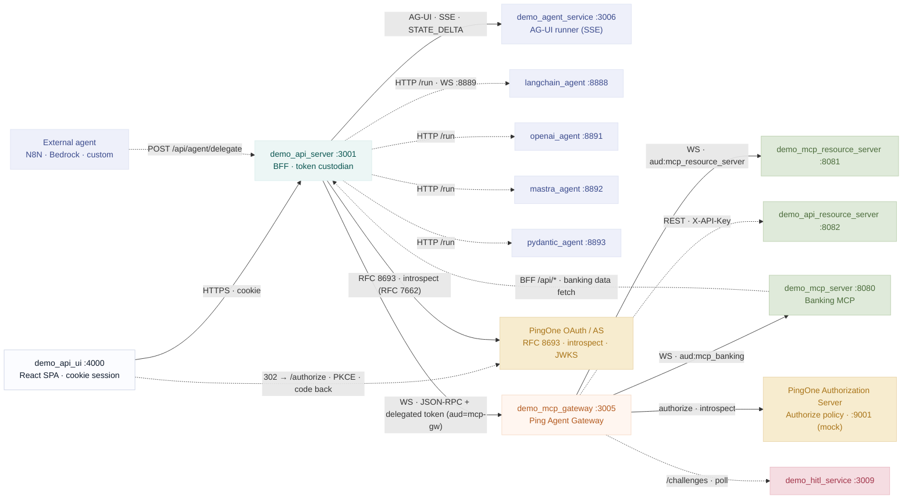
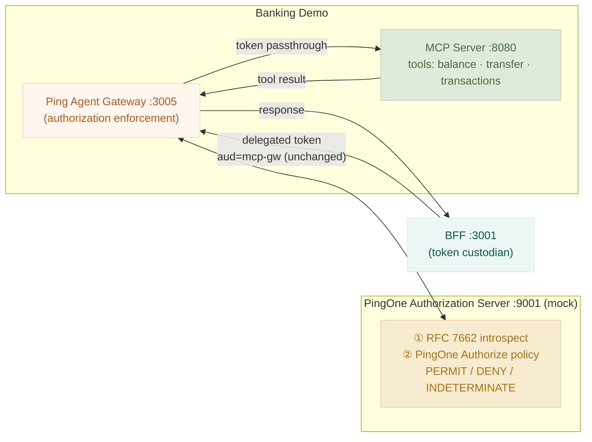

# Banking Demo — PingOne Edition

> ⚠️ **Disclaimer:** This is an independent community demo project. It is **not** created, endorsed, or supported by PingOne or ForgeRock. Use at your own risk. No warranty is provided, express or implied.

Standalone AI-powered banking demo using PingOne for authentication and **RFC 8693 Token Exchange** so the AI agent can securely access banking data on behalf of users.

This is a **completely standalone** project — it can be handed to anyone and run independently.

**AI assistants / agents:** follow **[CLAUDE.md](CLAUDE.md)** (repo conventions, regression guard, verification).

## 🚀 Quick Start (brand-new machine)

One command bootstraps everything on a fresh Mac — no tooling required beforehand:

```bash
curl -fsSL https://raw.githubusercontent.com/curtismu7/AI-demo/main/install.sh | bash
```

It installs **Homebrew, git, Node 20, Python 3.12, Docker (OrbStack), mkcert, llama.cpp**, and any
mode-specific tools, then clones the repo, generates TLS certs, and provisions PingOne. It first
asks **how you want to run** the demo:

| # | Mode | Launcher | Installs |
|---|------|----------|----------|
| **1** | **Local** (native Node/Python — recommended to start) | `./run.sh` | Node, Python, Docker¹, mkcert, llama.cpp |
| **2** | **Kubernetes / OrbStack** (local cluster) | `./run-k8.sh` | + OrbStack, kubectl |
| **3** | **Ping SE cluster** (shared AWS) | `./run-pingaws.sh` | + Docker Desktop, kubelogin, kubectx |
| **4** | **Kubernetes / EKS** (self-managed) | `./run-k8.sh aws-all` | + OrbStack, AWS CLI |

¹ Local mode still uses Docker to run **PingGateway** (the MCP authorization gateway).

**You need two things the installer can't create for you:**

1. **A PingOne Worker app** (role: *Identity Data Admin*) — create it once in the PingOne admin
   console. The installer **prompts for its Environment ID, Client ID, and Client Secret** and
   provisions everything else automatically. (Press Enter to skip and use the browser form instead.)
2. **A Helix agent key** (optional) — to power the natural-language AI. Without it the agent runs
   in heuristic-only mode. See [Configure the AI agent (Helix)](#configure-the-ai-agent-helix).

Non-interactive install (skip all prompts, defaults to local mode):

```bash
ASSUME_YES=1 curl -fsSL https://raw.githubusercontent.com/curtismu7/AI-demo/main/install.sh | bash
```

After install, start the demo any time with the launcher for your mode (e.g. `cd ~/AI-demo && ./run.sh`)
and open **`https://api.ping.demo:4000`**. Full details for each mode are in [How to Run](#how-to-run) below.

## Components

| Component | Port | Description |
| --- | --- | --- |
| `demo_api_ui` | 4000 | React frontend (admin + end-user dashboards) |
| `demo_api_server` | 3001 | Express REST API — **Backend-for-Frontend (BFF)** with PingOne OAuth; tokens stay server-side |
| `demo_mcp_server` | 8080 | TypeScript MCP tool server for banking tools |
| `demo_mcp_resource_server` | 8081 | TypeScript MCP server for investment tools |
| `demo_api_resource_server` | 8082 | Mortgage REST resource server (Path A — X-API-Key conversion at gateway) |
| `demo_mcp_gateway` | 3005 | **Demo Agent Gateway** (Node) — optional `demo-auth` profile; real stack uses PingGateway (IG) on :3036 |
| `ping-gateway` | 3036 | **PingOne Agent Gateway (IG)** — default MCP enforcement point when Quick Flag **Agent Gateway → PingOne GW** is ON |
| `demo_agent_service` | 3006 | AG-UI runner; streams `STATE_DELTA` events back to the BFF over SSE |
| `demo_hitl_service` | 3009 | Human-in-the-Loop consent challenge service |
| `langchain_agent` | 8888 | LangChain (Python) agent runtime — selectable via `configStore.llm_framework` |
| `openai_agent` | 8891 | OpenAI Agents SDK (Python) runtime |
| `mastra_agent` | 8892 | Mastra (TypeScript) runtime |
| `pydantic_agent` | 8893 | Pydantic AI (Python) runtime |
| `agent_token_service` | 8097 | PingOne agent-token broker for Microsoft Copilot Studio; run separately, not in compose |

## Architecture

System architecture with token flow. **Interactive version** (layer toggles, scenario highlighting, JWT payload cards, token-issue connector lines) is served by the UI:

- Running app: [`/architecture/token-flow.html`](https://api.ping.demo:4000/architecture/token-flow.html)
- Source: [`demo_api_ui/public/architecture/token-flow.html`](demo_api_ui/public/architecture/token-flow.html)
- Spec: [`docs/superpowers/specs/2026-05-29-architecture-diagram-token-overlay-design.md`](docs/superpowers/specs/2026-05-29-architecture-diagram-token-overlay-design.md)

Static mermaid companion (no interactivity, embeddable in docs):



Full mermaid source: [`docs/architecture-token-flow.mmd`](docs/architecture-token-flow.mmd).

## How to Run

Four deployment modes are supported. Pick the one that matches your environment.

---

### Option 1 — Local (native processes, no Docker)

Runs everything directly as Node/Python processes on your Mac. **No Docker, no Kubernetes, no containers.** This is the lightest-weight option.

**Prerequisites:** Node 20+, Python 3.11+, mkcert

```bash
# First-time setup
curl -fsSL https://raw.githubusercontent.com/curtismu7/AI-demo/main/install.sh | bash
# Select option 1 — installs Node, Python, mkcert, and bootstraps PingOne automatically
```

**Start:**

```bash
cd ~/AI-demo
./run.sh
```

**Access:** `https://api.ping.demo:4000`

`./run.sh` starts the BFF, UI dev server, MCP server, and agent directly as native processes. HTTPS is handled by mkcert (trusted on first run — no browser warnings).

**Common commands:**

```bash
./run.sh             # start all services
./run.sh stop        # stop all services
./run.sh restart     # stop then start
./run.sh status      # live service health check
```

**Logs:**

```bash
./run.sh tail        # interactive picker — choose a service or 'all'
./run.sh tail all    # tail all services interleaved
./run.sh tail 2      # tail a specific service by number (shown in picker)
```

Log files are written to `~/AI-demo/logs/`. Ctrl+C stops the tail without stopping services.

---

### Option 2 — Docker Compose

Runs all services in containers on your Mac. No Kubernetes needed — just Docker Desktop (or OrbStack).

**Prerequisites:** Docker Desktop or OrbStack, mkcert

```bash
# One-time: trust the local CA and add the hostname
sudo mkcert -install
echo '127.0.0.1  api.ping.demo' | sudo tee -a /etc/hosts

# Bootstrap PingOne (writes demo_api_server/.env and generates certs/)
cd ~/AI-demo/demo_api_server && npm run pingone:bootstrap
```

**Start (recommended — memory-efficient core stack):**

```bash
cd ~/AI-demo
./run-docker.sh              # core services only (~750 MB Docker RSS)
./run-docker.sh start full   # every compose service (all optional profiles)
./run-docker.sh build        # rebuild images, then start core
```

**Access:** `https://api.ping.demo:4000`

#### Memory-efficient Docker stack

By default `./run-docker.sh` starts only the **core** banking demo (~750 MB Docker,
plus host llama.cpp if you use local LLM). Optional subsystems stay stopped until
you start them.

| Core (always on) | Optional (on demand) |
| --- | --- |
| BFF, UI, MCP server | Code Search / RAG (`rag`) |
| **PingGateway (IG)** — real Agent Gateway | Alt agent frameworks (`agents`) |
| LangChain agent, agent-service, HITL | Invest + mortgage verticals (`verticals`) |
| LLM proxy | MCP proxy (`proxy`), Jaeger (`tracing`) |

**Real Authorize + real IG is the default.** The demo `authz-server` and demo
`mcp-gateway` are **not** in the core stack — they live in the `demo-auth` profile
and start only when Quick Flags call for them (see below).

Check what's running:

```bash
./run-docker.sh status
./run-docker.sh optional status
curl -sk https://api.ping.demo:3001/api/health/inventory/sizes   # per-container memory
```

#### Optional services on demand

```bash
./run-docker.sh optional start rag        # Code Search (Weaviate + embeddings + code-search)
./run-docker.sh optional start agents     # OpenAI / Mastra / Pydantic agents
./run-docker.sh optional start verticals  # MCP invest + mortgage services
./run-docker.sh optional start tracing    # Jaeger OTLP backend
./run-docker.sh optional stop rag         # free ~600 MB+ when done with Code Search
./run-docker.sh optional start rag agents # multiple groups in one command
```

Compose profiles (same groups): `docker compose --profile rag up -d`, etc.

#### Real vs demo Authorize / Agent Gateway

Two Quick Flags in the admin UI control which containers you need (they are **not**
hard-pinned in `docker-compose.yml`, so toggles persist in config):

| Quick Flag | OFF (default) | ON |
| --- | --- | --- |
| **Simulated Authorize** | Real PingOne Authorize | Demo `authz-server` |
| **Agent Gateway → PingOne GW** | Demo `mcp-gateway` (Node :3005) | **PingGateway (IG)** :3036 |

**Default path:** real PingOne Authorize + PingGateway only — no demo authz or demo
gateway containers.

After changing either flag, align containers (reads live config from the BFF):

```bash
./run-docker.sh demo-sync
# or
./run-docker.sh restart demo-api-server   # restart BFF runs demo-sync automatically
```

| Mode | Quick Flags | Containers started |
| --- | --- | --- |
| **Real (default)** | Simulated OFF, PingOne GW ON | PingGateway |
| Demo Authorize + real IG | Simulated ON, PingOne GW ON | PingGateway + authz-server |
| Full demo path | Simulated ON, Demo GW | authz-server + mcp-gateway |

Force demo containers regardless of flags: `./run-docker.sh optional start demo-auth`

**Common commands:**

```bash
./run-docker.sh                    # start core (lean default)
./run-docker.sh start full         # start every compose service
./run-docker.sh demo-sync          # apply Quick Flag toggles to demo-auth containers
./run-docker.sh stop               # stop all containers + host llama tiers
./run-docker.sh restart <service>  # recreate one or more services
./run-docker.sh build              # rebuild core images
./run-docker.sh logs               # interactive log picker
./run-docker.sh status             # container health table
./run-docker.sh help               # full command reference
```

Legacy raw compose (starts core only — optional profiles need `--profile` flags):

```bash
docker compose up --build -d
docker compose down
```

**Logs — terminal** (prefer `./run-docker.sh logs` or `./run-docker.sh logs <service>`):

```bash
docker compose logs -f                               # all services interleaved
docker compose logs -f demo-api-server               # BFF
docker compose logs -f langchain-agent               # AI agent
docker compose logs -f mcp-gateway                   # Demo Agent Gateway (demo-auth profile)
docker compose logs -f ping-gateway                  # PingOne Agent Gateway (IG)
docker compose logs -f mcp-server                    # MCP tools
docker compose logs -f ui                            # UI (nginx / Vite)
docker compose logs -f --tail=100 demo-api-server    # last 100 lines + follow
```

**Logs — Docker Desktop UI:**

1. Open **Docker Desktop**
2. Click **Containers** in the left sidebar
3. Click the **ai-demo** stack row to expand it
4. Click any container name (e.g. `ai-demo-api-server`) to open its live log view
5. Use the **search box** at the top to filter log lines
6. Click the **download icon** to save logs to a file

---

### Option 3 — Mac Kubernetes (OrbStack)

Runs all services in a local Kubernetes cluster via OrbStack. Same images as production — useful for testing K8s manifests locally before pushing to AWS.

**Prerequisites:** OrbStack with Kubernetes enabled, `kubectl`, Node 20+, Python 3.11+, mkcert

```bash
# First-time setup
curl -fsSL https://raw.githubusercontent.com/curtismu7/AI-demo/main/install.sh | bash
# Select option 2 — installs OrbStack, kubectl, and bootstraps PingOne
```

**Start:**

```bash
cd ~/AI-demo
./run-k8.sh
```

**Access:** `https://api.ping.demo:4000` (same local URL — port-forwarded from the cluster)

`./run-k8.sh` builds Docker images, applies Kubernetes manifests to the local `ai-demo` namespace, and sets up port-forwards that auto-respawn if dropped.

**Common commands:**

```bash
./run-k8.sh              # build + deploy + forward (full restart)
./run-k8.sh build        # rebuild images only
./run-k8.sh deploy       # re-apply manifests + restart pods (no rebuild)
./run-k8.sh forward      # restart port-forwards only
./run-k8.sh restart      # rebuild + rolling redeploy + forward
./run-k8.sh stop         # scale all pods to 0 (keeps config; frees memory)
./run-k8.sh status       # show pod and service status
./run-k8.sh destroy      # delete the ai-demo namespace entirely

# Switch AI agent without rebuilding:
./run-k8.sh deploy --agent=mastra    # mastra | langchain | openai | pydantic
```

**Logs:**

```bash
kubectl logs -n ai-demo deploy/banking-api-server -f    # BFF
kubectl logs -n ai-demo deploy/frontend -f              # UI
kubectl logs -n ai-demo deploy/mcp-gateway -f           # MCP gateway
kubectl logs -n ai-demo deploy/mcp-gateway -c authz-server -f   # authz sidecar
kubectl logs -n ai-demo deploy/langchain-agent -f       # AI agent
kubectl logs -n ai-demo -l app=ai-demo --all-containers --prefix -f   # everything
kubectl logs -n ai-demo deploy/<name> --previous        # after a crash
```

---

### Option 4 — Ping SE AWS Cluster

Deploys to the shared Ping SE DevOps cluster (`ping-dev-aws-us-east-2`). Images are built locally, pushed to GHCR, and deployed to your personal namespace.

**Launcher:** `./run-pingaws.sh` (wrapper around `./run-k8.sh se-*` and `se-update-*`).

**Prerequisites:**

| Tool | Install |
| ---- | ------- |
| Docker Desktop | Required to build images |
| `kubectl` | `brew install kubectl` |
| `kubectx` + `kubelogin` | `brew install kubectx int128/kubelogin/kubelogin` |
| `gh` CLI | `brew install gh` then `gh auth login` |
| SE cluster context | `kubectl config use-context us` |
| SE namespace | File a **JIRA DEVHELP** ticket — you get `ping-devops-<yourname>` |

```bash
# First-time setup
curl -fsSL https://raw.githubusercontent.com/curtismu7/AI-demo/main/install.sh | bash
# Select option 3 — installs all tools above automatically
```

**Deploy (build + push + deploy in one command):**

```bash
cd ~/AI-demo

# Authenticate to GHCR first (token expires — do this before every deploy)
gh auth token | docker login ghcr.io -u YOUR_GITHUB_USERNAME --password-stdin

# Then deploy
./run-pingaws.sh
# same as: ./run-pingaws.sh start
```

That builds images → pushes to `ghcr.io/<you>/` → applies K8s manifests to your SE namespace.

Your namespace is auto-derived from your Ping email:

- `cmuir@pingidentity.com` → `ping-devops-cmuir`
- Override: `SE_NAMESPACE=ping-devops-yourname ./run-pingaws.sh`

**Access:** `https://ai-demo.ping-devops.com` (live after ~5 min for DNS)

**Common commands:**

```bash
./run-pingaws.sh status                 # pods in your namespace
./run-pingaws.sh build                  # build + push only
./run-pingaws.sh deploy                 # deploy only (images already in GHCR)
./run-pingaws.sh update code frontend   # rebuild/redeploy one service
./run-pingaws.sh update config          # push .env / configmaps (no rebuild)
./run-pingaws.sh update pingone         # re-register OAuth redirect URIs for SE URL
./run-pingaws.sh undeploy               # tear down when done (keeps namespace)
```

**If the build succeeds but deploy fails (kubectl auth timeout):**

The OIDC browser popup must complete interactively. Run in your terminal:

```bash
kubectl config use-context us
kubectl get namespace ping-devops-cmuir   # triggers browser login — complete it
./run-pingaws.sh deploy                  # deploy only (images already pushed)
```

**If the push fails mid-way (token expired during push):**

```bash
# Re-auth and re-push only (build is cached — fast)
gh auth token | docker login ghcr.io -u YOUR_GITHUB_USERNAME --password-stdin
./run-pingaws.sh build     # push to GHCR
./run-pingaws.sh deploy    # deploy to cluster
```

**Check status after deploy:**

```bash
./run-pingaws.sh status
# or: kubectl get pods -n ping-devops-cmuir
```

**Logs:**

```bash
kubectl logs -n ping-devops-cmuir deploy/banking-api-server -f    # BFF
kubectl logs -n ping-devops-cmuir deploy/frontend -f              # UI
kubectl logs -n ping-devops-cmuir deploy/mcp-gateway -f           # MCP gateway
kubectl logs -n ping-devops-cmuir deploy/mcp-gateway -c authz-server -f   # authz sidecar
kubectl logs -n ping-devops-cmuir deploy/langchain-agent -f       # AI agent
kubectl logs -n ping-devops-cmuir -l app=ai-demo --all-containers --prefix -f   # everything
kubectl logs -n ping-devops-cmuir deploy/<name> --previous        # after a crash
```

**⚠️ Undeploy when finished — the SE cluster is shared infrastructure:**

```bash
./run-pingaws.sh undeploy   # removes all app resources; preserves the namespace
```

---

### Fresh install (new machine)

```bash
curl -fsSL https://raw.githubusercontent.com/curtismu7/AI-demo/main/install.sh | bash
```

Prompts you to choose a run mode and installs all required tools + bootstraps PingOne automatically.

```bash
# Install to a custom directory
INSTALL_DIR=~/work/AI-demo curl -fsSL https://raw.githubusercontent.com/curtismu7/AI-demo/main/install.sh | bash

# Non-interactive (skip all prompts)
ASSUME_YES=1 curl -fsSL https://raw.githubusercontent.com/curtismu7/AI-demo/main/install.sh | bash
```

---

### PingOne bootstrap

The installer runs PingOne bootstrap automatically. To re-run manually:

```bash
cd ~/AI-demo/demo_api_server
npm run pingone:bootstrap       # interactive (opens browser form)
npm run pingone:bootstrap:ci    # non-interactive (reads PINGONE_BOOTSTRAP_* env vars)
```

Provisions all PingOne resources (resource servers, scopes, apps, demo users) and writes credentials to `demo_api_server/.env`. Safe to re-run — idempotent.

---

### Configure the AI agent (Helix)

Helix (Ping AI) powers the natural-language UX in the banking agent. It's **optional** — without
it the agent runs heuristic-only (answers common phrases like "balance", "show my accounts",
"recent transactions" but falls through on free-form questions). Setup has two halves: create the
agent **online**, then point the demo at it **locally**.

**Part 1 — Online (Helix console):**

1. **Create an agent** in the Helix console (*Agents → New*), add an **AI Task** node, and note the
   **Prompt Field ID** of its input (e.g. `textInput502c5045a61c`).
2. **Publish** the agent (saving is not publishing — wait for the published badge).
3. **Create an agent-scoped API key:** on the published agent card click the **⋮** menu →
   **Create API Key** → **download the JSON**. It must have `"scope": "agent"` and a non-empty
   `target`. (An *env-admin* key returns HTTP 200 with a `null` body — looks fine, never works.)

**Part 2 — Local (this repo):**

Easiest path — **drop the downloaded key file in the repo root** as `LLM2.json`:

```bash
cp ~/Downloads/LLM2.json ~/AI-demo/LLM2.json

# Verify it's the right key type (agent, not env-admin):
cat ~/AI-demo/LLM2.json | python3 -c \
  "import json,sys; k=json.load(sys.stdin); print('OK — agent key' if k.get('target') else 'WRONG TYPE — regenerate from the agent ⋮ menu')"
```

`npm run setup:fresh` (and the installer) auto-detect `LLM2.json` in the repo root, `~/Documents`,
or `~/Downloads` and import the key. You still set the remaining values in `demo_api_server/.env`:

| Env var | Where to find it |
|---|---|
| `HELIX_BASE_URL` | Tenant origin only — e.g. `https://openam-helix.forgeblocks.com` (no path) |
| `HELIX_API_KEY` | The `keyValue` from the agent key JSON (auto-imported from `LLM2.json`) |
| `HELIX_ENVIRONMENT_ID` | Helix console → Settings, or the UUID in the console URL |
| `HELIX_AGENT_ID` | Agent **name** as shown in the console — not the UUID, case-sensitive |
| `HELIX_PROMPT_FIELD_ID` | The input field ID from the AI Task node (step 1) |

Alternatively, import the key from the running app: **Configuration → LLM Provider → Helix → Import
API Key JSON**, then fill the remaining fields and save.

A correct setup prints at startup: `✓  [HELIX LLM     ]  Helix AI Agent  configured`
(`partial` lists which of the 5 values are still missing).

Full guide: [`docs/user-guide/helix-setup.md`](docs/user-guide/helix-setup.md).

---

### Uninstall / start from scratch

```bash
~/AI-demo/uninstall.sh   # per-item confirmation for brew packages
ASSUME_YES=1 ~/AI-demo/uninstall.sh   # skip all prompts
```

Then re-install: `curl -fsSL https://raw.githubusercontent.com/curtismu7/AI-demo/main/install.sh | bash`

---

### Troubleshooting

| Symptom | Fix |
| ------- | --- |
| GHCR push fails with `unauthenticated` | `gh auth token \| docker login ghcr.io -u YOUR_USERNAME --password-stdin` then re-run |
| `kubectl` OIDC auth timeout | Run `kubectl get namespace ping-devops-<you>` in your terminal to complete the browser popup, then `./run-pingaws.sh deploy` |
| `error: get-token: context deadline exceeded` | OIDC session expired — open a terminal, run a kubectl command to re-auth, then retry |
| Docker socket error on SE deploy | Open Docker Desktop, wait for it to start, retry |
| `zsh: command not found: nvm` | `source ~/.zshrc` or open a new terminal |
| Browser cert error (local) | `sudo mkcert -install` then restart browser |
| `api.ping.demo` doesn't resolve | `echo '127.0.0.1 api.ping.demo' \| sudo tee -a /etc/hosts` |
| 503 after SE deploy | Wait ~5 min for DNS; then `kubectl get pods -n ping-devops-<you>` |
| `ImagePullBackOff` on SE cluster | Re-create pull secret: see [ping-aws-cluster skill](.claude/skills/ping-aws-cluster/SKILL.md) |


---

## What This Demo Does

See **[docs/FEATURES.md](docs/user-guide/FEATURES.md)** — demo scenarios, full feature matrix, 20-minute pitch checklist.  
See **[docs/RFC-STANDARDS.md](docs/RFC-STANDARDS.md)** — every RFC and standard implemented, compliance level, and known gaps.  
See **[docs/REQUEST_FLOW_SERVERS.md](docs/REQUEST_FLOW_SERVERS.md)** — complete request flow reference: every server a chat prompt touches, in order, with token details, for all 6 flows (login, agent actor token, chat, NL intent, HITL consent, MFA/step-up).
See **[docs/privilege-llm-protection.md](docs/privilege-llm-protection.md)** — calling Anthropic/Google/OpenAI through a PingOne Privilege virtual key, so the app holds no provider key and a policy can deny the call before it reaches the provider.

**Recent additions (June 2026):**

- **AG-UI streaming** (`ff_agui_enabled`, default ON) — the BFF (`routes/agentRun.js`) streams agent-run events over SSE so live panels (token chain, compliance flow) populate in real time; decoded token-chain events only, never raw JWTs.
- **Activity narration** (`ff_activity_narration`, default ON) — a "What's happening" panel that narrates each step of the agent flow in plain language.
- **Security Showcase** — a tabbed chip panel inside the agent (Defenses / AI Reasoning / Attacks) demonstrating 6 live attacks (prompt injection, indirect injection, wrong audience, scope escalation, confused deputy, HITL receipt-binding replay) plus defense chips; enabled in all 5 verticals.
- **Live Policy Console** (`/pingone-authorize`) — overhauled PingOne Authorize page with a live policy tree, recent decisions, an Evaluate tab with presets and explainers, and full request/response JSON; open to any authenticated user and warms the Authorize connection on boot and page load.
- **AI Control Plane** (`/ai-control-plane`) — cross-platform agent governance: stopping an agent revokes its identity at Ping so access dies everywhere at once; includes a Compliance Report view with CSV/JSON export.
- **Microsoft Copilot Studio integration** — a standalone agent mode where MSAL/Entra login drives a Copilot Studio client that calls `agent_token_service` (port 8097) to mint a PingOne agent token before reaching the gateway. See **[docs/COPILOT_PART3_RUNBOOK.md](docs/COPILOT_PART3_RUNBOOK.md)** for setup.

## Configuration

See **[docs/SETUP.md](docs/user-guide/SETUP.md)** (§ 2 — PingOne Application Configuration and § 3 — Environment Variables) for the full configuration reference, including all required env vars and their PingOne source.

## Testing

**A red X on a PR's GitHub Actions checks does not necessarily mean the code is
broken.** This is a private repo on the Free plan's 2,000 Actions-minutes/month
cap (see `.github/workflows/ci.yml` header); once the cap is hit, jobs fail in
~3-4 seconds with 0 steps executed — that failure is the billing gate, not a
test result. `git push` runs the same checks locally via `scripts/ci-local.sh`
(a pre-push hook) and that result is authoritative — trust it over a starved
remote run. To tell the two apart on a PR: open the failing check's job page —
0 steps and a multi-second runtime means billing-blocked, not a real failure.

Run the full test suite across all services:

```bash
npm test                                   # all tests
npm run test:api-server                    # BFF tests only
npm run test:mcp-server                    # MCP unit tests
npm run test:mcp-server:integration        # MCP integration tests
npm run test:ui                            # React component tests (CI mode)
npm run test:agent                         # LangChain agent tests (Python)
npm run test:agent-ui                      # Agent frontend tests
npm run test:e2e:ui:smoke                  # Fast E2E smoke test
npm run test:e2e:ui                        # Full E2E UI test suite
npm run test:session                       # Session + BFF token tests
```

From within `demo_api_server/`, you can run targeted test suites:

```bash
cd demo_api_server
npx jest oauthStatus.regression oauthStatus.integration hitlRoute.regression hitlRoute.integration
npx jest --testPathPattern='step-up-gate|authorize-gate'
```

**Test framework:** Jest (Node/Express services), Vitest (some TypeScript packages), React Testing Library (UI components), pytest (Python agent).

## Development & Contributing

All development must follow the patterns documented in **[CLAUDE.md](CLAUDE.md)** — the canonical agent instructions for this repository. Read § 1 (**Critical Do-Not-Break Areas**) in **[REGRESSION_PLAN.md](REGRESSION_PLAN.md)** before editing protected files like `routes/oauth.js`, `middleware/auth.js`, or session/token logic.

**Key development conventions:**
- **Minimal diff discipline** — touch only what the task requires; no while-I'm-here cleanup
- **Read REGRESSION_PLAN.md § 0–1** before editing files listed there
- **UI build required** — `cd demo_api_ui && npm run build` must exit 0 after any UI change
- **Token custody rule** — the BFF (demo_api_server) is the sole token custodian; tokens never reach the browser
- **Quote secrets in .env** — special characters like `~`, `-`, `.` break shell parsing if unquoted
- **No hardcoded localhost** — all OAuth redirect URIs use the configured host (`api.ping.demo` by default), never hardcoded `localhost:3001` / `localhost:4000`

See **[CONTEXT.md](CONTEXT.md)** for glossary of terms (BFF, gateway, agent, consent, delegation); **[ARCHITECTURE.md](docs/ARCHITECTURE.md)** for standards and architecture decisions; and **[docs/adr/](docs/adr)** for architectural decision records.

## Architecture

```
┌─────────────────────────────────────────────────────────┐
│              Banking Digital Assistant                    │
│                                                           │
│  demo_api_ui (:4000)   ←→   demo_api_server (:3001) │
│       React UI                  Express banking API        │
│                                    ↑ JWT validation        │
│                                    │ via PingOne JWKS      │
│                                                           │
│  langchain_agent (:8888)  ←→   demo_mcp_server (:8080) │
│    LangChain + OpenAI           MCP tools for banking      │
│           ↓ Token Exchange                                 │
│    oauth-playground (:3001)  (or PingOne directly)        │
└─────────────────────────────────────────────────────────┘
                        ↓
              PingOne (auth.pingone.com)
              Environment: b9817c16-...
```

## Reference Architecture (i4ai Token Exchange Flow)

The diagram in **[i4ai-ref-arch.mmd](i4ai-ref-arch.mmd)** illustrates the complete token exchange flow for delegated AI agent access in this banking demo:

1. **Agent context (no user subject)** — Agent requests tool list with its own credentials; authorization server returns tools matching agent's scopes
2. **User context required** — User authenticates via web app and requests access to banking data through the chatbot
3. **Subject token (user → agent)** — Chatbot requests a scoped token for the agent with `may_act` claim indicating agent can act on behalf of user
4. **RFC 8693 Token Exchange** — BFF (not the gateway) exchanges subject token (user AT) + actor token (agent CC) for a single delegated token scoped to the Ping Agent Gateway (`aud=mcp-gw`), carrying both `sub: user` and `act: agent1`
5. **Token passthrough at gateway** — Ping Agent Gateway forwards the BFF-issued token unchanged to the MCP Server; no second exchange occurs. Gateway calls PingOne Authorization Server twice per tool call: first RFC 7662 introspection, then policy decision (PERMIT / DENY / INDETERMINATE)
6. **Authorization decisions** — Ping Authorize validates token claims, scope, and tool policy at each hop; Resource Server validates final token before returning data

See **[README (mermaid).md](README%20(mermaid).md)** for detailed token operations, introspection patterns, delegation chain semantics, and standards references.

---

## Key Changes from Original (ForgeRock/PingOne AI IAM Core → PingOne)

| Component | Before | After |
| --- | --- | --- |
| AS endpoints | `openam-*.forgeblocks.com/am/oauth2/...` | `auth.pingone.com/{envId}/as/...` |
| Token validation | **Runtime-switchable** (Phase 97): `introspection` (RFC 7662, default — real-time, detects revoked) or `jwt` (RFC 7519, fast, offline). Toggle via Config UI or `POST /api/config/validation-mode`. Set default with `VALIDATION_MODE` env var. | Same modes available |
| Token Exchange | Not implemented | Implemented — `demo_api_server/services/agentMcpTokenService.js` performs RFC 8693 exchange on every `POST /api/mcp/tool` when `MCP_RESOURCE_URI` is set |
| MCP server config | `PINGONE_BASE_URL=*.PingOneentity.com` | `PINGONE_BASE_URL=https://auth.pingone.com/{envId}/as` |

## Services

| Service | Port | Description |
| --- | --- | --- |
| `demo_api_server` | 3001 | Express REST API — banking accounts, transactions, admin; **sole token custodian** |
| `demo_api_ui` | 4000 | React frontend for admin/customer portal |
| `demo_mcp_server` | 8080 | TypeScript MCP server — exposes banking tools to AI agents |
| `demo_mcp_gateway` | 3005 | **Ping Agent Gateway** — RFC 7662 introspection + PingOne Authorize policy per tool call; token forwarded unchanged |
| `demo_agent_service` | 3006 | LangGraph reasoning service for the canonical agent |
| `demo_hitl_service` | 3009 | Human-in-the-Loop consent challenge service |
| `demo_mcp_resource_server` | 8081 | Specialized MCP server for investment tools |
| `demo_api_resource_server` | 8082 | Mortgage service backend |
| `langchain_agent` | 8888 | Python LangChain + OpenAI demo agent (cross-stack exhibit) |

## Token Exchange Flow (RFC 8693)

The **Backend-for-Frontend (BFF)** — the `demo_api_server` — performs RFC 8693 Token Exchange on the **server side** — the browser never sees raw OAuth tokens. On every `POST /api/mcp/tool` call, `agentMcpTokenService.js` runs:

```text
1. Retrieve the user access token (stored in server-side session)
2. POST {issuer}/as/token
     grant_type = urn:ietf:params:oauth:grant-type:token-exchange
     subject_token = <user access token>
     subject_token_type = urn:ietf:params:oauth:token-type:access_token
     audience = <MCP_RESOURCE_URI>          -- binds audience to MCP server
     scope = <tool-scopes>                  -- e.g. banking:accounts:read
3. PingOne validates may_act, issues the MCP access token (delegated, MCP audience)
4. BFF opens WebSocket to demo_mcp_server with the MCP access token as Bearer
```

Optional delegation path (`USE_AGENT_ACTOR_FOR_MCP=true`):

```text
     actor_token = <agent access token>   -- client-credentials token
     actor_token_type = urn:ietf:params:oauth:token-type:access_token
     -- MCP access token carries act: { sub: "<agent-client-id>" }  per RFC 8693 s4.1
```

The exchange is **dormant until configured** — if `MCP_RESOURCE_URI` is not set, the BFF does not send a token to MCP for that path (local tool fallback; user access token stays on the BFF). To activate:

| Env var | Purpose |
| --- | --- |
| `MCP_RESOURCE_URI` | Audience URI for the MCP server (activates the exchange) |
| `USE_AGENT_ACTOR_FOR_MCP` | `true` to add `actor_token` (adds `act` claim to the MCP access token) |
| `AGENT_OAUTH_CLIENT_ID` | Agent OAuth client ID (required when actor path is on) |

Required in PingOne: enable the token-exchange grant type on the Backend-for-Frontend (BFF) client and configure a `may_act` / actor policy so PingOne will accept the exchange.

## PingOne Configuration Required

In your PingOne environment (`b9817c16-9910-4415-b67e-4ac687da74d9`), you need:

1. **Demo Worker Token App** (client_credentials, type: `WORKER`) — PingOne Management API access
   - Already configured: `66a4686b-9222-4ad2-91b6-03113711c9aa`

2. **Web Application** (auth_code + PKCE) — for user login
   - Already configured: `a4f963ea-0736-456a-be72-b1fa4f63f81f`

3. **Token Exchange** policy on the Backend-for-Frontend (BFF) client — allows the Backend-for-Frontend (BFF) to exchange user tokens for MCP-audience tokens
   - In PingOne: Applications → your Backend-for-Frontend (BFF) app → Grant Types → enable **Token Exchange**
   - Add a Token Exchange policy: subject token issuer = this PingOne environment; allowed audience = value of `MCP_RESOURCE_URI`
   - Add a `may_act` claim to tokens issued to end-users (Attribute Mappings) so the Backend-for-Frontend (BFF)'s client_id appears in `may_act.client_id`

## Ping Agent Gateway — Authorization Enforcement

The **Ping Agent Gateway** (`demo_mcp_gateway :3005`) is the live authorization enforcement point in this demo. It sits between the BFF and all MCP Servers, performing two inline calls on every tool request before allowing it through.



**Per-tool enforcement sequence:**

| Step | What happens |
| --- | --- |
| 1. BFF → Gateway | BFF sends delegated token (`sub=user`, `act=agent`, `aud=mcp-gw`) — issued once via RFC 8693 at the BFF |
| 2. Gateway → PingOne Authorization Server (call 1) | RFC 7662 introspection — is the token active? (cached 30 s dev / 5 s prod) |
| 3. Gateway → PingOne Authorization Server (call 2) | PingOne Authorize policy decision — PERMIT, DENY, or INDETERMINATE (triggers HITL) |
| 4. PERMIT | Gateway forwards request and token unchanged to the MCP Server |
| 5. DENY | Gateway returns 403; agent must not retry with same token |
| 6. INDETERMINATE | Gateway creates a HITL challenge; agent waits for user consent before retry |

---

## Vercel Deployment

The app is deployed to Vercel as a single serverless function (`api/handler.js`) with the React UI served as static files. Vercel spins up multiple function instances, so sessions must be persisted externally in [Upstash Redis](https://upstash.com).

### Quick Vercel Setup

Set environment variables manually via **Vercel Dashboard → Project → Settings → Environment Variables**. Use the table below as your reference for required variables. You can also use the Vercel CLI:

```bash
vercel env add UPSTASH_REDIS_REST_URL
vercel env add SESSION_SECRET
# ... add each variable from the table below
```

Create a local `.env.vercel.local` file (gitignored) to track your Vercel environment values locally. Copy these values to **Vercel Dashboard → Project → Settings → Environment Variables**.

### Required Environment Variables

| Variable | Description |
| --- | --- |
| `UPSTASH_REDIS_REST_URL` | Upstash REST URL (`https://…upstash.io`) |
| `UPSTASH_REDIS_REST_TOKEN` | Upstash REST token |
| `SESSION_SECRET` | 32+ char random string — generate: `node -e "console.log(require('crypto').randomBytes(32).toString('hex'))"` |
| `PINGONE_ENVIRONMENT_ID` | PingOne env ID |
| `PINGONE_REGION` | `com` / `eu` / `ca` / `asia` |
| `PINGONE_AI_CORE_CLIENT_ID` | Admin OAuth client ID |
| `PINGONE_AI_CORE_CLIENT_SECRET` | Admin OAuth client secret |
| `PINGONE_AI_CORE_REDIRECT_URI` | `https://<vercel-url>/api/auth/oauth/callback` |
| `PINGONE_AI_CORE_USER_CLIENT_ID` | Customer OAuth client ID |
| `PINGONE_AI_CORE_USER_CLIENT_SECRET` | Customer OAuth client secret |
| `PINGONE_AI_CORE_USER_REDIRECT_URI` | `https://<vercel-url>/api/auth/oauth/user/callback` |
| `REACT_APP_CLIENT_URL` | `https://<vercel-url>.vercel.app` |
| `MCP_SERVER_URL` | `wss://…` — deploy `demo_mcp_server` to Railway/Render/Fly (Vercel doesn't support WebSocket) |
| `NODE_ENV` | `production` |
| `CORS_ORIGIN` | Same as `REACT_APP_CLIENT_URL` |

> **Important:** Do NOT set `REDIS_URL` to an `https://` URL — it must be `redis://` or `rediss://` wire protocol, or use `UPSTASH_REDIS_REST_URL` instead. The setup wizard detects and fixes this automatically.

> **Important:** Never set `SKIP_TOKEN_SIGNATURE_VALIDATION=true` — the server will refuse to start in production.

### Session Store: Why Upstash REST?

Vercel's serverless environment kills TCP connections between invocations. `node-redis` (wire protocol) is unreliable because every cold start incurs a TLS handshake that races the session read/write window. The app uses `@vercel/kv` (Upstash REST API over HTTP) — stateless by design, no connection to re-establish.

### Post-Deploy Verification

After deploying, sign out and back in, then check:

```
GET /api/auth/debug
```

You want:
- `sessionStoreType: "upstash-rest"`
- `sessionStoreHealthy: true`
- `sessionRestored: false` (after a fresh login — not a cookie-only fallback)

### PingOne Redirect URIs

Add these to your PingOne application after getting your Vercel URL:
- Admin: `https://<your-vercel-url>/api/auth/oauth/callback`
- Customer: `https://<your-vercel-url>/api/auth/oauth/user/callback`

### Common Vercel Issues

| Symptom | Cause | Fix |
| --- | --- | --- |
| `sessionStoreHealthy: false` | Bad Upstash credentials | Run `npm run setup:vercel` to re-enter and test |
| `sessionRestored: true` + `accessTokenStub: true` | Session store failing silently | Check `sessionStoreError` in `/api/auth/debug` |
| `invalid_state` on login | No session store | Add `UPSTASH_REDIS_REST_URL` + `UPSTASH_REDIS_REST_TOKEN` |
| `session_error` redirect | Session write failed before PingOne redirect | Fix session store; sign out and try again |
| Agent shows "connecting…" | `MCP_SERVER_URL` not set | Set `MCP_SERVER_URL=wss://…` in Vercel env vars |
| Build fails with lint error | `CI=true` treats warnings as errors | Ensure `"CI": "false"` in `vercel.json` build.env |
| Redirect URI mismatch | PingOne URI ≠ Vercel URL | Update PingOne app redirect URIs |

---

## Environment Files

| File | Purpose |
| --- | --- |
| `.env.vercel.local` | Your local copy (gitignored) — create manually; see Vercel Deployment section above |
| `demo_api_server/.env` | Local dev config (PingOne credentials, port) |
| `demo_mcp_server/.env.development` | MCP server config (copy to `.env` before running) |
| `langchain_agent/.env` | Agent config (OpenAI key, PingOne endpoints) |
| `demo_api_ui/.env` | React frontend config |
