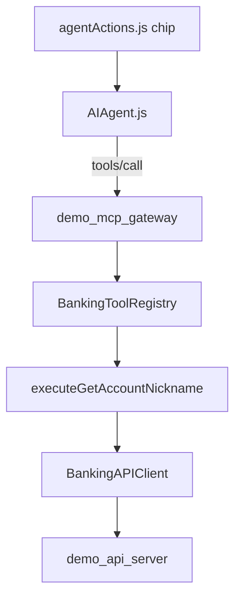

# Component Dependencies

| From | To | Pattern |
|------|-----|---------|
| UI chip | AIAgent | id `account_nickname` |
| AIAgent | Gateway | Direct MCP / heuristic |
| Registry | Handler | string handler name |
| Handler | BFF | existing REST via API client |
