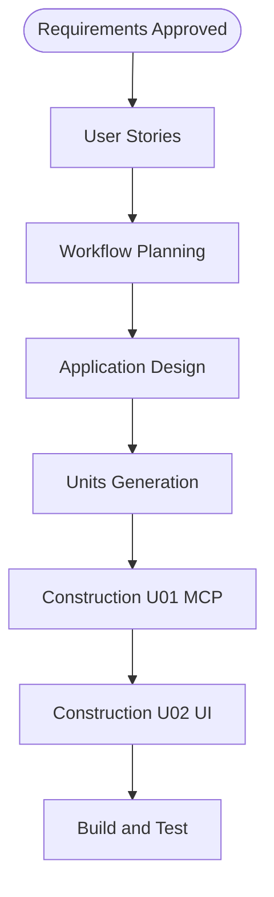

# Execution Plan

## Detailed Analysis Summary

### Transformation Scope (Brownfield)
- **Transformation Type**: Single feature across existing components
- **Primary Changes**: New MCP tool + UI chip + format hook
- **Related Components**: demo_mcp_server, demo_api_ui; demo_mcp_gateway unchanged (inherits tool list)

### Change Impact Assessment
| Area | Impact |
|------|--------|
| User-facing | Yes — new Actions chip + chat formatting |
| Structural | No new services |
| Data model | No schema change; read existing account `name` field |
| API | New MCP tool only; no new BFF routes if `getMyAccounts` suffices |
| NFR | Security baseline ON for Construction |

### Risk
- **Level**: Low–Medium (multi-file but bounded; protected auth paths untouched)

## Phase Determination

| Stage | Decision | Rationale |
|-------|----------|-----------|
| User Stories | EXECUTE | User-facing chip + testable AC |
| Application Design | EXECUTE | New tool + chip touch 2 packages |
| Units Generation | EXECUTE | MCP unit + UI unit |
| NFR Requirements (per-unit) | EXECUTE | Security baseline enabled |
| Infrastructure Design | SKIP | No infra changes |
| Operations | SKIP | Placeholder |

## Workflow Diagram

## Construction sequence
1. **U01** — MCP tool (registry, scopes, handler, tests) — no UI dependency
2. **U02** — UI chip + Direct MCP wiring + formatResult — depends on U01 tool name
3. **Build & Test** — `./run-tests.sh unit` for mcp-server + ui

## Module update strategy
- **Approach**: Sequential (MCP first, then UI)
- **Critical path**: U01 tool must exist before chip resolves tool name
- **Testing checkpoints**: MCP unit tests after U01; UI assertion after U02
