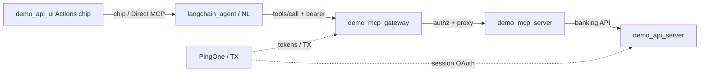

# System Architecture (scoped — MCP + Actions)

## System Overview
UI Actions chips and agents call MCP tools through the gateway. Banking tools
live in `demo_mcp_server`, which executes against `demo_api_server` with a
user-delegated token.

## Architecture Diagram

## Component Descriptions
### demo_mcp_server
- **Purpose**: Banking operations MCP server
- **Type**: Application
- **Dependencies**: demo_api_server, inbound token from gateway
- **Key files**: `src/tools/BankingToolRegistry.ts`, `toolScopeMap.ts`, `handlers/`

### demo_mcp_gateway
- **Purpose**: Validate audience/scopes, PingAuthorize, HITL for sensitive ops
- **Dependencies**: authz, HITL, downstream MCP servers

### demo_api_ui
- **Purpose**: Chip UX; format MCP results for chat
- **Key area**: `components/AIAgent.js`, Actions chip sets per vertical
- **Constraint**: Emoji allowlist per REGRESSION_PLAN §0

### demo_api_server
- **Purpose**: Account/transaction data + session
- **Protected**: OAuth/session/token-exchange paths (REGRESSION_PLAN §1)

## Data Flow (read tool)
1. User clicks Actions chip (or Direct MCP)
2. Tool name resolved; MCP `tools/call` with delegated bearer
3. Gateway validates token / policy
4. MCP handler loads account data from BFF
5. UI formats result (not raw JSON dump for Direct MCP success path)

## Integration Points
- **External**: PingOne (auth, TX)
- **Internal APIs**: BFF banking routes used by MCP handlers
- **Not in scope for pilot**: New IdP, new session store, new gateway product

## Constraints for this feature
- Reuse existing `read` scope pattern unless questions say otherwise
- Prefer extending `BankingToolRegistry` + handler + `TOOL_SCOPES`
- Chip must follow existing Actions / vertical chip conventions
- No changes to token exchange or BFF session layer without explicit approval
