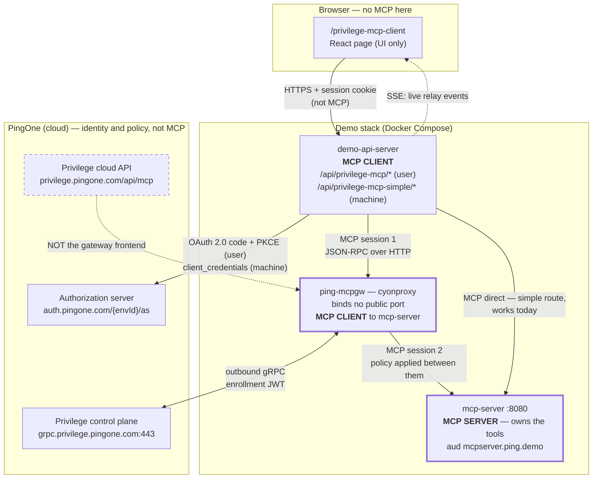
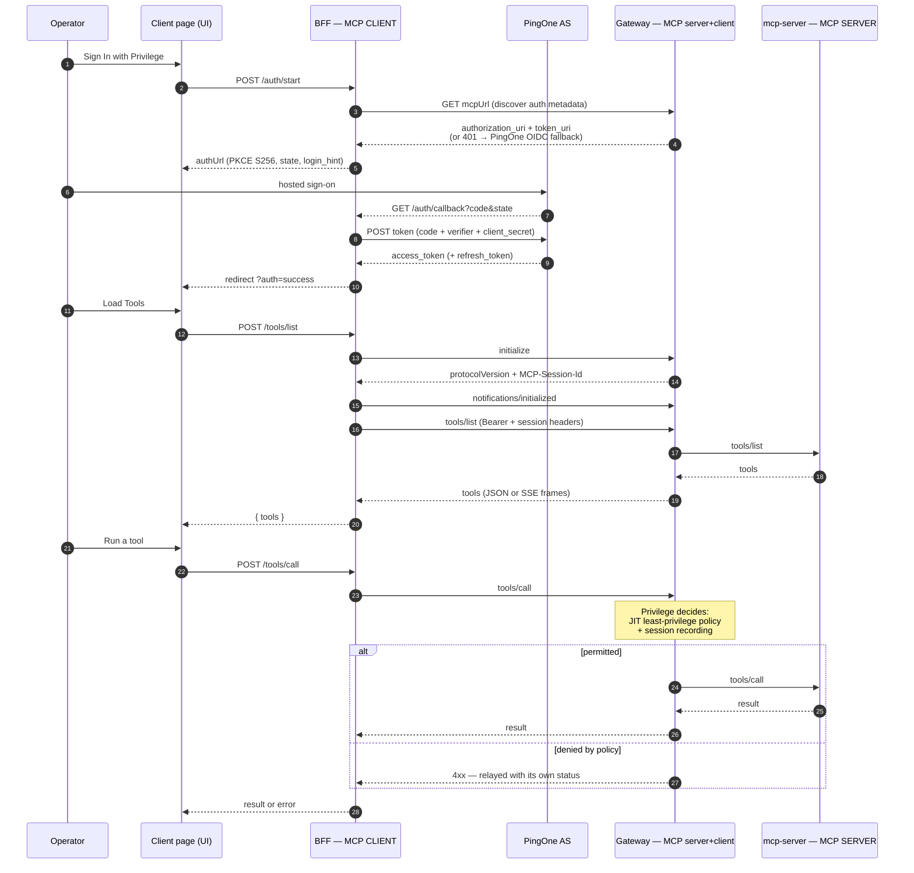

# Privilege MCP — what it is, how it works, and how it is wired here

PingOne Privilege is Ping's privileged-access product. Its **MCP Gateway (MCPGW)** is an
inline security gateway for the Model Context Protocol: an MCP client points at the
gateway instead of at the MCP server, and the gateway applies just-in-time,
least-privilege authorization to every `tools/call`, records the session, and forwards
what it permits to an **unchanged** MCP server.

That last part is the demo's whole point. `demo_mcp_server` needs no Privilege-specific
code. Policy and session recording are authored in the PingOne Privilege console, and the
gateway enforces them on the wire.

This repo contains a **client** for that gateway (`/privilege-mcp-client`), a **BFF relay**
that drives the OAuth and MCP protocol on the client's behalf, and Compose/K8s wiring for
running the gateway itself.

> Status as of 2026-08-02: the client, the relay and the protocol handling all work, and
> `/api/privilege-mcp-simple` performs a real token-to-MCP call end to end today. The
> **gateway** path is still blocked on two PingOne Privilege console steps. See
> [Current state](#current-state-verified-2026-08-02).

---

## Who is the MCP client, and who is the MCP server

Read this first. Almost every confusion about this feature comes from losing track of which
side of the protocol a component is on.

MCP has exactly two roles. A **client** opens a session and calls `tools/list` and
`tools/call`. A **server** owns the tools and answers. Everything else — gateway, relay,
proxy — is one of those two roles wearing a costume.

| Component | MCP role | Talks to |
|---|---|---|
| Privilege MCP Client page (browser) | not an MCP participant — it is a UI that drives the BFF | the BFF, over plain HTTPS |
| **BFF relay** (`/api/privilege-mcp/*`, `/api/privilege-mcp-simple/*`) | **MCP CLIENT** | the gateway, or the MCP server directly |
| **Privilege MCP Gateway** (`ping-mcpgw`) | **BOTH** — MCP *server* to the BFF, MCP *client* to `mcp-server` | BFF inbound; `mcp-server` outbound |
| **`mcp-server`** (`demo_mcp_server`) | **MCP SERVER** — owns the tools | answers whoever presents a valid token |
| PingOne AS / Privilege control plane | neither — identity and policy planes | OAuth and gRPC, not MCP |

Three consequences worth internalising:

1. **The browser is never an MCP client here.** It cannot be: MCP needs a client secret and
   a service-to-service token. The page clicks buttons; the BFF speaks MCP. That is why
   every MCP concept (`initialize`, session id, protocol version) lives in the BFF routes
   and not in React.
2. **The gateway is a man-in-the-middle by design.** It terminates one MCP session from the
   BFF and opens a second one to `mcp-server`. That is precisely what lets it apply policy
   and record the session — and why `mcp-server` needs no Privilege-specific code.
3. **The MCP server is the resource, not the gateway.** Tokens for tool calls carry
   `aud: mcpserver.ping.demo`. A token minted for the gateway's own audience will not open
   a tool call, and vice versa. Most "401 / insufficient scope" confusion is an audience or
   scope mismatch, not a broken gateway.

The demo can run the client role two ways:

| Route | MCP client | Identity it carries | Works today |
|---|---|---|---|
| `/api/privilege-mcp` | BFF, on behalf of a signed-in human | user token (OAuth code + PKCE) | needs the console steps |
| `/api/privilege-mcp-simple` | BFF, as itself | machine token (`client_credentials`) | yes — verified end to end |

---

## Moving parts

| Component | MCP role | Where it runs | Identity | Notes |
|---|---|---|---|---|
| Privilege MCP Client page | UI only | Browser, `/privilege-mcp-client` | the signed-in demo user | React page; drives everything through the BFF |
| BFF interactive relay | MCP client | `demo-api-server`, `/api/privilege-mcp/*` | express session + user token | [`routes/privilegeMcpClient.js`](../demo_api_server/routes/privilegeMcpClient.js) — OAuth PKCE, MCP JSON-RPC relay, SSE event stream |
| BFF simple relay | MCP client | `demo-api-server`, `/api/privilege-mcp-simple/*` | machine token | [`routes/privilegeMcpSimple.js`](../demo_api_server/routes/privilegeMcpSimple.js) — `client_credentials` in, MCP out; no browser flow |
| Privilege MCP Gateway (MCPGW) | server **and** client | `ping-mcpgw` container (binds no public port; frontend is cloud-hosted) | enrollment JWT | image `public.ecr.aws/s7q1z8z4/privilege-proxy`, binary `/procyon/bin/cyonproxy`; Compose profile `mcpgw`; reads `pingone.env` from `/var/lib/procyon/config` |
| PingOne authorization server | — | `auth.pingone.com/<envId>/as` | OAuth client | mints both the user and machine tokens |
| PingOne Privilege control plane | — | `grpc.privilege.pingone.com:443` | enrollment JWT | the gateway dials **out**; no inbound firewall holes |
| Privilege cloud API | — | `privilege.pingone.com/api/mcp` | Privilege session | tenant API — **not** the gateway frontend (see [Current state](#current-state-verified-2026-08-02)) |
| MCP server | **MCP server** | `mcp-server:8080/mcp` | audience `mcpserver.ping.demo` | the protected resource; Privilege-unaware |

"Procyon" appears throughout the gateway's wire protocol and binary names — it is the
product Privilege was built from, so `x-procyon-session-id` and `cyonproxy` are expected,
not stray artifacts.

---

## Protocols on each hop

**1. Browser to BFF** — ordinary HTTPS + the demo's express session cookie. One extra
channel: `GET /api/privilege-mcp/events` is a **Server-Sent Events** stream. Every OAuth
phase, every relayed request and every upstream response is mirrored to the page live, so
the demo can show the protocol rather than describe it.

**2. BFF to PingOne — OAuth 2.0 authorization code + PKCE.** The relay generates a 48-byte
verifier, sends `code_challenge_method=S256`, and pins `state`. Credentials go in the body
(`client_secret_post`). `login_hint` is set from `PRIVILEGE_LOGIN_HINT` so the operator
lands on the Privilege user rather than whoever the browser last used. Tokens are refreshed
one minute before expiry, and a `401` from the gateway triggers exactly one refresh-and-retry.

**3. BFF to gateway — MCP over HTTP, JSON-RPC 2.0.** The handshake is mandatory and ordered:

```
initialize                    → server returns its protocolVersion
notifications/initialized     → no response expected
tools/list  / tools/call      → the actual work
```

Three headers carry the session:

| Header | Set by | Purpose |
|---|---|---|
| `MCP-Session-Id` | server, echoed by client | MCP session, captured from the `initialize` response |
| `mcp-protocol-version` | client | required by Privilege on every non-`initialize` request |
| `x-procyon-session-id` | client | required by Privilege on **every** request, including discovery |

Responses arrive as JSON **or** as an SSE-framed body (`data:` lines). `decodeMcpBody()`
handles both, taking the last parsable `data:` frame — a plain `JSON.parse` breaks against
a streaming gateway.

**4. Gateway to MCP server** — plain MCP to `http://mcp-server:8080/mcp`. The gateway is a
proxy, so the MCP server sees a normal client.

**5. Gateway to Privilege control plane** — outbound gRPC to `grpc.privilege.pingone.com:443`,
authenticated by the enrollment JWT from the console's gateway wizard. This is how policy
reaches the gateway and how session recordings leave it.

---

## Architecture

Boxes are labelled with their MCP role. Note the gateway is a server on its left edge and a
client on its right — that double role is the whole mechanism.



## Sign-in and one tool call



---

## BFF endpoint reference

All mounted at `/api/privilege-mcp` ([`server.js`](../demo_api_server/server.js)).

| Method | Path | Purpose |
|---|---|---|
| GET | `/events` | SSE stream of OAuth, relay and error events |
| GET | `/state` | config, whether OAuth is authenticated, cached tools |
| POST | `/config` | set `mcpUrl`, `clientId`, `scopes`, LLM settings; resets MCP state |
| POST | `/auth/start` | discovery + PKCE, returns `authUrl` |
| GET | `/auth/callback` | code exchange, stores tokens, redirects to the page |
| POST | `/tools/list` | `initialize` if needed, then `tools/list` |
| POST | `/tools/call` | invoke one tool by name |
| POST | `/rpc` | raw JSON-RPC passthrough |
| POST | `/chat` | LLM loop that picks tools and calls them |
| GET/PUT | `/env` | read/write the gateway's own OIDC settings file (allowlisted keys) |

Relay handlers surface the **upstream** status: an upstream 4xx passes through, anything
else becomes 500. A Privilege policy DENY therefore reaches the page as a 4xx with its
reason, not as an opaque server error.

### The simple relay — `/api/privilege-mcp-simple`

Same MCP client role, no human. Use it to prove the token-to-MCP path without any console
prerequisite, and as the Postman target
([`postman/Privilege-MCP-Simple.postman_collection.json`](../postman/Privilege-MCP-Simple.postman_collection.json)).

| Method | Path | Purpose |
|---|---|---|
| GET | `/status` | target URL, mTLS on/off, whether a token is cached |
| POST | `/tools/list` | mint if needed, handshake, list tools |
| POST | `/tools/call` | invoke one tool by name |

Two details that are easy to get wrong and are pinned by tests:

- **Name the scopes.** A bare `client_credentials` on the Privilege SSO app is rejected —
  *"May not request scopes for multiple resources"* — because the app holds grants on three
  resources. And `mcp:invoke` alone opens the transport but fails every tool with
  *"Insufficient scope for tool 'get_my_accounts'"*. The working value is
  `read write mcp:invoke`, all on the `mcpserver.ping.demo` resource.
- **Send `mcp-protocol-version`** on every non-`initialize` request, taken from the
  `initialize` response, or the MCP server answers `400`.

A `client_credentials` token is a machine identity with no user, so `get_my_accounts`
correctly returns `count: 0`. User-scoped data needs the interactive route.

## Configuration

| Variable | Set in | Meaning |
|---|---|---|
| `PRIVILEGE_MCPGW_URL` | `docker-compose.yml` | MCP URL the client page defaults to — the console-assigned **cloud** frontend FQDN, never a local port |
| `PRIVILEGE_SIMPLE_MCP_URL` | env, optional | target of the simple relay; defaults to `https://mcp-server:8080/mcp`. Point at the gateway to route the same code through Privilege |
| `PRIVILEGE_SIMPLE_SCOPE` | env, optional | scopes for the machine token; defaults to `read write mcp:invoke` |
| `PRIVILEGE_SSO_CLIENT_ID` / `_SECRET` | `docker-compose.yml` | OAuth client for the user sign-in |
| `PRIVILEGE_SSO_ENV_ID` | `docker-compose.yml` | env used for OIDC discovery fallback |
| `PRIVILEGE_LOGIN_HINT` | `docker-compose.yml` | pre-fills the Privilege user at sign-on |
| `PRIVILEGE_MCP_CALLBACK_HOST` | env, optional | overrides the callback host (default `local.ping-devops.com:4000`) |
| `PRIVILEGE_PROXY_TOKEN` | root `.env` | enrollment JWT passed to the gateway as `ENV_PROXY_TOKEN` |
| `ping-mcpgw/config/proxy-token` | file, gitignored | same JWT; the proxy persists its exchanged copy into the `mcpgw-ssl` volume |
| `ping-mcpgw/config/pingone.env` | file, gitignored | `SERVER_URL` + the OIDC endpoints the gateway uses to authenticate MCP clients. Mounted at `/var/lib/procyon/config`. The BFF can author it via `PUT /api/privilege-mcp/env` |

Gateway setup — registering it, attaching an MCP Server application, authoring the DENY
rule, enabling recording — is in [`ping-mcpgw/README.md`](../ping-mcpgw/README.md). Those
console steps cannot be covered by any test in this repo: every check here can pass while
the demo still shows nothing.

---

## Current state (verified 2026-08-02)

The demo side is complete and proven. The gateway path is blocked on one tenant-side
trust setting that cannot be changed from this repo.

### How the frontend actually works

This took several wrong turns, so it is worth stating plainly: **the MCP frontend is
hosted in the cloud, not on your machine.** The Privilege console assigns each MCP Server
application an FQDN (Agentic Apps -> `mypingone` -> Frontend Name, read-only):

```
mypingone-app-default.applications.privilege.pingone.com:8643
```

That name resolves to Privilege (`18.220.252.186`), which routes over the mesh to the
enrolled private proxy, which forwards to Backend Name. The local container therefore
binds **no** MCP port — inside it, only `:8090` on loopback is listening, forever. Time
was lost publishing `:8680`, then `:8623` (the "MCP traffic port" from the product docs),
then `:8643`, all hunting a listener that does not exist in this topology. The tell:
probing the FQDN gives a real HTTP challenge, while every local port gives no listener.

### What works

| Step | Evidence |
|---|---|
| Gateway enrolled | `Node 570afb32-… established command stream`; console shows **Success** |
| Cloud frontend reachable | `401 "Bearer Token not found."` — an auth challenge, not a connection error |
| Backend wired | console lists the full tool catalogue (`get_my_accounts`, `create_transfer`, …) |
| Demo sign-in | `?auth=success`, `authenticated: true`, scope `mcp:invoke openid` |

### The one blocker: Privilege does not trust this environment's issuer

With a valid PingOne token the frontend answers:

```
401 Authorization header JWT parsing failed JWT signature validation failed
    header: {"alg":"RS256","kid":"default"}
```

The token is correctly signed — `kid: default` **is** published in the environment's JWKS
(`https://auth.pingone.com/01d89b06-…/as/jwks`). Privilege is validating it against a
different issuer's keys. That fits the identity split visible in the console: the Privilege
admin `cmuir+ssoAdmin@pingone.com` is a **Ping SSO User** and does not exist in environment
`01d89b06`, while the demo's users (`demoUser`, `cmuir+ssoEndUser`) do.

So Privilege must be told to trust:

```
https://auth.pingone.com/01d89b06-66d5-430e-9f28-65636843788b/as
```

Ruled out by experiment, so nobody repeats them:

- **It is not scope.** Requesting `openid profile email mcp:invoke` to match the app's
  declared scopes changes nothing — same signature error.
- **It is not the Agentic App's OAuth endpoints.** Those sit under Backend URL and govern
  the gateway -> backend hop. Saving them with this environment's Authorization/Token URLs
  changes nothing for inbound client tokens.
- **It is not solvable with a static token.** Setting Auth Mode to Static Token yields
  `JWT parsing failed … STaticToken` — the frontend parses *any* bearer as a JWT, so that
  field is backend-facing too. Leave Auth Mode on OAuth; a static value here breaks the
  working backend hop, since `mcp-server` requires a real PingOne token.
- **Discovery cannot self-configure it.** Every metadata endpoint on the frontend
  (`/.well-known/oauth-protected-resource`, `-authorization-server`,
  `openid-configuration`) returns the same 401, so `discoverAuth()` learns nothing and
  falls back to this environment — which is exactly the issuer being rejected.

### Order to fix

1. Have Privilege trust `https://auth.pingone.com/01d89b06-…/as` for inbound client tokens.
   The console surfaces no field for this, so it is a tenant configuration or support
   question for the Privilege team.
2. Re-run sign-in then `tools/list`. Everything else in the chain is already verified.

If instead the demo should authenticate against Privilege's own IdP, point
`PRIVILEGE_SSO_ENV_ID` (and the client id/secret) at that environment — but note the demo's
users live in `01d89b06`, so option 1 keeps the rest of the demo intact.


## Troubleshooting

| Symptom | Cause | Fix |
|---|---|---|
| `401 Not authenticated — click Sign In with Privilege` | no access token in the relay session | run the OAuth flow |
| `401 User is not authorized for privilege.pingone.com/api/mcp` | pointed at the cloud API, or the gateway is not enrolled | the three items above |
| `Failed to discover OAuth metadata from MCP URL` | MCP URL unreachable and no OIDC fallback resolved | check `PRIVILEGE_MCPGW_URL` and the gateway |
| `MCP gateway returned 502 Bad Gateway` | gateway up, upstream MCP server down or the user lacks tool entitlement | check `mcp-server`, then console policy |
| Tools load but a call is denied | Privilege policy DENY — the demo working as intended | inspect the decision in the console |
| Page shows nothing and no error | policy/recording never authored in the console | `ping-mcpgw/README.md` setup steps |
