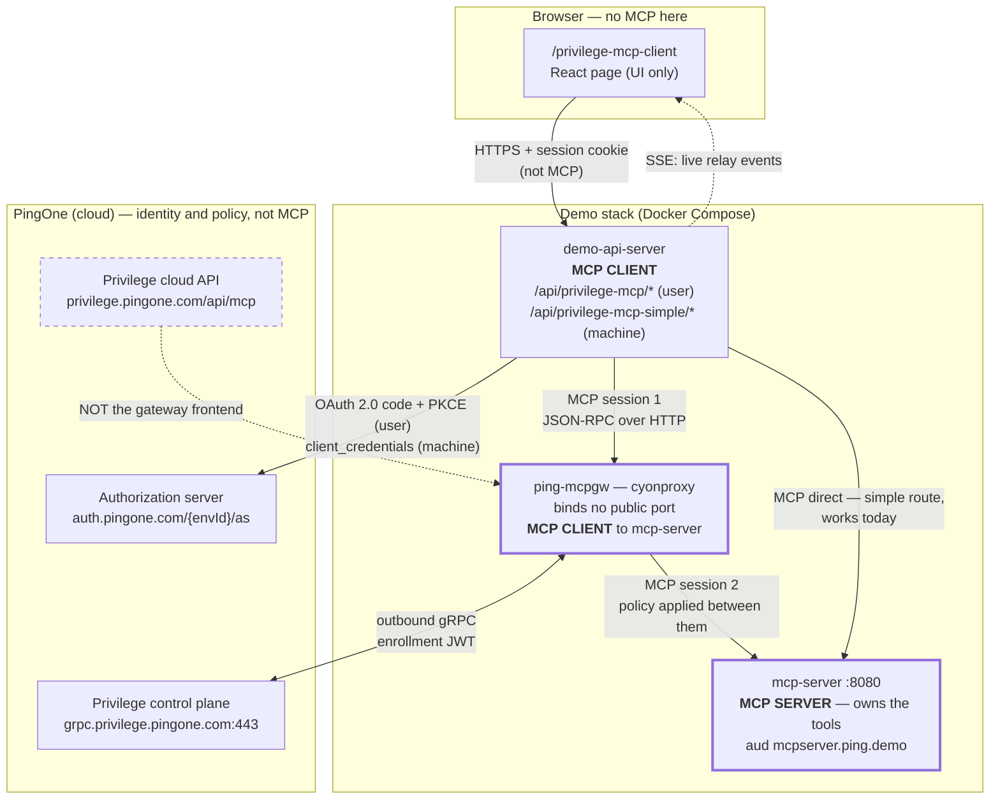
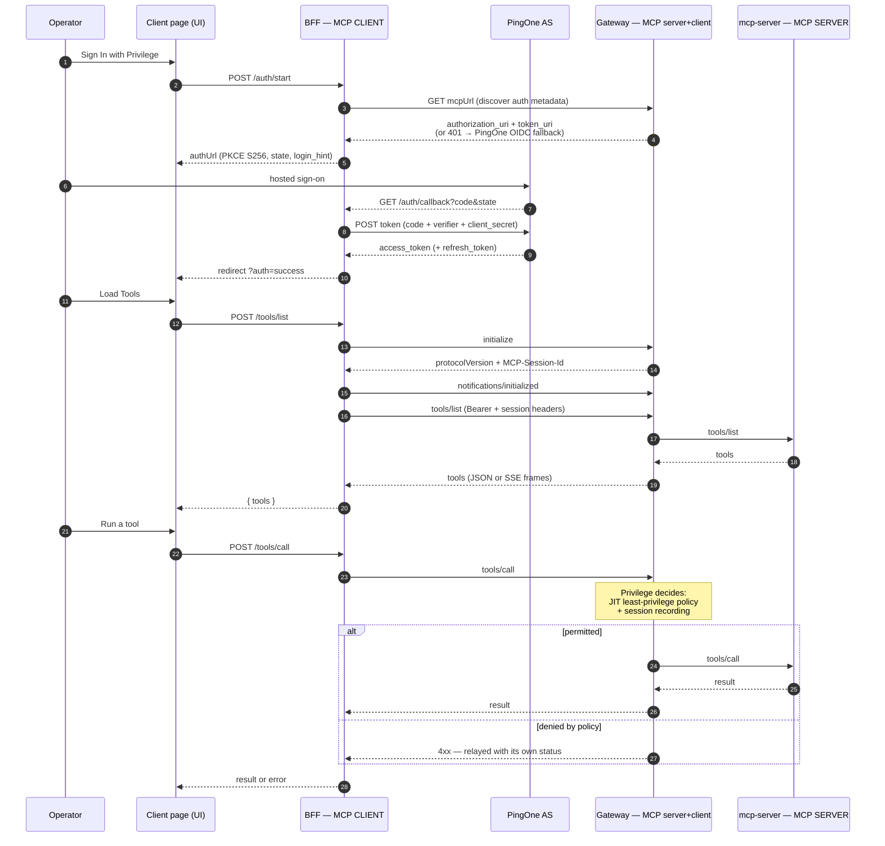

# Privilege MCP — what it is, how it works, and how it is wired here

PingOne Privilege is Ping's privileged-access product. Its **MCP Gateway (MCPGW)** is an
inline security gateway for the Model Context Protocol: an MCP client points at the
gateway instead of at the MCP server, and the gateway applies just-in-time,
least-privilege authorization to every `tools/call`, records the session, and forwards
what it permits to an **unchanged** MCP server.

That last part is the demo's whole point. `demo_mcp_server` needs no Privilege-specific
code. Policy and session recording are authored in the PingOne Privilege console, and the
gateway enforces them on the wire.

This repo contains a **client** for that gateway (`/privilege-mcp-client`), a **BFF relay**
that drives the OAuth and MCP protocol on the client's behalf, and Compose/K8s wiring for
running the gateway itself.

> Status as of 2026-08-03: the client, the relay and the protocol handling all work, and
> `/api/privilege-mcp-simple` performs a real token-to-MCP call end to end. The **gateway**
> path is blocked on two Privilege-side problems that no change in this repo can reach: the
> enrolled node never dispatches a discovery to the backend, and the cloud frontend accepts
> no token this PingOne environment can mint. See
> [Current state](#current-state-verified-2026-08-02-re-verified-2026-08-03).

---

## Who is the MCP client, and who is the MCP server

Read this first. Almost every confusion about this feature comes from losing track of which
side of the protocol a component is on.

MCP has exactly two roles. A **client** opens a session and calls `tools/list` and
`tools/call`. A **server** owns the tools and answers. Everything else — gateway, relay,
proxy — is one of those two roles wearing a costume.

| Component | MCP role | Talks to |
|---|---|---|
| Privilege MCP Client page (browser) | not an MCP participant — it is a UI that drives the BFF | the BFF, over plain HTTPS |
| **BFF relay** (`/api/privilege-mcp/*`, `/api/privilege-mcp-simple/*`) | **MCP CLIENT** | the gateway, or the MCP server directly |
| **Privilege MCP Gateway** (`ping-mcpgw`) | **BOTH** — MCP *server* to the BFF, MCP *client* to `mcp-server` | BFF inbound; `mcp-server` outbound |
| **`mcp-server`** (`demo_mcp_server`) | **MCP SERVER** — owns the tools | answers whoever presents a valid token |
| PingOne AS / Privilege control plane | neither — identity and policy planes | OAuth and gRPC, not MCP |

Three consequences worth internalising:

1. **The browser is never an MCP client here.** It cannot be: MCP needs a client secret and
   a service-to-service token. The page clicks buttons; the BFF speaks MCP. That is why
   every MCP concept (`initialize`, session id, protocol version) lives in the BFF routes
   and not in React.
2. **The gateway is a man-in-the-middle by design.** It terminates one MCP session from the
   BFF and opens a second one to `mcp-server`. That is precisely what lets it apply policy
   and record the session — and why `mcp-server` needs no Privilege-specific code.
3. **The MCP server is the resource, not the gateway.** Tokens for tool calls carry
   `aud: mcpserver.ping.demo`. A token minted for the gateway's own audience will not open
   a tool call, and vice versa. Most "401 / insufficient scope" confusion is an audience or
   scope mismatch, not a broken gateway.

The demo can run the client role two ways:

| Route | MCP client | Identity it carries | Works today |
|---|---|---|---|
| `/api/privilege-mcp` | BFF, on behalf of a signed-in human | user token (OAuth code + PKCE) | needs the console steps |
| `/api/privilege-mcp-simple` | BFF, as itself | machine token (`client_credentials`) | yes — verified end to end |

---

## Moving parts

| Component | MCP role | Where it runs | Identity | Notes |
|---|---|---|---|---|
| Privilege MCP Client page | UI only | Browser, `/privilege-mcp-client` | the signed-in demo user | React page; drives everything through the BFF |
| BFF interactive relay | MCP client | `demo-api-server`, `/api/privilege-mcp/*` | express session + user token | [`routes/privilegeMcpClient.js`](../demo_api_server/routes/privilegeMcpClient.js) — OAuth PKCE, MCP JSON-RPC relay, SSE event stream |
| BFF simple relay | MCP client | `demo-api-server`, `/api/privilege-mcp-simple/*` | machine token | [`routes/privilegeMcpSimple.js`](../demo_api_server/routes/privilegeMcpSimple.js) — `client_credentials` in, MCP out; no browser flow |
| Privilege MCP Gateway (MCPGW) | server **and** client | `ping-mcpgw` container (binds no public port; frontend is cloud-hosted) | enrollment JWT | image `public.ecr.aws/s7q1z8z4/privilege-proxy`, binary `/procyon/bin/cyonproxy`; Compose profile `mcpgw`; reads `pingone.env` from `/var/lib/procyon/config` |
| PingOne authorization server | — | `auth.pingone.com/<envId>/as` | OAuth client | mints both the user and machine tokens |
| PingOne Privilege control plane | — | `grpc.privilege.pingone.com:443` | enrollment JWT | the gateway dials **out**; no inbound firewall holes |
| Privilege cloud API | — | `privilege.pingone.com/api/mcp` | Privilege session | tenant API — **not** the gateway frontend (see [Current state](#current-state-verified-2026-08-02-re-verified-2026-08-03)) |
| MCP server | **MCP server** | `mcp-server:8080/mcp` | audience `mcpserver.ping.demo` | the protected resource; Privilege-unaware |

"Procyon" appears throughout the gateway's wire protocol and binary names — it is the
product Privilege was built from, so `x-procyon-session-id` and `cyonproxy` are expected,
not stray artifacts.

---

## Protocols on each hop

**1. Browser to BFF** — ordinary HTTPS + the demo's express session cookie. One extra
channel: `GET /api/privilege-mcp/events` is a **Server-Sent Events** stream. Every OAuth
phase, every relayed request and every upstream response is mirrored to the page live, so
the demo can show the protocol rather than describe it.

**2. BFF to PingOne — OAuth 2.0 authorization code + PKCE.** The relay generates a 48-byte
verifier, sends `code_challenge_method=S256`, and pins `state`. Credentials go in the body
(`client_secret_post`). `login_hint` is set from `PRIVILEGE_LOGIN_HINT` so the operator
lands on the Privilege user rather than whoever the browser last used. Tokens are refreshed
one minute before expiry, and a `401` from the gateway triggers exactly one refresh-and-retry.

**3. BFF to gateway — MCP over HTTP, JSON-RPC 2.0.** The handshake is mandatory and ordered:

```
initialize                    → server returns its protocolVersion
notifications/initialized     → no response expected
tools/list  / tools/call      → the actual work
```

Three headers carry the session:

| Header | Set by | Purpose |
|---|---|---|
| `MCP-Session-Id` | server, echoed by client | MCP session, captured from the `initialize` response |
| `mcp-protocol-version` | client | required by Privilege on every non-`initialize` request |
| `x-procyon-session-id` | client | required by Privilege on **every** request, including discovery |

Responses arrive as JSON **or** as an SSE-framed body (`data:` lines). `decodeMcpBody()`
handles both, taking the last parsable `data:` frame — a plain `JSON.parse` breaks against
a streaming gateway.

**4. Gateway to MCP server** — plain MCP to `http://mcp-server:8080/mcp`. The gateway is a
proxy, so the MCP server sees a normal client.

**5. Gateway to Privilege control plane** — outbound gRPC to `grpc.privilege.pingone.com:443`,
authenticated by the enrollment JWT from the console's gateway wizard. This is how policy
reaches the gateway and how session recordings leave it.

---

## Architecture

Boxes are labelled with their MCP role. Note the gateway is a server on its left edge and a
client on its right — that double role is the whole mechanism.



## Sign-in and one tool call



---

## BFF endpoint reference

All mounted at `/api/privilege-mcp` ([`server.js`](../demo_api_server/server.js)).

| Method | Path | Purpose |
|---|---|---|
| GET | `/events` | SSE stream of OAuth, relay and error events |
| GET | `/state` | config, whether OAuth is authenticated, cached tools |
| POST | `/config` | set `mcpUrl`, `clientId`, `scopes`, LLM settings; resets MCP state |
| POST | `/auth/start` | discovery + PKCE, returns `authUrl` |
| GET | `/auth/callback` | code exchange, stores tokens, redirects to the page |
| POST | `/tools/list` | `initialize` if needed, then `tools/list` |
| POST | `/tools/call` | invoke one tool by name |
| POST | `/rpc` | raw JSON-RPC passthrough |
| POST | `/chat` | LLM loop that picks tools and calls them |
| GET/PUT | `/env` | read/write the gateway's own OIDC settings file (allowlisted keys) |

Relay handlers surface the **upstream** status: an upstream 4xx passes through, anything
else becomes 500. A Privilege policy DENY therefore reaches the page as a 4xx with its
reason, not as an opaque server error.

### The simple relay — `/api/privilege-mcp-simple`

Same MCP client role, no human. Use it to prove the token-to-MCP path without any console
prerequisite, and as the Postman target
([`postman/Privilege-MCP-Simple.postman_collection.json`](../postman/Privilege-MCP-Simple.postman_collection.json)).

| Method | Path | Purpose |
|---|---|---|
| GET | `/status` | target URL, mTLS on/off, whether a token is cached |
| POST | `/tools/list` | mint if needed, handshake, list tools |
| POST | `/tools/call` | invoke one tool by name |

Two details that are easy to get wrong and are pinned by tests:

- **Name the scopes.** A bare `client_credentials` on the Privilege SSO app is rejected —
  *"May not request scopes for multiple resources"* — because the app holds grants on three
  resources. And `mcp:invoke` alone opens the transport but fails every tool with
  *"Insufficient scope for tool 'get_my_accounts'"*. The working value is
  `read write mcp:invoke`, all on the `mcpserver.ping.demo` resource.
- **Send `mcp-protocol-version`** on every non-`initialize` request, taken from the
  `initialize` response, or the MCP server answers `400`.

A `client_credentials` token is a machine identity with no user, so `get_my_accounts`
correctly returns `count: 0`. User-scoped data needs the interactive route.

The default target's scheme follows `MCP_MTLS_ENABLED`, because `mcp-server` serves TLS
on 8080 only when mTLS is on. Overriding `PRIVILEGE_SIMPLE_MCP_URL` opts out of that — get
the scheme wrong and the relay fails with a TLS `EPROTO`, not a 4xx. See
[The simple relay's default URL vs the mTLS switch](#the-simple-relays-default-url-vs-the-mtls-switch-resolved-2026-08-03).

## Configuration

| Variable | Set in | Meaning |
|---|---|---|
| `PRIVILEGE_MCPGW_URL` | `docker-compose.yml` | MCP URL the client page defaults to — the console-assigned **cloud** frontend FQDN, never a local port |
| `PRIVILEGE_SIMPLE_MCP_URL` | env, optional | target of the simple relay; defaults to `http${MCP_MTLS_ON:+s}://mcp-server:8080/mcp`, i.e. the scheme follows the mTLS switch ([why](#the-simple-relays-default-url-vs-the-mtls-switch-resolved-2026-08-03)). Point at the gateway to route the same code through Privilege |
| `PRIVILEGE_SIMPLE_SCOPE` | env, optional | scopes for the machine token; defaults to `read write mcp:invoke` |
| `PRIVILEGE_SSO_CLIENT_ID` / `_SECRET` | `docker-compose.yml` | OAuth client for the user sign-in |
| `PRIVILEGE_SSO_ENV_ID` | `docker-compose.yml` | env used for OIDC discovery fallback |
| `PRIVILEGE_LOGIN_HINT` | `docker-compose.yml` | pre-fills the Privilege user at sign-on |
| `PRIVILEGE_MCP_CALLBACK_HOST` | env, optional | overrides the callback host (default `local.ping-devops.com:4000`) |
| `PRIVILEGE_PROXY_TOKEN` | root `.env` | enrollment JWT passed to the gateway as `ENV_PROXY_TOKEN` |
| `ping-mcpgw/config/proxy-token` | file, gitignored | same JWT; the proxy persists its exchanged copy into the `mcpgw-ssl` volume |
| `ping-mcpgw/config/pingone.env` | file, gitignored | `SERVER_URL` + the OIDC endpoints the gateway uses to authenticate MCP clients. Mounted at `/var/lib/procyon/config`. The BFF can author it via `PUT /api/privilege-mcp/env` |

Gateway setup — registering it, attaching an MCP Server application, authoring the DENY
rule, enabling recording — is in [`ping-mcpgw/README.md`](../ping-mcpgw/README.md). Those
console steps cannot be covered by any test in this repo: every check here can pass while
the demo still shows nothing.

---

## Current state (verified 2026-08-02, re-verified 2026-08-03)

**The demo side is complete, proven, and deployed.** Two defects found on 2026-08-03 are
fixed and live-verified against the running stack:

| Fixed | Live evidence |
|---|---|
| The simple relay's target scheme now follows the mTLS switch (#1285) — it was dying on `EPROTO` before reaching MCP | `/api/privilege-mcp-simple/tools/list` returns **225 tools**; `tools/call get_my_accounts` returns `{"success":true,"count":0}` |
| `notifications/initialized` no longer 401s (#1292), so the spec-mandatory handshake completes without a bearer | from inside the gateway container: `initialize` 200, `notifications/initialized` **202**, `tools/list` **241 tools** |

**The gateway path is blocked on two Privilege-side problems, neither reachable from this
repo:**

1. [The enrolled node receives backend config but never dispatches a
   discovery](#the-node-receives-config-but-never-dispatches-a-discovery-open-2026-08-03)
   — fix this first; nothing downstream is testable while the gateway never contacts the
   backend.
2. [The cloud frontend accepts no token this PingOne environment can
   mint](#the-one-blocker-privilege-does-not-trust-this-environments-issuer) — a
   Privilege-issued console token authenticates; every `01d89b06` token does not.

A third would-be blocker is gone: `AuthMode` was found set to **static-token** on the
`mypingone` app (the doc's own trap warns mTLS must be off for the backend to work, and the
static-token flip was never reverted). It is back on **OAuth** with the client secret
populated. Read it yourself with the
[console API recipe](#reading-privileges-real-config-use-the-console-api-not-cyctl) rather
than trusting the console UI, which serves stale values once its session expires.

### How the frontend actually works

This took several wrong turns, so it is worth stating plainly: **the MCP frontend is
hosted in the cloud, not on your machine.** The Privilege console assigns each MCP Server
application an FQDN (Agentic Apps -> `mypingone` -> Frontend Name, read-only):

```
mypingone-app-default.applications.privilege.pingone.com:8643
```

That name resolves to Privilege (`18.220.252.186`), which routes over the mesh to the
enrolled private proxy, which forwards to Backend Name. The local container therefore
binds **no** MCP port — inside it, only `:8090` on loopback is listening, forever. Time
was lost publishing `:8680`, then `:8623` (the "MCP traffic port" from the product docs),
then `:8643`, all hunting a listener that does not exist in this topology. The tell:
probing the FQDN gives a real HTTP challenge, while every local port gives no listener.

### What works

| Step | Evidence |
|---|---|
| Gateway enrolled | `Node 570afb32-… established command stream`; console shows **Success** |
| Mesh links up | `LinkStatus: Active` both directions; reachability heartbeats every 30s |
| Config reaches the node | `Created backend node … BackendDomains:http://host.docker.internal:8080` in `cyonproxy.log` within seconds of every console save |
| Cloud frontend reachable | `401 "Bearer Token not found."` — an auth challenge, not a connection error |
| Backend answers correctly | from **inside** the proxy container: `initialize` 200 / `notifications/initialized` 202 / `tools/list` 241 tools |
| Demo sign-in | `?auth=success`, `authenticated: true`, scope `mcp:invoke openid` |

Re-verified 2026-08-03: enrolled node still `570afb32-…` (`/procyon/ssl/proxy-crt.pem`
carries `OU=570afb32-…`, and the log shows a fresh `established command stream`); the
frontend still answers `Bearer Token not found.` unauthenticated; the container still
binds only `127.0.0.1:8090` (`0100007F:1F9A` in `/proc/net/tcp`).

**The tool catalogue the console displays is not evidence of a working backend hop.** It is
a cached `Status.McpServerStatus.McpTools` from an older successful discovery; the console
re-renders it (and any stored error) indefinitely. Judge the backend by probing it from
inside the proxy container, as the row above does.

### The simple relay's default URL vs the mTLS switch (resolved 2026-08-03)

For one day the relay returned `500` on every call:

```
write EPROTO ...:error:0A00010B:SSL routines:tls_validate_record_header:wrong version number
```

`mcp-server` listens on one port, 8080, and only speaks TLS when mTLS is on. The relay's
default target was a hardcoded `https://mcp-server:8080/mcp`, while `MCP_MTLS_ON` is empty
in the root `.env` — so it was speaking TLS at a plaintext port. Every other consumer
derives its scheme from that switch (`http${MCP_MTLS_ON:+s}://…` in `docker-compose.yml`);
this route did not.

The collision is worth remembering, because both halves are load-bearing: **mTLS must be
off for the console-configured backend to work** (see the trap below), and mTLS being off
is exactly what broke this default. A fixed scheme could not be right in both states.

Fixed in [`routes/privilegeMcpSimple.js`](../demo_api_server/routes/privilegeMcpSimple.js):
`targetUrl()` now derives the scheme from the same `MCP_MTLS_ENABLED` flag that decides
whether to attach a client cert, so the two can never drift apart again. An explicit
`PRIVILEGE_SIMPLE_MCP_URL` still wins, which is how you point the route at the gateway.

The escape was that the test always set `PRIVILEGE_SIMPLE_MCP_URL`, so it never exercised
the default — the suite stayed green while the route was dead. `tests/routes/privilegeMcpSimple.test.js`
now asserts the default in both switch positions.

### The one blocker: Privilege does not trust this environment's issuer

With a valid PingOne token the frontend answers:

```
401 Authorization header JWT parsing failed JWT signature validation failed
    header: {"alg":"RS256","kid":"default"}
```

The token is correctly signed — `kid: default` **is** published in the environment's JWKS
(`https://auth.pingone.com/01d89b06-…/as/jwks`). Privilege is validating it against a
different issuer's keys. That fits the identity split visible in the console: the Privilege
admin `cmuir+ssoAdmin@pingone.com` is a **Ping SSO User** and does not exist in environment
`01d89b06`, while the demo's users (`demoUser`, `cmuir+ssoEndUser`) do.

**Do not read that error string as evidence of anything specific.** It is a catch-all: the
frontend returns byte-identical text for a valid RS256 PingOne token, for Privilege's own
ES256 enrollment JWT, for the literal configured static token `STaticToken`, and for the
bare string `not-a-jwt` — which has no signature to validate at all. The conclusion above
rests on the *positive* result instead: a Privilege-issued console token (`iss
https://auth.pingone.com/8d4d7a4c-…/as`, `aud: procyon`) clears authentication and reaches
authorization, answering `User 4c746ea6-… doesn't have access to MCP app mypingone`. One
issuer gets in, the other never does.

So Privilege must be told to trust:

```
https://auth.pingone.com/01d89b06-66d5-430e-9f28-65636843788b/as
```

Reproduce it in one paste — mint a machine token and hand it to the cloud frontend. Two
seconds, and it saves re-deriving the whole chain:

```bash
CID=$(docker exec ai-demo-api-server printenv PRIVILEGE_SSO_CLIENT_ID)
CS=$(docker exec ai-demo-api-server printenv PRIVILEGE_SSO_CLIENT_SECRET)
EID=$(docker exec ai-demo-api-server printenv PRIVILEGE_SSO_ENV_ID)
TOK=$(curl -s -X POST "https://auth.pingone.com/$EID/as/token" \
  -d grant_type=client_credentials -d "client_id=$CID" -d "client_secret=$CS" \
  -d "scope=read write mcp:invoke" | python3 -c "import sys,json;print(json.load(sys.stdin)['access_token'])")
curl -sk -X POST "$(docker exec ai-demo-api-server printenv PRIVILEGE_MCPGW_URL)" \
  -H "Authorization: Bearer $TOK" -H 'Content-Type: application/json' \
  -H 'Accept: application/json, text/event-stream' \
  -d '{"jsonrpc":"2.0","id":1,"method":"initialize","params":{"protocolVersion":"2025-06-18","capabilities":{},"clientInfo":{"name":"probe","version":"1"}}}'
```

Still `JWT signature validation failed` on 2026-08-03, from a token whose `iss` is this
environment and whose `aud` is `mcpserver.ping.demo`.

Ruled out by experiment, so nobody repeats them:

- **It is not scope.** Requesting `openid profile email mcp:invoke` to match the app's
  declared scopes changes nothing — same signature error.
- **It is not the Agentic App's OAuth endpoints.** Those sit under Backend URL and govern
  the gateway -> backend hop. Saving them with this environment's Authorization/Token URLs
  changes nothing for inbound client tokens.
- **It is not solvable with a static token.** Setting Auth Mode to Static Token yields
  `JWT parsing failed … STaticToken` — the frontend parses *any* bearer as a JWT, so that
  field is backend-facing too. Leave Auth Mode on OAuth; a static value here breaks the
  working backend hop, since `mcp-server` requires a real PingOne token.
- **Discovery cannot self-configure it.** Every metadata endpoint on the frontend
  (`/.well-known/oauth-protected-resource`, `-authorization-server`,
  `openid-configuration`) returns the same 401, so `discoverAuth()` learns nothing and
  falls back to this environment — which is exactly the issuer being rejected.

### Independent confirmation from the environment side

Enumerating all **25 resources** in environment `01d89b06` shows why no token minted here
can satisfy Privilege: every resource is a demo audience (`*.ping.demo`,
`a2a-intermediate-*`, `agent`, `content`, `test`) plus the built-in `PingOne API` and
`openid`. **There is no Privilege resource**, so no application in this environment can
mint a token carrying a Privilege audience. That is the same conclusion the JWKS evidence
reaches, from the opposite direction.

Reading grants needs **basic auth** on the worker credential — `client_secret_post` gives
`401 invalid_client "Unsupported authentication method"`:

```bash
WID=$(docker exec ai-demo-api-server printenv PINGONE_WORKER_CLIENT_ID)
WS=$(docker exec ai-demo-api-server printenv PINGONE_WORKER_CLIENT_SECRET)
WT=$(curl -s -u "$WID:$WS" -X POST "https://auth.pingone.com/$ENVID/as/token" \
  -d grant_type=client_credentials | python3 -c "import sys,json;print(json.load(sys.stdin)['access_token'])")
curl -s -H "Authorization: Bearer $WT" \
  "https://api.pingone.com/v1/environments/$ENVID/applications/6586d3de-b916-454c-84e5-6d21b572a534/grants"
```

The app `6586d3de` holds three grants across three resources (`Demo MCP JWT Verifier`,
`Demo MCP Invest`, `Demo MCP Server`) — which is why a scopeless `client_credentials`
request is refused with "May not request scopes for multiple resources".

### Reading Privilege's real config — use the console API, not `cyctl`

Privilege does not keep its real configuration in this repo, and for a while this document
claimed the only way to read it was `cyctl`, blocked on a credential nobody had. **That was
wrong.** The console's own REST API answers with nothing more than the session cookie your
browser already holds, and it is how every Privilege-side fact below was established on
2026-08-03.

Grab two values from devtools (Network → any XHR to `console.privilege.pingone.com` → Request
Headers): the `auth_token` cookie and the `x-procyon-session-id` header. Then:

```bash
TENANT=8d4d7a4c-de40-4f71-9b98-0c3507cd4d1b     # the Privilege tenant / PingOne env
TOK='eyJ...'                                     # auth_token cookie value
SID='cb2db637-...'                               # x-procyon-session-id header

curl -s "https://console.privilege.pingone.com/api/$TENANT/v1/applications?ObjectMeta.Namespace=default" \
  -b "auth_token=$TOK" -H "x-procyon-session-id: $SID" -H 'accept: application/json' \
  | python3 -c "import sys,json; print(json.dumps(json.load(sys.stdin)['Applications'][0]['Spec']['McpAppConfig'], indent=1))"
```

That prints the complete `McpAppConfig` — `FrontEndName`, `Backends`, `EntryPath`,
`AuthMode`, `AuthToken`, and the whole `ResourceOAuth` block. Other useful collections
follow the same shape: `/v1/pacpolicys` (access policies — an empty list is why tool calls
answer *"User … doesn't have access to MCP app"*), `/v1/tenantprofiles`, `/v1/servers`.

Two gotchas. The session token is short-lived — about **60 minutes** — and when it expires
the console does not say so; it renders **"Gateway Unreachable — Showing Cached Data"** and
replays stale values, which reads exactly like a live failure. And every request needs
`x-procyon-session-id`: without it `privilege.pingone.com` answers `400 Procyon required
header is missing` on every path, including `.well-known`.

Sign-in note: `console.privilege.pingone.com` cannot mint its own session. Enter through
`https://console.pingone.com/?env=8d4d7a4c-de40-4f71-9b98-0c3507cd4d1b` (the bare
`console.pingone.com` URL errors with *"Invalid Sign-on URL"*), authenticate as the Ping SSO
admin, then launch PingOne Privilege from that environment.

**Two environments, easily conflated:** `8d4d7a4c-…` is Privilege's own PingOne environment
— the issuer of the console token, and the `tenant` in the gateway's enrollment JWT.
`01d89b06-…` is AI-Demo, where the banking demo and its users live. Both are real PingOne
environments and both answer `/.well-known/openid-configuration`.

### `cyctl` — the admin CLI, and why you do not need it

Kept for the record: the CLI exists in the container but is blocked, and the console API
above supersedes it entirely.

Inside the proxy container:

```
/procyon/bin/cyonproxy      the proxy daemon
/procyon/bin/cyctl          Privilege's admin CLI   <-- the important one
/procyon/ssl/               live node state (docker volume ai-demo_mcpgw-ssl)
/var/lib/procyon/config/    our bind-mount of ping-mcpgw/config (pingone.env)
```

`ping-mcpgw/config/pingone.env` supports only seven keys — `SERVER_URL`, `OIDC_CLIENT_ID`,
`OIDC_CLIENT_SECRET`, `OIDC_AUTH_URL`, `OIDC_TOKEN_URL`, `OIDC_USER_URL`, `OIDC_SCOPES`.
No issuer, no `jwks_uri`. **Do not conclude the issuer cannot be configured** — that
inference was made once and was wrong. `cyctl` is the real admin surface:

```
cyctl object application  create | get | list | update | delete
cyctl object accesspolicy ...
cyctl authn challenge | cyctl admin | cyctl tenant | cyctl device
```

It is blocked on a credential nobody has here — read the app object over the console API
instead:

```
cyctl --token <enrollment JWT> object application list
  -> token validation failed: unexpected signing method: ES256
cyctl token jwt <tenant> <org> <user> <device-id>
  -> Error: token is required: pass --token or set TOKEN env variable
```

The enrollment JWT is ES256 — a *node* identity; `cyctl` wants a *user* auth JWT, and its
own minting path needs a token to mint a token. Checking every global flag confirms there
is no alternative: `--apigw`, `--apisrv`, `--device-svc`, `--nameserver`, `--namespace`,
`--notary`, `--notarysvc`, `--tenant`, `--token`. **No cert, key or client-credentials
option** — so the node's own mTLS identity cannot be substituted.

Its default `--apigw` is `http://localhost:8643`, which is the useful detail: **8643 is
Privilege's API-gateway port convention**, not something specific to MCP. That is why the
console-assigned frontend carries it.

What would unblock it: a `cyctl` auth token (`--token` or `TOKEN`), or whatever admin
credential Privilege issues for CLI use. Not worth chasing — the console API reads and
writes the same objects.

### Traps that cost hours

- **`docker logs ai-demo-ping-mcpgw` is nearly empty.** The proxy writes to
  `/var/log/procyon/cyonproxy.log` inside the `mcpgw-logs` volume. Every diagnosis here
  went through `docker run --rm -v ai-demo_mcpgw-logs:/logs alpine tail /logs/cyonproxy.log`.
- **An expired enrollment token does NOT stop the proxy.** The JWT is consumed once to
  obtain an mTLS client cert (`/procyon/ssl/proxy-crt.pem`, valid to **2036-01-26**); node
  identity rides on the cert thereafter. Do not diagnose "expired token" from the file's
  `exp` alone — check whether the container is running and linked. It only matters on
  first boot or after `ai-demo_mcpgw-ssl` is deleted. **Get a fresh JWT from the console
  before ever wiping that volume**, because the one on disk will be expired. This is not
  hypothetical: as of 2026-08-03 `ping-mcpgw/config/proxy-token` expired at
  `2026-08-03T01:23Z` while the container kept running normally — so deleting
  `ai-demo_mcpgw-ssl` today would be unrecoverable without a console visit first.
- **`nc -z` reports 8623/8643 open even with nothing serving.** Docker publishes the port
  regardless. Use `curl` against `/mcp`, or check real listeners with
  `docker exec … cat /proc/net/tcp` — only `127.0.0.1:8090` ever binds.
- **`ping-mcpgw/config/proxy-token` once held the literal placeholder `eyJ...`** (6 bytes).
  Compose passes it as `ENV_PROXY_TOKEN` and the container crash-looped with
  `token contains an invalid number of segments`.
- **Do not run `docker compose up` directly** — a hook blocks it after repeated
  name-squatting collisions between parallel sessions. Use `./run-docker.sh`;
  `restart <svc>` force-recreates, so env changes are picked up.
- **mTLS must be off for the console-configured backend to work.** `MCP_MTLS_ON` drives
  four services at once; with it on, the app's `http://host.docker.internal:8080/mcp`
  backend returns 403. Bearer enforcement is unchanged either way — only the transport
  cert requirement goes.

### The node receives config but never dispatches a discovery (open, 2026-08-03)

Separate from the inbound-token blocker, and the reason the console keeps showing
*"Error discovering MCP server"*. The chain is broken at one hop:

| Hop | State |
|---|---|
| Console -> control plane | works — app objects create and save |
| Control plane -> node | works — `Created backend node … BackendDomains:http://host.docker.internal:8080` lands in `cyonproxy.log` within seconds of every save |
| **Node -> backend** | **never attempted** — zero connections at the destination, zero errors in the proxy log |
| Backend handshake | correct — see below |

The backend is provably healthy from inside the proxy container itself
(`docker exec ai-demo-ping-mcpgw python3 …`, or `curl`, against
`http://host.docker.internal:8080/mcp`): `initialize` 200, `notifications/initialized` 202,
`tools/list` 241 tools. So this is not connectivity, DNS, or the MCP server.

Ruled out by experiment, so nobody repeats them:

- **Not a stale status field.** A brand-new Agentic App with an empty
  `Status.McpServerStatus` was created (`http-New`, same backend, same mesh cluster); its
  config reached the node in seconds and it too produced no connection in the following
  150s.
- **Not the gateway node.** Mesh links report `LinkStatus: Active`, reachability heartbeats
  run every 30s, and config propagation is immediate. Re-enrolling replaces a component
  that is working — and costs the `ai-demo_mcpgw-ssl` identity.
- **Not the handshake bug.** That was real and is fixed (see the §4 entry for
  `notifications/initialized`), verified against the rebuilt image. Discovery has not
  reached the server once since.

**The question for Ping:** what triggers a discovery run on an enrolled private proxy, and
why would it not fire when the app's backend config demonstrably arrives at the node?

Note the console never surfaces this honestly. Once its ~60-minute session expires it shows
**"Gateway Unreachable — Showing Cached Data"** and replays the last stored error string, so
the same modal appears whether discovery just failed, or was never attempted at all. Read
`Status.McpServerStatus` over the console API before believing the UI.

### Loose ends

- **A stale node identity sits in `ping-mcpgw/config/ssl/`** — inside the directory
  bind-mounted to `/var/lib/procyon/config`. It is two artifacts, not one: `proxy-token.data`
  is an **expired** enrollment JWT for node `a7d08406-…` (`exp` 2026-07-31), while the
  `proxy-crt.pem` beside it is a still-valid cert (to 2036-01-26) carrying
  `OU=a7d08406-…`. Neither is the live identity — the running node's cert, in the
  `ai-demo_mcpgw-ssl` volume, carries `OU=570afb32-…`. Two identities visible to the proxy
  is a plausible source of the repeating `has same NodeURL` error. Untouched; confirm
  before removing.
- **Duplicate node registrations.** The control plane still lists `a7d08406-…`,
  `9a8bddf5-…` and `e40f4540-…` alongside the live node. As of the 2026-08-02 re-enrolment
  the live node is **`570afb32-366a-48aa-9623-8e82341e3b52`** — earlier notes name
  `e40f4540-…` as live, which is now stale. **Never delete the row matching the running
  node:** that invalidates enrollment, and recovery needs a valid JWT from the console.
- The `has same NodeURL` line logs at **`level=error`**, not warning, and repeats every
  ~15-30s (still doing so on 2026-08-03). Ignore the severity: enrollment works and the
  command stream is up. It is cleanup, not the blocker.

### Already tested — do not repeat

- **The interactive `authorization_code` sign-in fails the same way.** An earlier handoff
  listed this as the top untested lead, on the theory that the user flow might validate via
  `/userinfo` rather than JWT signature. It was driven end to end through the browser on
  2026-08-02 — `?auth=success`, `authenticated: true`, scope `mcp:invoke openid` — and
  `tools/list` still returned `JWT signature validation failed`. The failure is **not**
  specific to machine tokens.
- **Scope alignment, the app's OAuth endpoints, static token, metadata discovery** — all
  four disproved; see the blocker section above.
- **Creating the Privilege admin's username in the demo environment does nothing.** On
  2026-08-03 `cmuir+ssoAdmin@pingone.com` was created in `01d89b06` (id `34bedfef-…`) on the
  theory that the identity split was the cause. Signature validation happens on the raw JWT
  before any claim is parsed, so Privilege never reaches a user lookup. Two accounts sharing
  an email are not the same identity — the Privilege admin is a Ping SSO user in `8d4d7a4c`.
- **A second client in the same environment fails identically.** App `873cc9e4` (from
  `postman/Privilege-MCP-Gateway.postman_environment.json`, `client_secret_basic`) mints a
  token with a real `kid`, not `default` — and is rejected the same way. The issue is the
  issuer, not key resolution.
- **A brand-new Agentic App does not trigger a reachable discovery** — see the
  discovery-dispatch section above.

### Order to fix

1. **Ask Ping why discovery never dispatches** (section above). Nothing downstream can be
   tested while the gateway never contacts the backend, and the evidence is complete: config
   arrives at the node, no connection follows, the backend answers correctly when probed
   from inside that same container.
2. **Ask Ping what token an MCP client should present to Frontend Name.** A Privilege-issued
   console token authenticates; every token this PingOne environment can mint does not.
   Whether an Agentic App can be told to trust an external issuer is the open question —
   `McpAppConfig` exposes `ResourceOAuth` (backend-facing) and no inbound issuer field.
3. **Author a policy** on the app once discovery works — `pacpolicys` is currently empty,
   which is why an authenticated console token still gets *"doesn't have access to MCP app
   mypingone"*. The console will not open the policy editor until a tool catalogue exists.
4. Re-run sign-in then `tools/list`. Everything else in the chain is already verified.
5. Independently, and not blocking: clear the stale `config/ssl/` node identity and the
   duplicate console registrations.

If instead the demo should authenticate against Privilege's own IdP, point
`PRIVILEGE_SSO_ENV_ID` (and the client id/secret) at `8d4d7a4c-…` — but the demo's users
live in `01d89b06`, so that trades this blocker for a broken demo everywhere else.


## Troubleshooting

| Symptom | Cause | Fix |
|---|---|---|
| `401 Not authenticated — click Sign In with Privilege` | no access token in the relay session | run the OAuth flow |
| `401 User is not authorized for privilege.pingone.com/api/mcp` | pointed at the cloud API, or the gateway is not enrolled | the three items above |
| `Failed to discover OAuth metadata from MCP URL` | MCP URL unreachable and no OIDC fallback resolved | check `PRIVILEGE_MCPGW_URL` and the gateway |
| `MCP gateway returned 502 Bad Gateway` | gateway up, upstream MCP server down or the user lacks tool entitlement | check `mcp-server`, then console policy |
| Tools load but a call is denied | Privilege policy DENY — the demo working as intended | inspect the decision in the console |
| Page shows nothing and no error | policy/recording never authored in the console | `ping-mcpgw/README.md` setup steps |
| `500 write EPROTO … wrong version number` from `/api/privilege-mcp-simple` | an explicit `PRIVILEGE_SIMPLE_MCP_URL` whose scheme disagrees with `MCP_MTLS_ON` — `mcp-server` speaks TLS on 8080 only when mTLS is on | match the scheme, or unset the var and let the default follow the switch |
| Console: `Gateway Unreachable — Showing Cached Data` | the console session (~60 min) expired; every value on screen is stale, including error modals | sign in again via `console.pingone.com/?env=8d4d7a4c-…`, then launch Privilege |
| Console: `Error discovering MCP server: sending "notifications/initialized": Unauthorized` | if `mcp-server` predates the handshake fix, real; otherwise a stored string from an old attempt | verify with the tokenless handshake from inside the proxy container; if that returns 202, no new discovery has run |
| `400 Procyon required header is missing` from `privilege.pingone.com` | console API called without `x-procyon-session-id` | add the header, copied from any console XHR |
| `Invalid Sign-on URL` at `console.pingone.com` | admin console needs an explicit environment | `https://console.pingone.com/?env=<env-id>` |
| `401 Authorization header JWT parsing failed JWT signature validation failed` | Privilege does not trust this environment's issuer — the open blocker | [The one blocker](#the-one-blocker-privilege-does-not-trust-this-environments-issuer) |

## 2026-08-04: Fresh rebuild against Privilege's own tenant (8d4d7a4c) — still blocked, same symptom

Everything above this section was written against PingOne env `01d89b06` (AI-Demo, where the
banking demo's users live). On 2026-08-04 the user asked to tear down and rebuild clean,
then partway through explicitly pivoted the target to `8d4d7a4c-de40-4f71-9b98-0c3507cd4d1b`
— Privilege's *own* PingOne environment (previously called "Privilege Tenant" in the
`privilege-cloud-mcp` skill's identifier table). The hypothesis: since the doc above found a
Privilege-issued *console* token from `8d4d7a4c` clears authentication, maybe a customer OIDC
app registered in that same environment would too. **It does not.** Same `IssuerPublicKey:[]`
symptom, same 401, on a brand-new cluster/app/policy. This section is the state to resume
from — read it before repeating any of the diagnostic steps above, they were re-run here too.

### What's different now vs. the state documented above

- **Local Docker teardown done fresh**: all prior `mcpgw` containers (`ai-demo-ping-mcpgw`,
  `privilege-mcpgw`, `mcpgw-gw2`) and volumes (`ai-demo_mcpgw-*`, `mcpgw2-*`, `mcpgw-*`)
  removed. `ping-mcpgw/config/` reset to template (`pingone.env` regenerated from
  `.example`, `ssl/` cleared).
- **`docker-compose.yml` fixed** (PR #1374, merged to main as `43d81259`): the
  `demo-api-server` service used to bake `01d89b06` + the dead cloud-API URL + a stale
  client id/secret in as `${VAR:-default}` fallbacks under `environment:` — which, per the
  compose-env-shadow hygiene gate, **always overrides `env_file`** regardless of what's in
  `demo_api_server/.env`. Those four `environment:` entries (`PRIVILEGE_MCPGW_URL`,
  `PRIVILEGE_SSO_ENV_ID`, `PRIVILEGE_SSO_CLIENT_ID`, `PRIVILEGE_SSO_CLIENT_SECRET`) are now
  removed entirely from `docker-compose.yml`. They live **only** in
  `demo_api_server/.env` now (gitignored, main checkout only — not in this worktree).
- **New PingOne app in `8d4d7a4c`**: reused an existing app `deff60f5-5a67-4a6e-b283-47252856c89c`
  (was already sitting in the old broken `.env` config, turned out to already live in this
  tenant — not the `6586d3de` app the identifier table above documents, that one's in
  `01d89b06`). Confirmed redirect URI `https://local.ping-devops.com:4000/api/privilege-mcp/auth/callback`
  is registered on it.
- **New Privilege gateway cluster**: `ai-demo-fresh` (not `ai-demo-se`), created via the
  Privilege console's "Setup Gateways" modal — Private Proxy mode, `Get Docker Command`
  button, **not** the elaborate native-installer wizard (that one only offers RHEL/Debian/Ubuntu
  packages, no macOS — a dead end on this dev machine, don't try it again). Live node:
  `1cf90baf-2a83-45db-830f-581ea98110d1`. Enrollment JWT **expired 2026-08-04T18:44:28Z** —
  per the "traps that cost hours" section above, that's fine, the container has been running
  continuously since before expiry and doesn't need it again unless `ai-demo_mcpgw-ssl` gets
  deleted. **Get a fresh token from the console before ever wiping that volume.**
- **New MCP Server app**: `mcp-pingone-admin`, backend `http://mcp-server:8080/mcp`
  (compose-internal DNS, confirmed correct against the actual `mcp-server` service —
  `MCP_TLS_ENABLED=false`, plain HTTP, port 8080), Auth Mode Static Token with an empty
  value (mirrors `MCP_MTLS_ENABLED=false` already documented above — Privilege enforces
  policy at its own layer). Console-assigned Frontend Name:
  `mcp-pingone-admin-app-default.applications.privilege.pingone.com:8643` — confirms the
  per-app cloud-FQDN model this doc's earlier sections describe is still how it works; the
  `docker-compose.yml` comments describing "nothing binds locally" were correct.
- **Policy**: `FirstPolicy`, attached to both `Curtis MuirAdmin` (`cmuir+ssoAdmin@pingone.com`)
  and `Curtis MuirEndUser` (`cmuir+ssoEndUser@pingone.com`). **Time-bound, was "ends in an
  hour" as of ~16:52 UTC — almost certainly expired by the time anyone reads this.** Re-author
  it before testing further.
- **Discovery now dispatches** (new — this is actual progress over the state documented
  above, on a completely fresh app/cluster): the proxy log shows
  `Created backend node: ... BackendDomains:http://mcp-server:8080 ... MeshCluster:ai-demo-fresh`
  and `Created frontend node: ... Name:http-mcp-pingone-admin`, both timestamped
  `2026-08-04T21:08:3x` — several hours after the app was created at `16:52`, so this fired
  on some kind of delay or retry, not immediately. Worth another data point before concluding
  discovery dispatch is reliably fixed; it may just be timing.

### Current wiring (all confirmed set, as of 2026-08-04 ~21:10 UTC)

```ini
demo_api_server/.env (gitignored, main checkout):
  PRIVILEGE_MCPGW_URL=https://mcp-pingone-admin-app-default.applications.privilege.pingone.com:8643/mcp
  PRIVILEGE_SSO_ENV_ID=8d4d7a4c-de40-4f71-9b98-0c3507cd4d1b
  PRIVILEGE_SSO_CLIENT_ID=deff60f5-5a67-4a6e-b283-47252856c89c
  PRIVILEGE_SSO_CLIENT_SECRET=p_IYLrsDaRXv_W3W-zI~yk9799fQICYfdb16uJ1hausw__b01R9Ddc6h-uDQtXcz

root .env (gitignored, main checkout) — only PRIVILEGE_PROXY_TOKEN lives here now:
  PRIVILEGE_PROXY_TOKEN=<expired JWT, see above — fine, do not renew unless re-enrolling>

ping-mcpgw/config/pingone.env (gitignored, main checkout — NOTE: proxy never reads this,
see below):
  SERVER_URL=https://local.ping-devops.com:8623
  OIDC_CLIENT_ID=deff60f5-5a67-4a6e-b283-47252856c89c
  OIDC_CLIENT_SECRET=p_IYLrsDaRXv_W3W-zI~yk9799fQICYfdb16uJ1hausw__b01R9Ddc6h-uDQtXcz
  OIDC_AUTH_URL=https://auth.pingone.com/8d4d7a4c-de40-4f71-9b98-0c3507cd4d1b/as/authorize
  OIDC_TOKEN_URL=https://auth.pingone.com/8d4d7a4c-de40-4f71-9b98-0c3507cd4d1b/as/token
  OIDC_USER_URL=https://auth.pingone.com/8d4d7a4c-de40-4f71-9b98-0c3507cd4d1b/as/userinfo
```

`docker exec ai-demo-api-server env | grep PRIVILEGE` and
`curl -sk https://api.ping.demo:3001/api/privilege-mcp/state` both confirmed these values
landed correctly in the running container.

### New evidence on the same blocker: `pingone.env` is dead code

Grepped the full proxy log (`docker exec ai-demo-ping-mcpgw tail -2000
/var/log/procyon/cyonproxy.log`) for any reference to `auth.pingone.com`, `/jwks`,
`openid-configuration`, or even our own `pingone.env` / `OIDC_AUTH_URL` / `SERVER_URL`
strings: **zero hits, all of them.** The proxy never reads the config file this doc's
"Required host configuration" section and the Privilege console's own setup wizard both
describe writing. Whatever governs `IssuerPublicKey` for the per-app `AuthzMiddleware`
(`AuthzServer:mcp-pingone-admin`, confirmed still `IssuerPublicKey:[]` on this fresh tenant)
is a control-plane-side mechanism this repo cannot influence by editing that file. This
strengthens rather than contradicts the "ask Ping" conclusion above — it rules out one more
theory (that the OIDC endpoints we configure are simply not being *discovered correctly*)
in favor of the simpler one (they are never consulted for this purpose at all).

### Untested lead: "PingOne Privilege Administrator" role

Not yet tried. The user found a PingOne environment role called (their words) "PingOne
Privilege Administrator." Working theory: the one token that ever authenticated in the
original investigation (`aud: procyon`) may have gotten that audience via a **role-based
connected-service entitlement**, not a manually created PingOne Resource — which would
explain why searching env `8d4d7a4c`'s Resources list for anything named `procyon` found
nothing (confirmed empty, 2026-08-04). **Next step**: assign this role to
`cmuir+ssoEndUser@pingone.com`, sign in again via `/privilege-mcp-client`, and inspect the
resulting token's `aud` claim (decode the JWT — no signature verification needed, just
`base64 -d` the payload segment) to see if it changed. If the role grants a Privilege-aware
audience, this could be the actual fix. Nobody has confirmed or ruled this out yet — this is
the most promising untested angle as of this handoff.

### Two known-harmless noise sources — do not chase these

- **`has same NodeURL` duplicate-node error**, repeating every ~15-30s at `level=error` for
  node `1cf90baf-2a83-45db-830f-581ea98110d1` / `local.ping-devops.com:8690`. Same as the
  "Loose ends" entry above — a stale node from an earlier attempt still claims the same
  NodeURL tenant-wide. The user could not delete old gateway/node rows from the console (no
  permission or option found). Confirmed cosmetic: command stream stays established, backend
  discovery still dispatched despite it firing continuously throughout this session.
- **`grpc.privilege.pingone.com on 127.0.0.11:53: server misbehaving`** — transient Docker
  DNS resolution hiccups, self-recovers within seconds every time observed. Not a config
  problem.

### Order to fix — unchanged from above, still the right order

The "Order to fix" section above still applies verbatim; nothing in this session's work
changes it, except that step 1 (discovery dispatch) now has a positive data point (see
above) while step 2 (issuer trust) is still the open blocker. Try the role lead first since
it's untested and cheap; if it doesn't pan out, this is still fundamentally "ask Ping" —
see that section's two concrete questions.

## 2026-08-08: Pivot to agentless (self-hosted frontend) mode

Everything above fought the same wall from inside **mesh / cloud-frontend** mode: the
console assigns each MCP Server application an `*.applications.privilege.pingone.com`
FQDN, the client presents a PingOne JWT to Ping's cloud, and Privilege rejects it with
`IssuerPublicKey:[]` / `JWT signature validation failed`. Two PingOne environments,
three clusters, and a `cyctl` detour later, that is still unfixable from this repo.

Ping's own SE enablement storyboard ("Priv for AI Gateway: Architecture, Flows, and
Troubleshooting") documents a **different topology** that does not have this problem:

```
MCP client -> customer DNS -> nginx :443 -> MCPGW runtime :8623
           -> 401 WWW-Authenticate: Bearer authorization_uri="https://<gateway>/authorize"
           -> MCPGW runs the OIDC dance ITSELF against pingone.env's OIDC_* endpoints
           -> policy -> Backend Name -> backend MCP server -> Activity Logs
```

The gateway authenticates the user itself and validates via `OIDC_USER_URL` (userinfo),
so it never has to trust our issuer's signing keys. `pingone.env` — which the mesh-mode
investigation correctly proved was dead code, with zero hits for `SERVER_URL` or
`auth.pingone.com` in the proxy log — is the live configuration in this mode.

### What flipped the switch

`docker run --rm --entrypoint /procyon/bin/cyonproxy <image> --help` documents:

```
-listen string        local port to listen on (default ":8680")
-alp-port string      agentless proxy api port (default ":8620")
```

The listener always existed. The earlier "listener that never exists in this topology"
comment in `docker-compose.yml` was true of mesh mode only — with no self-hosted
Frontend Name registered, the port binds and serves nothing. The console field that
selects the topology is the MCP Server application's **Frontend Name**.

### Wiring as of this change

| | Local Docker Compose | SE cluster (pingaws) |
|---|---|---|
| Gateway base (`SERVER_URL`) | `https://mcpgw.local.ping-devops.com` | `https://mcpgw.ai-demo.ping-devops.com` |
| Frontend Name (per app) | `banking.mcpgw.local.ping-devops.com` | `banking.mcpgw.ai-demo.ping-devops.com` |
| nginx engine | `mcpgw-nginx` service, host `443` | ingress-nginx, `k8s/aws/mcpgw-agentless-ingress.yaml` |
| Gateway runtime | `ping-mcpgw`, `-listen :8623` | same, Service/Deployment on `8623` (was `8680`) |
| Backend Name | `http://mcp-server:8080/mcp` | `http://mcp-server:8080/mcp` |
| PingOne environment | `8d4d7a4c-de40-4f71-9b98-0c3507cd4d1b` | same |

**Environment is `8d4d7a4c`, and the reason is access, not theory.** It is the only
environment we hold PingOne Privilege console access in, and everything that makes this
mode work is authored in that console: the gateway cluster, the MCP Server application's
Frontend Name, and the policy. No console access means no way to configure the gateway
at all, so `01d89b06` is not a candidate however convenient its user population is.

Consequence worth stating plainly: the gateway signs users in against `8d4d7a4c`, so the
identities that reach the MCP tools are that environment's — `cmuir+ssoEndUser@pingone.com`
and `cmuir+ssoAdmin@pingone.com`. The banking demo's own users live in `01d89b06` and are
unrelated to this hop. Agentless mode makes that split harmless where mesh mode could not:
the gateway validates its own sign-in via userinfo and never has to trust a foreign issuer.

Known app in this environment: `deff60f5-5a67-4a6e-b283-47252856c89c`. It already carries
`https://local.ping-devops.com:4000/api/privilege-mcp/auth/callback`; agentless mode needs
`https://mcpgw.local.ping-devops.com/callback` **added** to it, not swapped in — the BFF
relay path still uses the first one.

Repo changes: `demo_mcpgw_nginx/` (new), `scripts/ensure-mcpgw-certs.sh` (new),
`k8s/aws/mcpgw-agentless-ingress.yaml` (new), plus `-listen :8623` and the nginx service
in `docker-compose.yml`, port `8680` → `8623` in `k8s/75-ping-mcpgw-deployment.yaml` and
`k8s/aws/se-ingress.yaml`, and a `pingone.env` mount + a real PVC for `/procyon/ssl`
(it was `emptyDir` and `readOnly: true` — the first would lose the exchanged proxy token
on every restart, the second is the documented `ProxyToken write ... read-only file
system` exit 1).

### Console steps — not automatable, do these before testing

1. **Enrollment JWT.** Privilege console → Cloud → Gateways → Add via Docker. Copy the
   `ENV_PROXY_TOKEN` JWT into `PRIVILEGE_PROXY_TOKEN` in the root `.env`. The previous
   token expired 2026-08-04 and the `ai-demo_mcpgw-ssl` volume is gone, so this is
   required, not optional.
2. **PingOne OIDC app** in `8d4d7a4c` — `deff60f5-5a67-4a6e-b283-47252856c89c` unless you
   create a new one. **Add** redirect URI `https://mcpgw.local.ping-devops.com/callback`,
   keeping the existing `https://local.ping-devops.com:4000/api/privilege-mcp/auth/callback`
   (the BFF relay still uses it). Put its id/secret in `ping-mcpgw/config/pingone.env`
   (copy from `pingone.env.example`).
3. **MCP Server application** in the Privilege console:
   - Frontend Name: `banking.mcpgw.local.ping-devops.com` — **our domain, not the
     auto-assigned cloud FQDN. This is the setting the whole pivot turns on.**
   - Backend Name: `http://mcp-server:8080/mcp`
   - Mesh Cluster: the cluster the freshly enrolled proxy joined
   - Auth Mode: Static Token, empty value (`MCP_AUTH_DISABLED=true` on `mcp-server`
     leaves the gateway→server hop open; Privilege enforces at its own layer)
4. **Policy**, attached to `cmuir+ssoEndUser@pingone.com`. Time-bound policies expire —
   re-author before each test session.
5. `/etc/hosts`: `127.0.0.1 mcpgw.local.ping-devops.com` and
   `127.0.0.1 banking.mcpgw.local.ping-devops.com`.
6. `PRIVILEGE_MCPGW_URL=https://banking.mcpgw.local.ping-devops.com/mcp` in
   `demo_api_server/.env`.

### The gate — run this before trusting any of the above

```bash
./run-docker.sh optional start mcpgw
docker exec ai-demo-ping-mcpgw ss -lntp | grep 8623        # is anything listening?
curl -vk https://localhost:8623/mcp \
  -d '{"jsonrpc":"2.0","id":1,"method":"initialize","params":{}}'
```

**Pass:** `401` carrying `WWW-Authenticate: Bearer authorization_uri="https://mcpgw.local.ping-devops.com/authorize"`.

**Fail (nothing bound on 8623, or the console refuses a non-Privilege Frontend Name):**
agentless mode is not available to this tenant or licence. Stop — that is the question
to take to Ping, and it is a much sharper one than the issuer-trust question this doc
has been carrying.

Then through the front door:

```bash
curl -vk https://banking.mcpgw.local.ping-devops.com/mcp \
  -d '{"jsonrpc":"2.0","id":1,"method":"initialize","params":{}}'
```

Same 401 challenge means nginx, DNS, TLS and Host-header passthrough are all correct.
Browser sign-in at `/privilege-mcp-client` closes the loop; the console's Activity Log
is the proof the tool call was governed.

### Troubleshooting the new hops

| Symptom | Cause | Fix |
|---|---|---|
| nginx exits at start | `certs/mcpgw-wildcard.pem` missing | `bash scripts/ensure-mcpgw-certs.sh` |
| `502` + `SSL_do_handshake` in nginx log | proxy's `-listen` port is plain HTTP, not TLS | change `proxy_pass` to `http://` in `demo_mcpgw_nginx/nginx.conf` (and `backend-protocol: "HTTP"` in the k8s ingress) |
| `404` from the gateway | Host header rewritten, or Frontend Name does not match the host called | keep `proxy_set_header Host $host` |
| Browser cert warning | wildcard cert not trusted | `mkcert -install` |
| MCP session drops after 60s | a proxy timeout somewhere still at its default | `proxy_read_timeout 3600s` on every hop |

### 2026-08-08 (later): the frontend is port 8620, not 8623 — and the cert theory was wrong

Two corrections to the section above, both found by probing the running proxy rather
than by reading vendor material.

**1. `-listen` is the mesh port. The MCP frontend is `-alp-port`.**

Ports actually bound inside the container:

```
8090   debug api (loopback)
8620   -alp-port, "agentless proxy api port"   <- the MCP frontend
8623   -listen  (we set it; mesh/mTLS)
8690   medusa
```

Probing each one settles it:

```
POST http://localhost:8620/mcp   -> 401  "Bearer Token not found."
POST https://localhost:8623/mcp  -> TLS: tlsv13 alert certificate required
```

`Bearer Token not found.` is this gateway's documented tokenless response — the same
string the blocker table above records. 8620 is the hop nginx must target, over plain
HTTP. Pointing nginx at 8623 produces a bare `502` whose real cause appears only in the
nginx error log, which is what made this take a while to see.

The vendor SE deck's "proxy forwards to MCPGW runtime, often 8623 in field examples"
is what sent us at 8623. Either their field config differs, or the deck is loose about
which port is which; the local evidence is unambiguous.

**2. Mounting a server certificate for 8623 changed nothing.**

PR #1465 mounted `certs/mcpgw-wildcard.pem` at `/procyon/ssl/mcpgw-cert.pem` on the
theory that the listener demanded a client certificate because it lacked a server one.
Verified after the mount landed and the container was recreated: the files were present
(`ls /procyon/ssl/` shows both) and 8623 returned the *identical* alert. 8623 requires
mTLS because it is the mesh port, full stop. The mount has been reverted — re-add it
only with evidence that some listener reads those files.

The one durable finding from #1465 stands: `ping-mcpgw/README.md` had documented that
mount as existing since the service was added, and it never did.

**Still unresolved and console-side:** the 401 carries no `WWW-Authenticate` header, so
the browser never learns where to authenticate. Grepping the log after a restart with
`pingone.env` correctly mounted and populated still returns **zero** hits for
`SERVER_URL`, `authorize`, `oidc`, or `pingone.env`. The challenge is control-plane
driven — it should appear once the MCP Server application's Frontend Name and auth mode
are set in the console.
