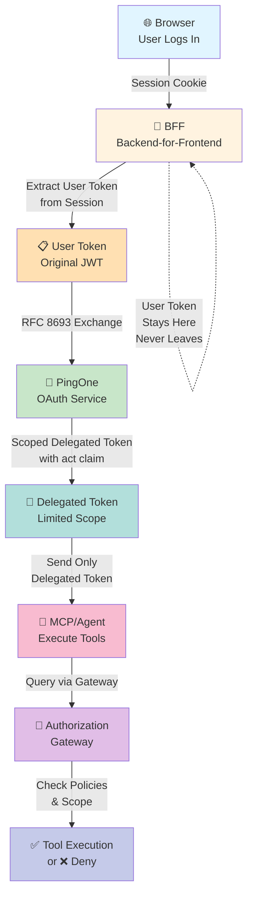
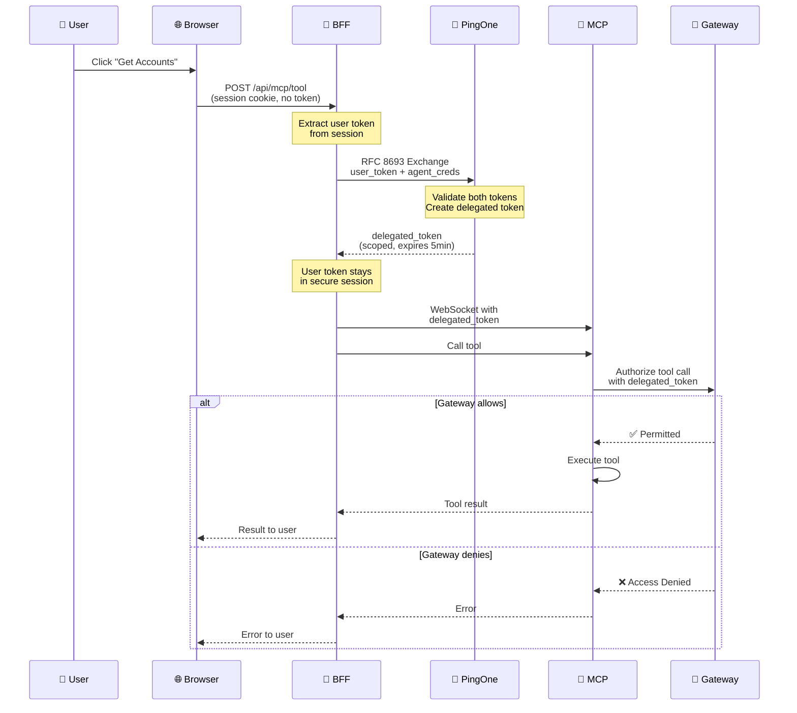

# Token Exchange Architecture: A Security Boundary Explanation

> 📚 **Part of the Token Exchange Learning Series**  
> **Quick Start:** [30-second summary](TOKEN_EXCHANGE_QUICK_REFERENCE.md#30-second-summary) • **Visual Learner?** [See diagrams](TOKEN_EXCHANGE_DIAGRAM.md) • **Onboarding?** [Use checklist](TOKEN_EXCHANGE_ONBOARDING.md)

## The Core Principle

**User tokens are exchanged at the Backend-for-Frontend (BFF) layer, not at the agent level.**

This is a fundamental security boundary that prevents agents from bypassing your authorization gateway and accessing user data without going through the proper channels.

---

## The Problem We're Solving

Imagine if agents had direct access to user tokens:

```
❌ INSECURE PATTERN
┌─────────────────────────────────────────────────────────┐
│ Browser: User logs in, gets access token                │
├─────────────────────────────────────────────────────────┤
│ JavaScript sends: { tool: "get_accounts", token: JWT }  │
├─────────────────────────────────────────────────────────┤
│ Agent receives user's raw token                         │
│ → Can call any backend API                             │
│ → Can bypass authorization gateway                      │
│ → No audit trail of what agent is doing                │
└─────────────────────────────────────────────────────────┘
```

**Why this is dangerous:**
- Agent could call backend APIs the user didn't authorize it to call
- No way to track what the agent did on behalf of the user
- User token is exposed to agent code/logs
- Authorization checks in the gateway are bypassed entirely

---

## The Secure Pattern: Token Exchange at the BFF



---

## How It Works: Step-by-Step

### Complete Sequence



### Step 1: User Authentication (OAuth)

```javascript
// User logs in via the UI
// Browser receives access token (JWT)
// Token is stored in a secure, HTTP-only session cookie
// Token is NEVER exposed to JavaScript directly
```

**Where:** PingOne OAuth endpoint  
**Result:** Session established, user token stored securely at the server

---

### Step 2: Browser Makes Tool Request

```javascript
// From demo_api_ui/src/services/demoAgentService.js

const response = await fetch("/api/mcp/tool", {
  method: "POST",
  credentials: "include",  // ← CRITICAL: send session cookie
  headers: { "Content-Type": "application/json" },
  body: JSON.stringify({
    tool: "get_accounts",
    params: { /* ... */ }
  })
});
```

**Key point:** The browser sends a session cookie, NOT a token in the body or header.

---

### Step 3: BFF Receives Request & Extracts User Token

```javascript
// From demo_api_server/server.js:1678

app.post('/api/mcp/tool', express.json(), requireSession, async (req, res, next) => {
  // requireSession middleware ensures user is logged in
  // req.session contains the user's OAuth token (stored server-side)
  
  const userToken = getSessionBearerForMcp(req);
  // userToken = original JWT from user's session
});
```

**Key point:** BFF reads the token from the secure session, not from the request body.

---

### Step 4: BFF Performs RFC 8693 Token Exchange

```
RFC 8693 Token Exchange (on-behalf-of grant)

Input:
  • subject_token = user's original access token
  • actor_token = agent's client-credentials token
  • resource = MCP server audience (e.g., "https://api.banking/mcp")
  • scope = narrowed scopes for this specific tool

PingOne processes:
  • Validates subject_token signature & expiry
  • Validates actor_token (agent's credentials)
  • Checks agent has permission to act on behalf of user
  • Issues NEW token scoped to MCP only

Output:
  • delegated_token = new JWT for MCP server
  • Contains: sub=user, act={client_id: agent}, scope=narrowed
```

**Code location:** [demo_api_server/services/agentMcpTokenService.js:1345-1354](file:///Users/cmuir/Development/ai-demo2/demo_api_server/services/agentMcpTokenService.js#L1345)

---

### Step 5: BFF Sends Delegated Token to MCP

```javascript
// From demo_api_server/services/mcpWebSocketClient.js

// BFF has: user token + delegated token
// BFF sends: ONLY delegated token to MCP

await mcpCallTool(toolName, params, {
  bearerToken: delegatedToken  // ← NOT userToken
});

// User's original token stays at BFF
// Agent never sees it
```

**Key point:** User token remains in the BFF's session storage. Only the delegated token is forwarded.

---

### Step 6: Agent Receives Delegated Token

```
Agent sees in the delegated token:

{
  "sub": "user-123",           // ← who this is for
  "aud": "https://api.banking/mcp",  // ← where it can be used
  "act": {
    "client_id": "agent-oauth-client"  // ← who's acting (the agent)
  },
  "scope": "mcp:invoke read",  // ← narrowed scopes (NOT full user scopes)
  "exp": 1689456789            // ← expires soon (short-lived)
}
```

**Agent's constraints:**
- ✅ Can call MCP tools through the gateway
- ❌ Cannot call arbitrary backend APIs
- ❌ Cannot access user's full token scope
- ❌ All actions audited under `act` claim (agent identity)

---

## Why Each Layer Matters

### Layer 1: Browser & Session Cookies
**Purpose:** Authenticate the user's request to the BFF  
**Security:** HTTP-only cookies cannot be accessed by JavaScript  
**Benefit:** User token is server-side only, never exposed to client-side code

### Layer 2: Backend-for-Frontend (BFF)
**Purpose:** Control and mediate all agent access  
**Security:** Only the BFF has access to the user's real token  
**Benefit:** Token exchange happens in a trusted environment

### Layer 3: Token Exchange (RFC 8693)
**Purpose:** Create a scoped, delegated token for the agent  
**Security:** New token has limited scope and lifetime  
**Benefit:** Principle of least privilege — agent gets only what it needs

### Layer 4: Authorization Gateway
**Purpose:** Final check before tool execution  
**Security:** Validates the delegated token and policies  
**Benefit:** Even if agent had a token, gateway enforces authorization rules

### Layer 5: Agent & MCP Server
**Purpose:** Execute the user's requested tool  
**Security:** Only receives delegated token, cannot bypass previous layers  
**Benefit:** Agent cannot act without going through the gateway

---

## Concrete Example: "Get Accounts" Flow

### Scenario
User clicks "Get Accounts" in the UI. Here's what happens:

#### Step 1: Browser Request
```javascript
// demo_api_ui/src/services/demoAgentService.js:280
fetch("/api/mcp/tool", {
  method: "POST",
  credentials: "include",  // Send session cookie
  body: JSON.stringify({
    tool: "get_accounts",
    params: {}
  })
});
```

#### Step 2: BFF Receives (server-side)
```
POST /api/mcp/tool
Cookie: session=ABC123...  ← Contains encrypted session

BFF reads session:
  req.session.oauthTokens.accessToken = "eyJhbGc..."
  // This is the user's original token
```

#### Step 3: BFF Exchanges
```
RFC 8693 Request to PingOne:
{
  "subject_token": "eyJhbGc...",  // User's token
  "actor_token": "eyJhbGc...",    // Agent's client credentials
  "resource": "https://api.banking/mcp",
  "scope": "mcp:invoke read"
}

PingOne Response:
{
  "access_token": "eyJhbGc...",   // NEW delegated token
  "token_type": "Bearer",
  "expires_in": 300
}
```

#### Step 4: BFF Sends Delegated Token
```
MCP WebSocket Header:
Authorization: Bearer eyJhbGc...  // ← Delegated token only

User's original token remains in BFF session
```

#### Step 5: MCP Processes Request
```
MCP receives: delegated_token
MCP forwards to gateway for authorization check

Gateway validates:
  ✓ Token signature is valid
  ✓ act.client_id is authorized agent
  ✓ Scope includes "mcp:invoke"
  ✓ User has "read" permission

Result: Tool executes, results sent back
```

#### Step 6: Response Flows Back
```
Agent → BFF → Browser
         ↑
  User token still in session
  (never sent to browser or agent)
```

---

## Security Guarantees

### ✅ User Token Never Leaves BFF
The original OAuth token is never sent outside the backend-for-frontend service.

**Proof:**
- Stored in secure server-side session
- Only accessed by BFF code
- Not in request/response bodies
- Not sent to browser or agent

### ✅ Agent Cannot Bypass Gateway
Even if an agent had a token, it could only use scoped capabilities.

**How:** RFC 8693 delegation creates a token with narrowed scopes and `act` claim

### ✅ All Agent Actions Are Auditable
The `act` claim proves which agent performed which action.

**Proof:** `act: { client_id: "agent-oauth-client-123" }` is in every token the agent uses

### ✅ Short-Lived Tokens Reduce Exposure
Delegated tokens expire quickly (default 5 minutes).

**How:** `expires_in: 300` means token is only valid for 5 minutes

### ✅ Scope is Narrowed Per Tool
Agent doesn't get access to all user scopes, just what that tool needs.

**How:** `scope: "mcp:invoke read"` (not the full scope from user's token)

---

## Comparison: Insecure vs Secure

| Aspect | Insecure ❌ | Secure ✅ |
|--------|-----------|---------|
| **Where token is** | Browser memory, sent to agent | Server session, never leaves BFF |
| **What agent receives** | Full user token | Delegated, scoped token |
| **Agent's permissions** | Same as user | Limited by scope + act claim |
| **Audit trail** | None (agent has user identity) | Clear (act claim shows agent identity) |
| **Gateway bypass possible?** | Yes (agent has real token) | No (delegated token limited) |
| **Token exposure risk** | High (in agent code/logs) | Low (token stored server-side) |
| **Scope creep** | Yes (agent could request extra) | No (BFF controls scope) |

---

## Configuration: When Token Exchange Happens

### Default (Recommended)
```
ff_skip_token_exchange = false  (or unset)
→ Full RFC 8693 exchange at BFF
→ Delegated token sent to agent
✅ PRODUCTION MODE
```

### Bypass Mode (Demo Only)
```
ff_skip_token_exchange = true
→ User token forwarded directly to MCP
→ No exchange performed
❌ DEMO/DEV ONLY — NOT RECOMMENDED
```

**Why bypass mode exists:** Early testing when PingOne token exchange wasn't configured. Should never be used in production.

---

## For Different Roles

### 🔐 Security Engineers
**You care about:** Token never leaves BFF, scoping, audit trail  
**Key files:**
- [agentMcpTokenService.js](file:///Users/cmuir/Development/ai-demo2/demo_api_server/services/agentMcpTokenService.js) — Token exchange logic
- [server.js:1478-1481](file:///Users/cmuir/Development/ai-demo2/demo_api_server/server.js#L1478) — "user's raw token never leaves the BFF"
- [RFC 8693 spec](https://tools.ietf.org/html/rfc8693) — Token exchange standard

### 👨‍💻 Backend Developers
**You care about:** How to call token exchange, handling delegated tokens  
**Key files:**
- [demoAgentService.js:280](file:///Users/cmuir/Development/ai-demo2/demo_api_ui/src/services/demoAgentService.js#L280) — Browser-side call
- [server.js:1678](file:///Users/cmuir/Development/ai-demo2/demo_api_server/server.js#L1678) — `/api/mcp/tool` handler
- [mcpWebSocketClient.js](file:///Users/cmuir/Development/ai-demo2/demo_api_server/services/mcpWebSocketClient.js) — Token delivery to MCP

### 🎯 Product Managers
**You care about:** Authorization enforcement, audit logging, user privacy  
**Key concept:** Token exchange is how we ensure agents can't access data the user didn't authorize them to access.

### 🏗️ Architects
**You care about:** Layered security, defense in depth, compliance  
**Design principle:** Never pass user credentials to agents; always exchange for scoped, delegated tokens.

---

## Common Mistakes to Avoid

### ❌ Mistake 1: Passing Token in URL/Body
```javascript
// WRONG
fetch("/agent/call-tool", {
  body: JSON.stringify({
    token: userToken,  // ← NEVER DO THIS
    tool: "get_accounts"
  })
});
```

**Why it's wrong:** Token is exposed in logs, request history, agent code  
**Fix:** Use session cookies with `credentials: "include"`

### ❌ Mistake 2: Sending Raw Token to Agent
```javascript
// WRONG
mcp.callTool(toolName, {
  bearerToken: userToken  // ← Agent receives user's real token
});
```

**Why it's wrong:** Agent can bypass gateway, access data outside its scope  
**Fix:** Exchange for delegated token first, send that instead

### ❌ Mistake 3: No Token Expiry
```javascript
// WRONG
exchangedToken.expiresIn = 3600 * 24  // 24 hours
```

**Why it's wrong:** Long-lived token increases exposure window  
**Fix:** Use short lifetimes (300 seconds = 5 minutes default)

### ❌ Mistake 4: Not Narrowing Scope
```javascript
// WRONG
exchangedToken.scope = userToken.scope  // ← Agent gets all user scopes
```

**Why it's wrong:** Violates principle of least privilege  
**Fix:** Exchange only requests scopes that specific tool needs

### ❌ Mistake 5: Ignoring the act Claim
```javascript
// WRONG
ignoreActClaimInAudit()  // ← Lose provenance
```

**Why it's wrong:** Can't prove which agent did what  
**Fix:** Always log and check the `act: { client_id: ... }` claim

---

## Testing & Verification

### How to Verify Exchange is Happening

1. **Check Token Chain UI**
   - Go to demo UI → Token Chain panel
   - See each step: User Token → Exchange → Delegated Token
   - Verify `act` claim is present

2. **Check Logs**
   ```bash
   grep "Token Exchange" demo_api_server/logs/*.log
   # Should see: "[AGENT_MCP] resolveAccessToken tool=..."
   ```

3. **Decode the Token**
   ```bash
   # Delegated token should have:
   # {
   #   "sub": "user-123",
   #   "act": { "client_id": "agent-oauth-client" },
   #   "scope": "mcp:invoke read"
   # }
   ```

4. **Verify User Token Doesn't Leak**
   ```bash
   grep -r "userToken" demo_api_server/logs/
   # Should NOT see raw JWT in logs
   # (agentMcpTokenService.js sanitizes for display)
   ```

---

## Key Takeaways

1. **Token exchange happens at BFF, not agent level** — This is the security boundary
2. **User token stays server-side** — Never sent to browser or agent
3. **Agent receives scoped, delegated token** — Limited capabilities
4. **All actions are auditable** — `act` claim proves agent identity
5. **Defense in depth** — Gateway is final check, even with delegated token
6. **RFC 8693 is the standard** — On-behalf-of delegation is well-defined

---

## Further Reading

- **[RFC 8693](https://tools.ietf.org/html/rfc8693)** — OAuth 2.0 Token Exchange
- **[RFC 8707](https://tools.ietf.org/html/rfc8707)** — Resource Indicators for OAuth 2.0
- **[Token Chain Trace Rail Documentation](../TOKEN_CHAIN_TRACE.md)** — How to read Token Chain in UI
- **[REGRESSION_PLAN.md §1](../REGRESSION_PLAN.md)** — Protected token exchange areas
- **[agentMcpTokenService.js](file:///Users/cmuir/Development/ai-demo2/demo_api_server/services/agentMcpTokenService.js)** — Implementation source code

---

## Questions?

- **"Where does the token sit during exchange?"** → In the BFF's memory, during the OAuth call to PingOne
- **"Why not let agent handle exchange?"** → Agents might be compromised; BFF is controlled infrastructure
- **"What if agent needs broader scopes?"** → Scopes are requested at login; can't be changed per-tool
- **"Can agent see the user's token?"** → No; BFF performs exchange, agent only gets delegated token
- **"How long is delegated token valid?"** → Default 300 seconds (5 minutes); short-lived to limit exposure
