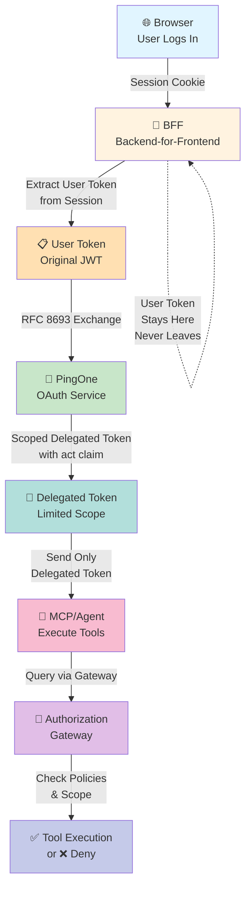
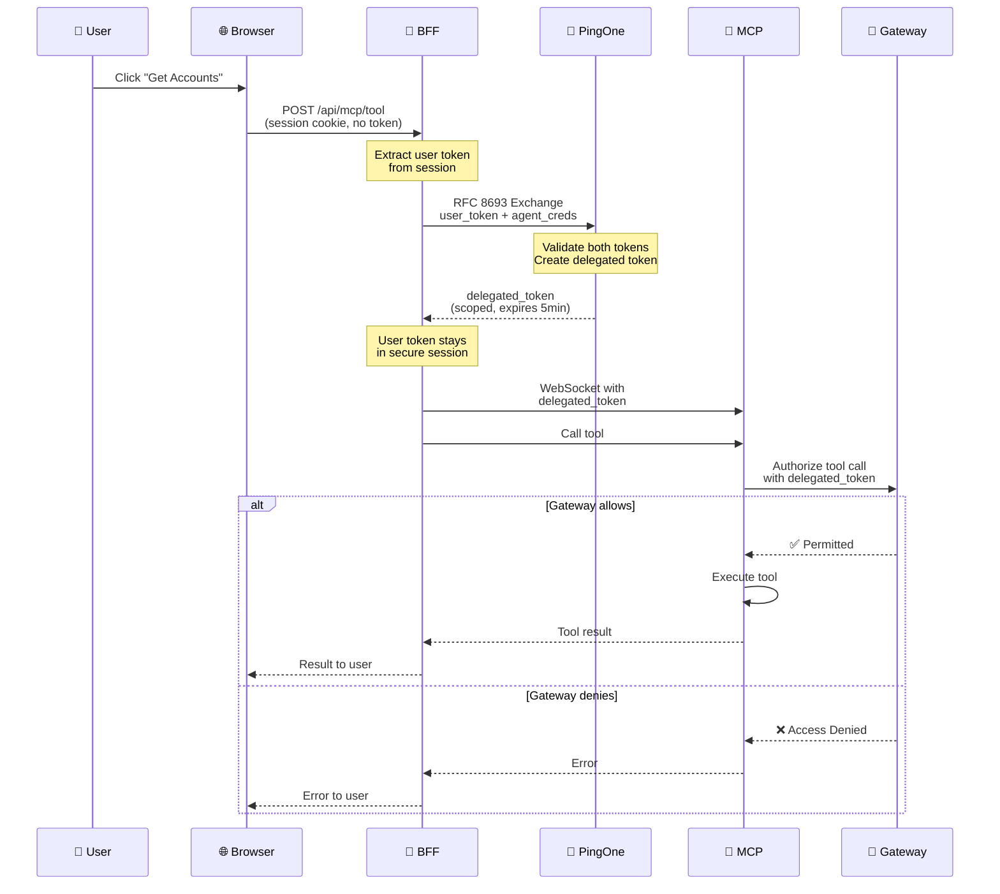
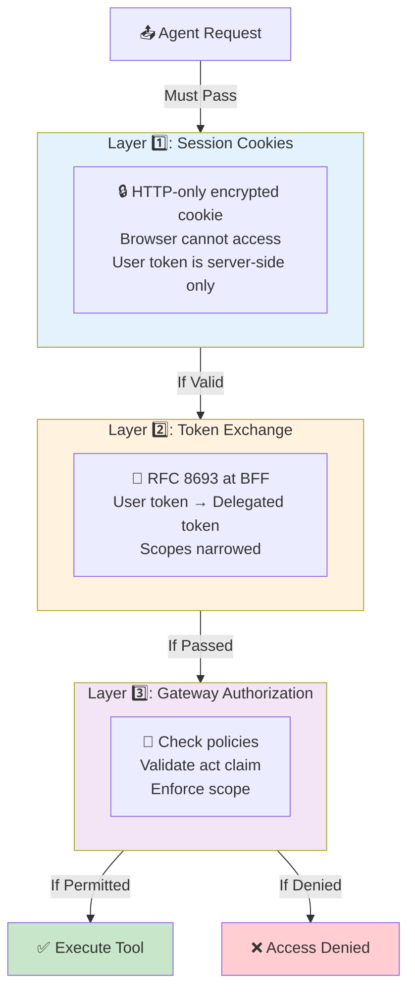
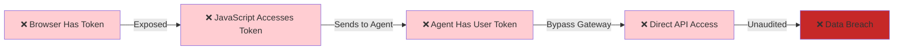
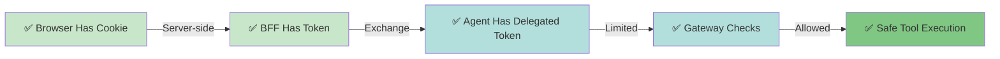
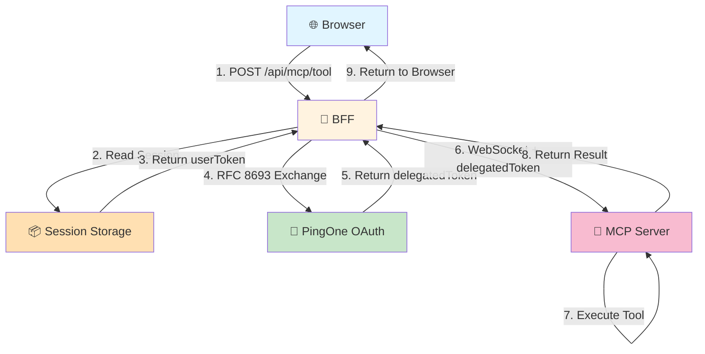
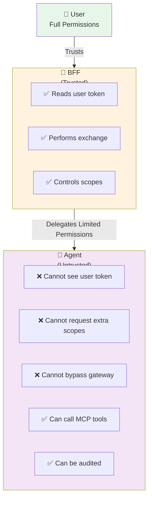
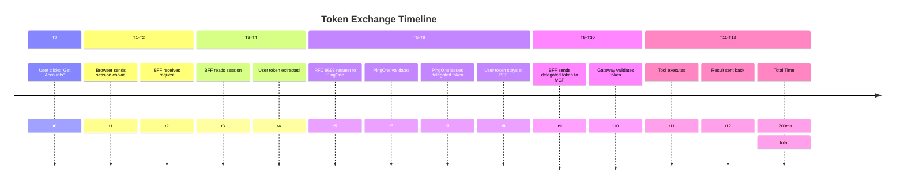
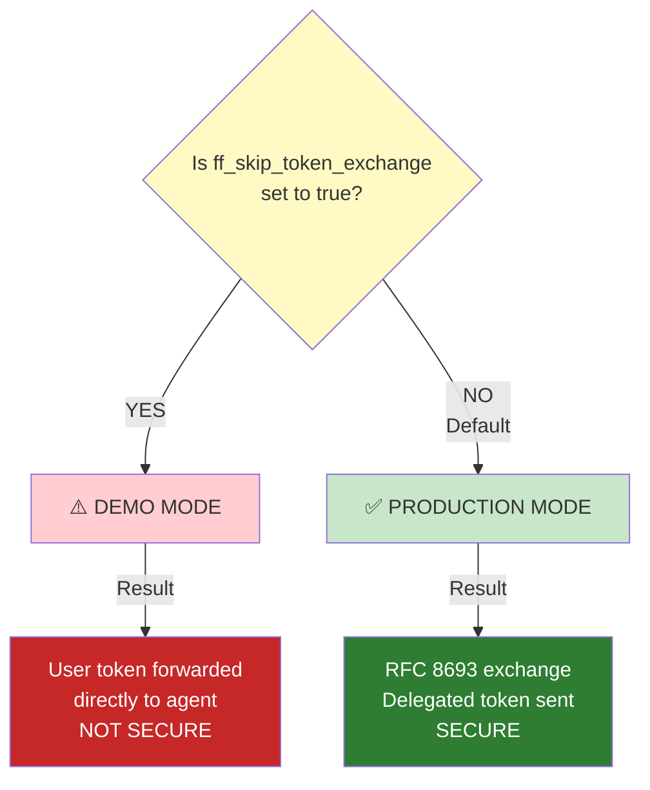

# Token Exchange Flow Diagrams

> 📚 **Part of the Token Exchange Learning Series**  
> **Architecture Deep Dive?** [Full guide](TOKEN_EXCHANGE_ARCHITECTURE.md) • **Need Quick Ref?** [Quick reference](TOKEN_EXCHANGE_QUICK_REFERENCE.md) • **Onboarding?** [Use checklist](TOKEN_EXCHANGE_ONBOARDING.md)

## Simple Flow Diagram



---

## Detailed Sequence Diagram



---

## Token Comparison Diagram

```mermaid
graph LR
    subgraph UserToken["👤 User's Original Token<br/>(In BFF Session)"]
        UT1["sub: user-123"]
        UT2["aud: api.banking"]
        UT3["scope: read write email"]
        UT4["act: null"]
        UT5["⏱️ exp: 1hr"]
    end
    
    subgraph Delegation["🔄 RFC 8693<br/>Exchange"]
        D1["Validate user token"]
        D2["Validate agent creds"]
        D3["Narrow scope"]
        D4["Add act claim"]
        D5["Short expiry"]
    end
    
    subgraph DelegatedToken["🎯 Delegated Token<br/>(Sent to Agent)"]
        DT1["sub: user-123"]
        DT2["aud: api.banking/mcp"]
        DT3["scope: mcp:invoke read"]
        DT4["act: {client_id: agent}"]
        DT5["⏱️ exp: 5min"]
    end
    
    UserToken -->|Exchange| Delegation
    Delegation -->|Result| DelegatedToken
    
    style UserToken fill:#ffe0b2
    style Delegation fill:#c8e6c9
    style DelegatedToken fill:#b2dfdb
```



---

## Security Layers Diagram



---

## What Could Go Wrong (Insecure Pattern)



---

## What We Actually Do (Secure Pattern)



---

## Request/Response Flow



---

## Permission Model



---

## Timeline: "Get Accounts" Request



---

## Configuration Decision Tree



---

## Copy-Paste for Your Docs

All diagrams are in Mermaid format. To use in your docs:

**Markdown:**
```markdown
```mermaid
[paste diagram code]
```
```

**Rendered in:**
- GitHub (auto-renders)
- GitLab (auto-renders)
- Notion
- Confluence
- Any Mermaid-compatible viewer

---

## Print-Friendly Reference

If you want to print these:
- Use your browser's Print function
- Diagrams will render as SVG (vector graphics)
- Won't pixelate at any size
