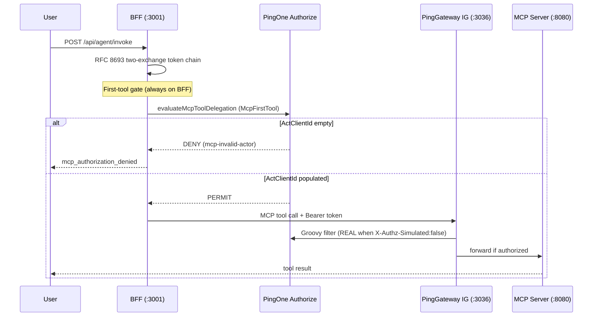

# Agent Handoff: PingGateway + Real P1AZ E2E Investigation

**Date:** 2026-07-05  
**Repo state at investigation:** `main` @ `1aaf509` (includes P1AZ snapshot fix `95fa252`)  
**Audience:** Another coding agent continuing IG-path MCP authorization work  
**Machine-readable E2E report:** `/tmp/e2e-agent-report.json` (local; regenerate with steps below)

---

## Executive summary

Two separate MCP gateway routing modes exist in this demo:

| Mode | Flag | Authorize decision location | E2E status (2026-07-05) |
|------|------|----------------------------|-------------------------|
| **Node MCP Gateway** | `ff_mcp_gateway_pinggateway=false` | BFF → Node gateway (`:3005`) → `demo_authz_server` or P1AZ | **PASS** — agent returns account data |
| **PingGateway (IG)** | `ff_mcp_gateway_pinggateway=true` | BFF first-tool gate → P1AZ; then BFF → PingGateway (`:3036`) → IG Groovy → P1AZ again | **FAIL** at BFF first-tool gate before IG is reached |

A upstream fix (`95fa252`) corrected **stale actor client IDs** in the P1AZ policy snapshot (`HasValidActorChain`). That fix is necessary but **not sufficient** for the IG path: the BFF still sends **empty `ActClientId`** to P1AZ because Exchange #2 tokens lack a JWT `act` claim, and `mcpToolAuthorizationService.js` does not bridge the actor the way `mcpGatewayClient.js` already does.

**Do not assume the snapshot fix alone unblocks IG-path E2E.** Re-import the snapshot in the PingOne Authorize console *and* address the empty-actor gap (or confirm a code fix landed).

---

## Architecture: where P1AZ runs



**Key insight:** When `ff_mcp_gateway_pinggateway=true`, the BFF **still** evaluates P1AZ at the first-tool gate *before* calling PingGateway. IG Groovy P1AZ is a second evaluation on the MCP hop. Current failure happens at step 1 — IG logs never show `[P1AZ]`.

---

## What `95fa252` fixed (snapshot only)

Commit `95fa252` — `fix(p1az): replace retired-env actor client ids in the Authorize snapshot`

All seven client IDs in `HasValidActorChain` pointed at a **retired** PingOne environment (404 against live env `01d89b06-66d5-430e-9f28-65636843788b`). Every real P1AZ evaluation with a *valid* `ActClientId` that wasn't in the live set would DENY.

| Role | Live client ID (env `01d89b06…`) |
|------|----------------------------------|
| MCP / Token Exchanger | `f4dd707d-f78d-4417-ba56-dc8707d10a1f` |
| AI Agent Actor (may_act sub) | `71e878ea-2d79-4760-b570-66f00cbeffe7` |
| End-user app (reference) | `83572007-b2c7-4862-8197-dc225a9fb8e1` |
| MCP first-tool decision endpoint | `1f9e9c71-9e84-47dd-8f91-54197564930c` |
| Investment Advisor | `0bba2bb8-…` |
| Records Specialist | `74d7fafe-…` |
| Purchase Specialist | `fb66cb43-…` |
| Membership Specialist | `5a5d730f-…` |
| Payroll Specialist | `9283be7f-…` |

**File:** `snapshots/Super_Banking_Transaction_Authorization_P1AZ.snapshot.json`

**Operator action required:** Re-import this snapshot in the PingOne Authorize console. Updating the repo file does not change live P1AZ policy.

**Verification with worker creds (when not rate-limited):**

```javascript
// demo_api_server — worker token + evaluateMcpToolDelegation
ActClientId = '71e878ea-2d79-4760-b570-66f00cbeffe7'  → PERMIT
ActClientId = ''                                       → DENY (mcp-invalid-actor)
Full topology chain (agent + exchanger)                → PERMIT
```

---

## Current blocker: empty `ActClientId` at BFF first-tool gate

### Symptom

Agent invoke with IG routing enabled:

```
POST /api/agent/invoke { prompt: "show my accounts", forceHeuristic: true }
→ success: false
→ reply: "mcp_authorization_denied"
```

BFF log (representative):

```
[BFF→P1AZ] PARAMETERS: {
  "DecisionContext": "McpFirstTool",
  "ToolName": "get_my_accounts",
  "TokenAudience": "https://api.ping.demo:3036/mcp",
  "ActClientId": "",
  "McpResourceUri": "https://api.ping.demo:3036/mcp"
}
[BFF→P1AZ] RESPONSE: decision=DENY, code=mcp-invalid-actor
  "Actor client ID '' is not a registered actor in the RFC 8693 delegation chain."
```

PingGateway container: **no** `[P1AZ]` log lines — request never reaches IG.

### Root cause

1. With `ff_mcp_gateway_pinggateway=true`, Exchange #2 targets audience `https://api.ping.demo:3036/mcp` (PingGateway resource URI).
2. PingOne token exchange does **not** emit `act` / `may_act` on exchanged tokens (documented in `docs/ACT_CLAIM_VERIFICATION.md`).
3. `mcpToolAuthorizationService.js` extracts actor only from JWT:

   ```javascript
   const actClientId = claims.act && typeof claims.act === 'object'
     ? String(claims.act.client_id || claims.act.sub || '')
     : '';
   ```

4. The gateway path already bridges actor via headers in `mcpActorBridge.js` → `X-Act-Client-Id` (AI Agent `71e878ea…`), used by `mcpGatewayClient.js` and `authorize.js` `/mcp-console-defaults`. **The first-tool gate does not use this bridge.**

### Proposed fix (not implemented — user declined code change)

In `mcpToolAuthorizationService.js`, after JWT extraction, fall back when empty:

```javascript
const { buildActorBridgeHeaders } = require('./mcpActorBridge');
// ...
let actClientId = /* JWT extraction as today */;
if (!actClientId) {
  actClientId = buildActorBridgeHeaders()['X-Act-Client-Id'] || '';
}
```

Match the pattern already in `demo_api_server/routes/authorize.js` (`GET /api/authorize/mcp-console-defaults`).

---

## Secondary issue: audience mismatch on partial success path

When BFF used `TokenAudience=mcpgateway.ping.demo` with populated `ActClientId=71e878ea…`, P1AZ returned **PERMIT** and PingGateway audit showed `authorize.decision=PERMIT`. The MCP server then returned `invalid_token` / authentication errors because the bearer token's `aud` did not match what the MCP resource server expected.

Exchange #2 with IG routing correctly uses `aud=https://api.ping.demo:3036/mcp` — but that path currently DENYs at the BFF gate due to empty `ActClientId`. Fixing the actor bridge should be validated together with MCP server audience acceptance (`audienceAccepted()` in MCP server; rebuild Docker image if stale).

---

## Hybrid stack used for E2E (recommended)

Native BFF + Docker sidecars avoids the broken Docker `api-server` image (`multer` missing in anonymous volume).

### Services

| Service | How run | URL |
|---------|---------|-----|
| BFF | **Native** Node | `https://api.ping.demo:3001` |
| Node MCP Gateway | Docker `ai-demo-mcp-gateway` | `http://127.0.0.1:3005` |
| PingGateway IG | Docker `ai-demo-ping-gateway` | `http://127.0.0.1:3036` |
| MCP Server | Docker `ai-demo-mcp-server` | `http://127.0.0.1:8080` |
| Authz / UI / agents | Docker (compose project `ai-demo`) | per topology |

### Required BFF env (native start)

```bash
export TOPOLOGY_GUARD=warn
export MCP_GATEWAY_HTTP_URL=http://127.0.0.1:3005   # Docker gateway is plain HTTP
export FF_MCP_GATEWAY_PINGGATEWAY=true
export FF_AUTHORIZE_SIMULATED=false
export MCP_PINGGATEWAY_URL=http://127.0.0.1:3036
cd demo_api_server && node server.js
```

**Critical:** Start BFF and run tests in the **same shell session**. Background BFF processes die when the shell exits.

### MCP server → native BFF (hybrid override)

File: `/tmp/mcp-host-bff.override.yml`

```yaml
services:
  mcp-server:
    environment:
      DEMO_API_BASE_URL: "https://host.docker.internal:3001"
    extra_hosts:
      - "host.docker.internal:host-gateway"
```

```bash
COMPOSE_PROJECT_NAME=ai-demo docker compose \
  -f docker-compose.yml -f docker-compose.override.yml -f /tmp/mcp-host-bff.override.yml \
  up -d --no-deps mcp-server
```

### Config flags (persist via configStore)

```javascript
await configStore.setRaw({
  ff_mcp_gateway_pinggateway: 'true',
  ff_authorize_simulated: 'false',
});
await configStore.setConfig({ mcp_pinggateway_url: 'http://127.0.0.1:3036' });
```

Or PATCH `/api/admin/feature-flags` with `{ updates: { ff_mcp_gateway_pinggateway: true, ff_authorize_simulated: false } }`.

### PingGateway P1AZ env

Ensure `ping-gateway/.env` has live values synced:

- `P1AZ_REAL_BASE` → `https://api.pingone.com/v1/environments/01d89b06-66d5-430e-9f28-65636843788b`
- `P1AZ_WORKER_ID`, worker client creds, `TE_CLIENT_*`, scopes
- Recreate: `docker compose … up -d --force-recreate ping-gateway`

---

## How to reproduce E2E

### 1. Preflight

```bash
curl -sk https://api.ping.demo:3001/api/healthz          # 200
curl -s http://127.0.0.1:3005/health                     # banking-mcp-gateway ok
curl -s http://127.0.0.1:8080/health                     # MCP server ok
curl -s -o /dev/null -w '%{http_code}' http://127.0.0.1:3036/mcp  # 401 without token (expected)
```

### 2. Token chain trace harness

```bash
cd demo_api_server
node scripts/tokenChainTrace.js get_my_accounts "show my accounts"
```

### 3. Agent invoke (IG path)

Login via `tests/real/helpers/session.js`, set banking vertical, then:

```bash
POST /api/agent/invoke
{ "prompt": "show my accounts", "forceHeuristic": true, "vertical": "banking" }
```

### 4. Expected outcomes

| Check | Node GW path (`ff_mcp_gateway_pinggateway=false`) | IG path (current) |
|-------|---------------------------------------------------|-------------------|
| Token chain events | 12+ through final MCP token | Same — chain **PASS** |
| BFF P1AZ first-tool | PERMIT (with bridged or token act) | **DENY** — `ActClientId=""` |
| Agent reply | Account data | `mcp_authorization_denied` |
| PingGateway `[P1AZ]` logs | N/A | Empty |
| `GET /api/token-chain` MCP rows | Grows | Stays flat |

### 5. Log grep

```bash
grep -E 'BFF→P1AZ|ActClientId|mcp-invalid-actor|mcp_authorization' /tmp/bff-e2e.log | tail -20
docker logs ai-demo-ping-gateway 2>&1 | grep -E '\[P1AZ\]|REAL|DENY|PERMIT' | tail -30
```

---

## Key source files

| File | Role |
|------|------|
| `demo_api_server/services/mcpToolAuthorizationService.js` | BFF first-tool P1AZ gate; **reads JWT `act` only** |
| `demo_api_server/services/mcpActorBridge.js` | Builds `X-Act-Client-Id` / `X-May-Act-Sub` for gateway calls |
| `demo_api_server/services/mcpGatewayClient.js` | Routes to PingGateway when flag on; bridges actor headers |
| `demo_api_server/services/agentMcpTokenService.js` | Exchange #2 audience → PG resource when IG flag on |
| `demo_api_server/services/pingOneAuthorizeService.js` | Real P1AZ `evaluateMcpToolDelegation()` |
| `demo_api_server/routes/authorize.js` | `/mcp-console-defaults` — already uses bridge for `actClientId` |
| `ping-gateway/scripts/groovy/p1az-decision.groovy` | IG-side P1AZ (REAL vs MOCK via `X-Authz-Simulated`) |
| `snapshots/Super_Banking_Transaction_Authorization_P1AZ.snapshot.json` | Policy snapshot with live actor IDs (`95fa252`) |
| `docs/ACT_CLAIM_VERIFICATION.md` | Why exchanged tokens lack `act` |
| `docs/PINGONE_AUTHORIZE_PLAN.md` | P1AZ parameter map (`ActClientId`, `TokenAudience`, etc.) |
| `REGRESSION_PLAN.md` | Protected areas — read §0–§1 before auth changes |

---

## Infra pitfalls encountered

1. **Port 3005 conflict** — native Node MCP gateway + Docker gateway both binding `:3005`. Kill native squatter or use Docker only.
2. **BFF → gateway URL** — ConfigStore may have `https://api.ping.demo:3005`; Docker gateway needs `MCP_GATEWAY_HTTP_URL=http://127.0.0.1:3005`.
3. **Docker api-server** — crashes on missing `multer`; use native BFF instead.
4. **Stale MCP server image** — old `audienceAccepted()` logic caused false audience rejects; rebuild `ai-demo-mcp-server` on `ai-demo` compose project.
5. **Compose project mismatch** — align on `COMPOSE_PROJECT_NAME=ai-demo`.
6. **P1AZ rate limits** — worker evaluation API may return `429 REQUEST_LIMITED` during rapid probes; space calls out.

---

## Related commits on `main` (pulled 2026-07-05)

| Commit | Summary |
|--------|---------|
| `95fa252` | P1AZ snapshot: live `HasValidActorChain` actor IDs |
| `62dab4d` | BFF: PingGateway audit trail on 401/error paths in token chain |
| `1aaf509` | Merge including token chain trace UI updates |

---

## Suggested next steps for a follow-up agent

1. Confirm live P1AZ policy was re-imported from the updated snapshot.
2. Implement (or verify landing of) `mcpActorBridge` fallback in `mcpToolAuthorizationService.js`.
3. Re-run IG-path E2E; expect BFF P1AZ **PERMIT** with `ActClientId=71e878ea…`.
4. Confirm PingGateway Groovy logs `[P1AZ] REQUEST → REAL` and audit `authorize.decision=PERMIT`.
5. Validate MCP server accepts token `aud=https://api.ping.demo:3036/mcp` end-to-end.
6. Run `./run-tests.sh unit` and any real E2E in `demo_api_server/tests/real/` touching MCP authz.

---

## Regression guard

Before editing auth flows, token exchange, BFF session layer, or UI surfaces:

- Read `REGRESSION_PLAN.md` §0 (emoji/UI rules) and §1 (protected areas).
- Invoke `.claude/skills/regression-guard/` when touching protected code.
- Minimal diff: change only the component and element named in the task.
