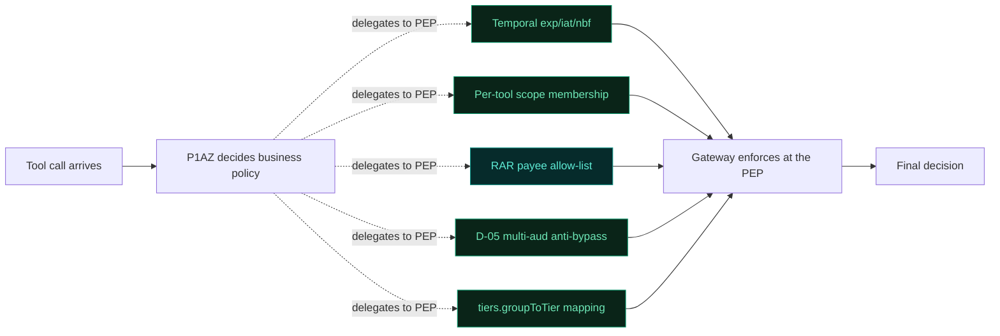

# Gateway Local Enforcement Map

GENERATED by `node scripts/gen-gateway-enforcement-map.js` from the actual source
files listed below — do not hand-edit. Re-run after changing any of them; this
file and `demo_api_ui/src/components/education/gatewayEnforcementDiagram.generated.js`
regenerate together from the same scan.

Scanned files: `snapshots/gen-authorize-snapshot.js`,
`demo_mcp_gateway/src/auth/GatewayTokenPolicy.ts`, `demo_mcp_gateway/src/rarEnforce.ts`,
`demo_mcp_gateway/src/tokenValidator.ts`, `demo_mcp_gateway/src/auth/toolScopes.ts`,
`demo_mcp_gateway/src/tierEnforce.ts`, `ping-gateway/scripts/groovy/p1az-decision.groovy`.

Current state: **10/10** checks live (5 checks × 2 gateways).
See `docs/superpowers/plans/2026-08-12-gateway-local-enforcement.md` for the
implementation plan behind them.

**Reading the diagram:** P1AZ (the cloud PDP) decides business policy — amount,
tier, group, step-up, HITL. These 5 checks run at the PEP instead, where the raw
token claims and call parameters actually live. Each branches to the gateway that
enforces it, then reconverges on one decision.

## What each check stops

**Temporal exp/iat/nbf**
> A token minted hours ago, past the demo's replay window, gets replayed against a tool call — exp alone doesn't catch this, only iat max-age does.

✅ Enforced at both gateways

**Per-tool scope membership**
> A token carries the coarse gateway:mcp:invoke scope but never earned transfer — and tries to call create_transfer anyway.

✅ Enforced at both gateways

**RAR payee allow-list**
> A transfer's granted intent named one payee — the actual call sends the funds somewhere else.

✅ Node enforces locally · IG delegates to P1AZ by design

**D-05 multi-aud anti-bypass**
> An agent presents a token whose aud already targets the banking resource server directly — skipping the gateway hop entirely.

✅ Enforced at both gateways

**tiers.groupToTier mapping**
> A Standard-tier caller invokes a PrivateBanking-only tool, or tries to move more than their tier's ceiling.

✅ Enforced at both gateways

## Detail

| Check | Why the gateway owns it | Node gateway | IG gateway (groovy) |
|---|---|---|---|
| Temporal exp/iat/nbf | Temporal exp/iat/nbf (mock Rules 0c-0f): the snapshot Timestamp attribute is an ISO 8601 STRING while token claims are epoch-second strings; without a verified CurrentEpoch attribute and confirmed numeric coercion the… | ✅ enforced — iat max-age check in tokenValidator.ts | ✅ enforced — local iat/nbf deny in p1az-decision.groovy (default olb route has no local temporal recheck otherwise) |
| Per-tool scope membership | Per-tool scope membership (mock Rule 3): TokenScopes is a space-separated set and the DSL has no set/contains operator; enumerating scope x tool combinations as OR-of-equals would not survive multi-scope tokens. | ✅ enforced — unconditional Rule-3-parity backstop (A2A-safe) in toolScopes.ts | ✅ enforced — local scope backstop reading scope-topology.json in p1az-decision.groovy |
| RAR payee allow-list | RAR payee allow-list (mock Rule 3c payee half): permitted payees are an array; same missing set-membership operator. | ✅ enforced — rarEnforce.ts — unconditional, gated on REQUIRE_RAR_INTENT | ✅ P1AZ owns the decision — forwards RarAuthorizationDetails/RarMaxAmount/RarPermittedPayees so the cloud RarMaxAmount rule decides (p1az-decision.groovy:716-718); the local payee DENY stays opt-in behind PG_LOCAL_RAR_PAYEE_ENFORCE |
| D-05 multi-aud anti-bypass | D-05 multi-aud: TokenAudTargetsUpstream compares a SINGLE aud string; a space-joined multi-aud value is only caught at the PEP (gateway) and mock. | ✅ enforced — GatewayTokenPolicy.ts — unconditional, every inbound token | ✅ enforced — local deny using the forwarded TokenAudActual, mirroring GatewayTokenPolicy.ts |
| tiers.groupToTier mapping | tiers.groupToTier (step 10): mapping a PingOne group ARRAY to a tier needs set membership. The BFF resolves it and sends the scalar UserTier, the same flattening precedent as InRequiredGroup / TokenKidKnown. The tier… | ✅ enforced — tierEnforce.ts, reads X-User-Tier/X-Tier-Max-Amount-Usd/X-Tier-Restricted-Tools headers from the BFF | ✅ enforced — reads the same 3 headers the Node gateway does |
