# Gateway Local Enforcement Map

GENERATED by `node scripts/gen-gateway-enforcement-map.js` from the actual source
files listed below — do not hand-edit. Re-run after changing any of them; this
file and `demo_api_ui/src/components/education/gatewayEnforcementDiagram.generated.js`
regenerate together from the same scan.

Scanned files: `snapshots/gen-authorize-snapshot.js`,
`demo_mcp_gateway/src/auth/GatewayTokenPolicy.ts`, `demo_mcp_gateway/src/rarEnforce.ts`,
`demo_mcp_gateway/src/tokenValidator.ts`, `demo_mcp_gateway/src/auth/toolScopes.ts`,
`demo_mcp_gateway/src/tierEnforce.ts`, `ping-gateway/scripts/groovy/p1az-decision.groovy`.

Current state: **9/10** gateway-side backstops enforced (5 rules × 2 gateways).
See `docs/superpowers/plans/2026-08-12-gateway-local-enforcement.md` for the
implementation plan that closes the remaining gaps.

**Reading the diagram:** the top row (P1AZ) is the cloud PDP — it structurally
cannot check any of these 5 rules itself (DSL limits, see the table below). Each
dashed arrow points from the rule to where it's enforced INSTEAD: the gateway box
below it. A green gateway box means that backstop is live; the arrow doesn't mean
"still needed," it means "this is where this rule actually gets checked."

```mermaid
flowchart TB
  subgraph P1AZ["PingOne Authorize (cloud PDP) — DSL cannot express any of these 5"]
    direction TB
    p_temporal["Temporal exp/iat/nbf"]
    p_scope["Per-tool scope membership"]
    p_rar["RAR payee allow-list"]
    p_d05["D-05 multi-aud anti-bypass"]
    p_tier["tiers.groupToTier mapping"]
  end
  subgraph NODE["Node Gateway (demo_mcp_gateway) — A2A path"]
    direction TB
    n_temporal["Temporal exp/iat/nbf<br/>ENFORCED"]
    n_scope["Per-tool scope membership<br/>ENFORCED"]
    n_rar["RAR payee allow-list<br/>ENFORCED"]
    n_d05["D-05 multi-aud anti-bypass<br/>ENFORCED"]
    n_tier["tiers.groupToTier mapping<br/>ENFORCED"]
  end
  subgraph GROOVY["IG Gateway (ping-gateway groovy) — default path"]
    direction TB
    g_temporal["Temporal exp/iat/nbf<br/>ENFORCED"]
    g_scope["Per-tool scope membership<br/>ENFORCED"]
    g_rar["RAR payee allow-list<br/>BUILT, OFF BY DEFAULT"]
    g_d05["D-05 multi-aud anti-bypass<br/>ENFORCED"]
    g_tier["tiers.groupToTier mapping<br/>ENFORCED"]
  end
  p_temporal -.-> n_temporal
  p_temporal -.-> g_temporal
  p_scope -.-> n_scope
  p_scope -.-> g_scope
  p_rar -.-> n_rar
  p_rar -.-> g_rar
  p_d05 -.-> n_d05
  p_d05 -.-> g_d05
  p_tier -.-> n_tier
  p_tier -.-> g_tier
  classDef gap fill:#1a1535,color:#c4b5fd,stroke:#7c3aed,stroke-width:1px
  classDef done fill:#0a2418,color:#6ee7b7,stroke:#059669,stroke-width:1px
  classDef pending fill:#2d0a0a,color:#fca5a5,stroke:#dc2626,stroke-width:1px,stroke-dasharray:4 4
  classDef flagged fill:#2a1a00,color:#fbbf24,stroke:#d97706,stroke-width:1px,stroke-dasharray:2 2
  class p_temporal,p_scope,p_rar,p_d05,p_tier gap
  class n_temporal,g_temporal,n_scope,g_scope,n_rar,n_d05,g_d05,n_tier,g_tier done
  class g_rar flagged
```

## Detail

| Rule | Why P1AZ can't | Node gateway | IG gateway (groovy) |
|---|---|---|---|
| Temporal exp/iat/nbf | Temporal exp/iat/nbf (mock Rules 0c-0f): the snapshot Timestamp attribute is an ISO 8601 STRING while token claims are epoch-second strings; without a verified CurrentEpoch attribute and confirmed numeric coercion the co | ✅ enforced — iat max-age check in tokenValidator.ts | ✅ enforced — local iat/nbf deny in p1az-decision.groovy (default olb route has no local temporal recheck otherwise) |
| Per-tool scope membership | Per-tool scope membership (mock Rule 3): TokenScopes is a space-separated set and the DSL has no set/contains operator; enumerating scope x tool combinations as OR-of-equals would not survive multi-scope tokens. | ✅ enforced — unconditional Rule-3-parity backstop (A2A-safe) in toolScopes.ts | ✅ enforced — local scope backstop reading scope-topology.json in p1az-decision.groovy |
| RAR payee allow-list | RAR payee allow-list (mock Rule 3c payee half): permitted payees are an array; same missing set-membership operator. | ✅ enforced — rarEnforce.ts — unconditional, gated on REQUIRE_RAR_INTENT | ⚠️ built, default OFF — opt-in only — check-groovy-params.sh:78-81 warns against a local RAR DENY here ("P1AZ decides") |
| D-05 multi-aud anti-bypass | D-05 multi-aud: TokenAudTargetsUpstream compares a SINGLE aud string; a space-joined multi-aud value is only caught at the PEP (gateway) and mock. | ✅ enforced — GatewayTokenPolicy.ts — unconditional, every inbound token | ✅ enforced — local deny using the forwarded TokenAudActual, mirroring GatewayTokenPolicy.ts |
| tiers.groupToTier mapping | tiers.groupToTier (step 10): mapping a PingOne group ARRAY to a tier needs set membership. The BFF resolves it and sends the scalar UserTier, the same flattening precedent as InRequiredGroup / TokenKidKnown. The tier THR | ✅ enforced — tierEnforce.ts, reads X-User-Tier/X-Tier-Max-Amount-Usd/X-Tier-Restricted-Tools headers from the BFF | ✅ enforced — reads the same 3 headers the Node gateway does |
