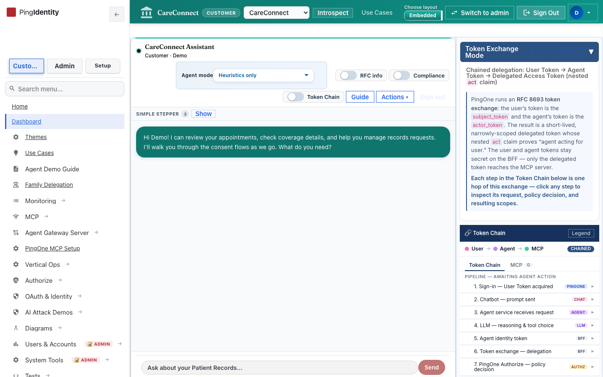
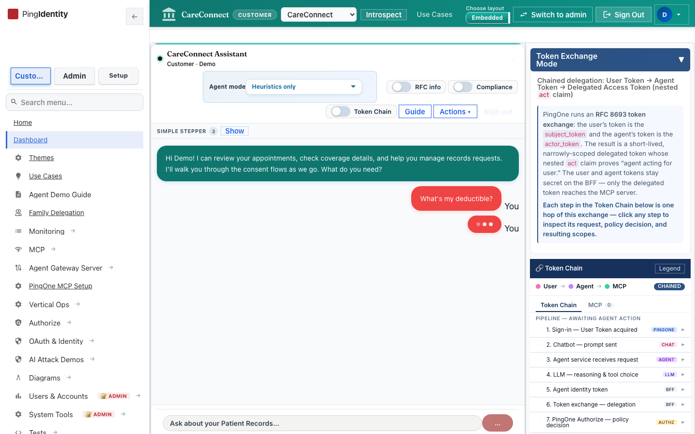
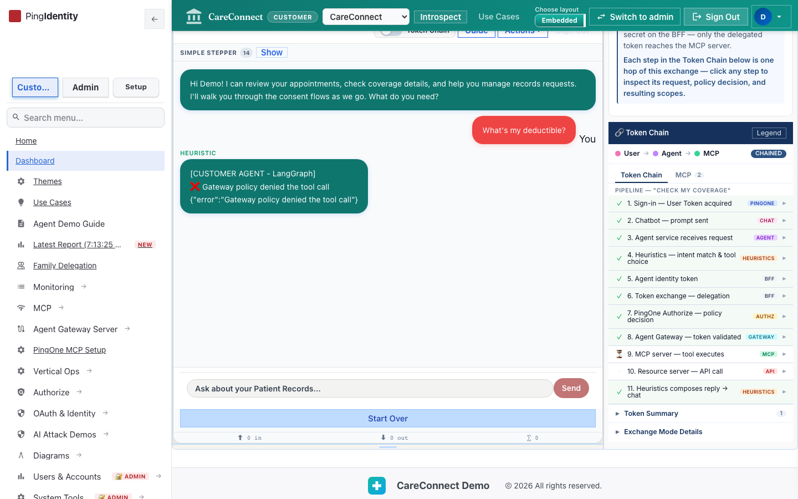
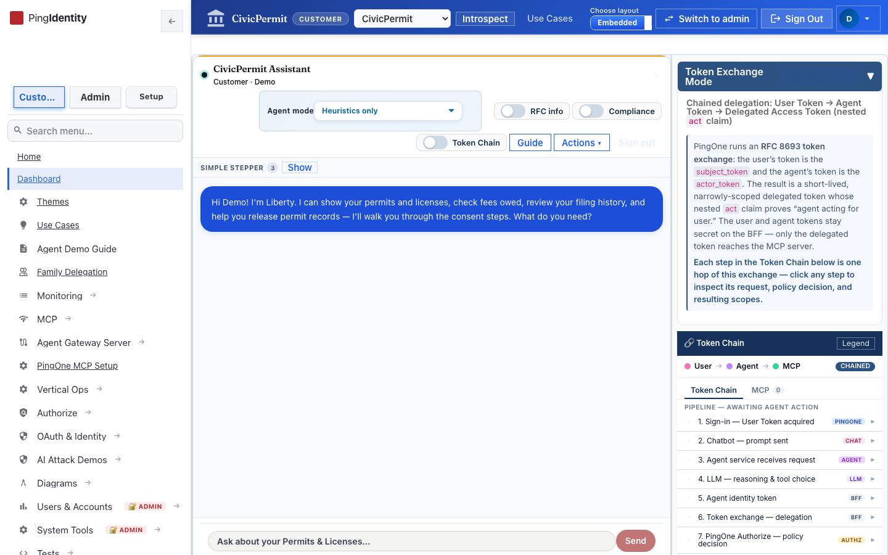
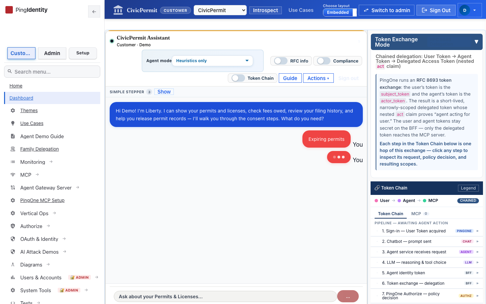
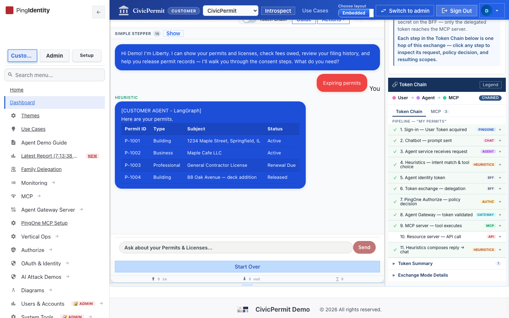
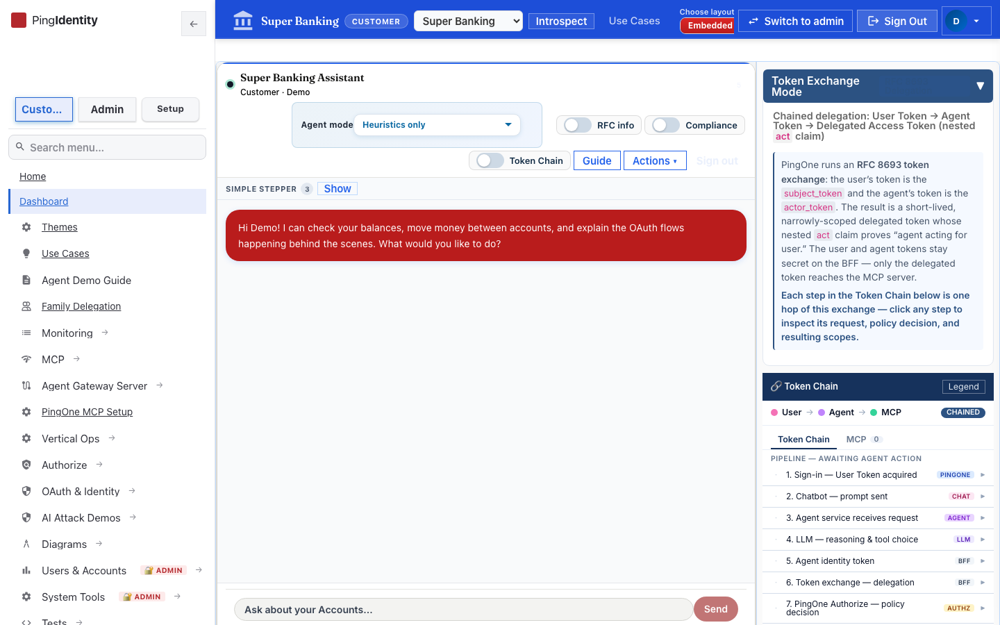
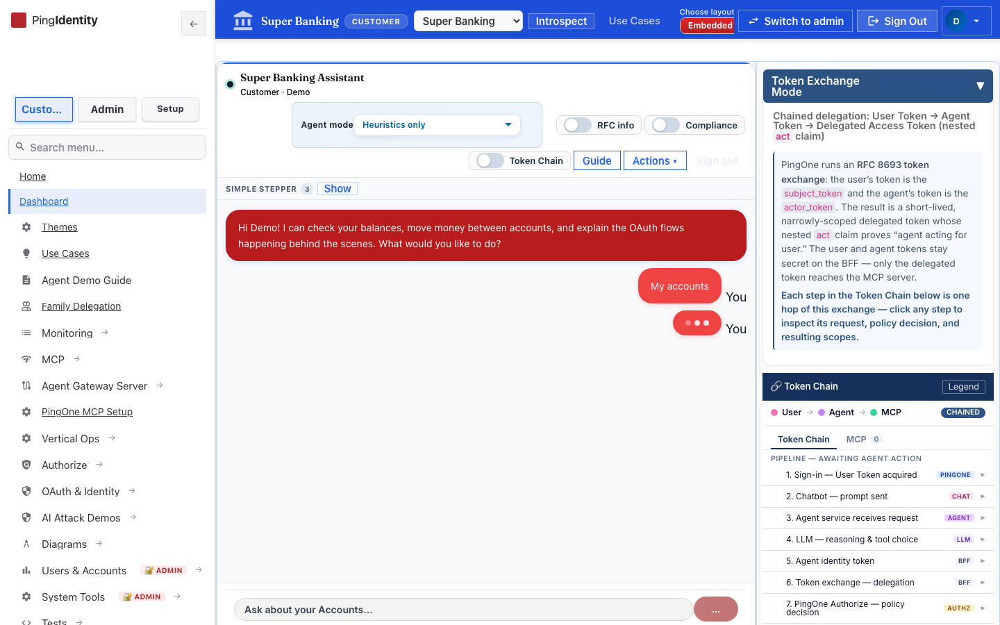
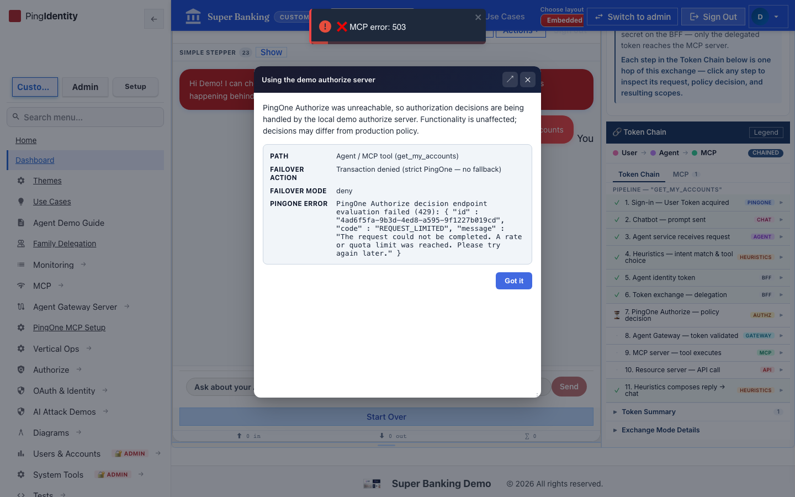

# Token Chain Heuristics — Vertical Chip Report

**Date:** 2026-07-08  
**PR:** [#231](https://github.com/curtismu7/AI-DEMO2/pull/231) (merged `5aa1191`)  
**UI under test:** local Vite on `https://api.ping.demo:4000` serving the merged Heuristics Token Chain fix (K8s frontend image was older and did not include the change)  
**Agent mode:** Heuristics only  
**Verdict:** Steps 4 and 11 show **HEURISTICS** labels with checks for CareConnect, CivicPermit, and Super Banking Actions chips

## Summary

| Vertical | Chip exercised | Step 4 | Step 11 | Result |
|----------|----------------|--------|---------|--------|
| CareConnect (`healthcare`) | Actions heuristic chip | `Heuristics — intent match & tool choice` / HEURISTICS / ✓ | `Heuristics composes reply → chat` / HEURISTICS / ✓ | Pass |
| CivicPermit (`government`) | Actions heuristic chip | same | same | Pass |
| Super Banking (`banking`) | My accounts | same | same | Pass |

Downstream MCP/Authorize failures (gateway deny, `mcp_authorize_unavailable`, PingOne Authorize 429) appeared in some runs. Those are environment/policy issues; they do **not** block the Heuristics step-label verification.

## Screenshots

### CareConnect

Dashboard / Actions:

Token Chain (steps 4 & 11):

### CivicPermit

### Super Banking

## What was verified

For each vertical:

1. `POST /api/verticals/active` → 204  
2. Open Actions dropdown chips  
3. Click a heuristic (`mode: both`) chip  
4. Token Chain rail shows:
   - **4.** `Heuristics — intent match & tool choice` · lane `HEURISTICS` · status `done`
   - **11.** `Heuristics composes reply → chat` · lane `HEURISTICS` · status `done`

Machine-readable capture: [`results.json`](results.json)

## Merge

- Branch: `fix/token-chain-heuristics-all-verticals`
- Commit: `b576281` — mark Heuristics Token Chain for all vertical Actions chips
- Merged via PR #231 into `main`

## Note on K8s UI

The cluster `frontend` image (`ai-demo-ui:latest`, last rolled ~2026-07-08 02:29Z) did not yet include this UI change. Screenshots were taken against a local Vite build of the merged code proxied to the live BFF at `api.ping.demo:3001`. Redeploy the UI image to pick up the fix in K8s.
