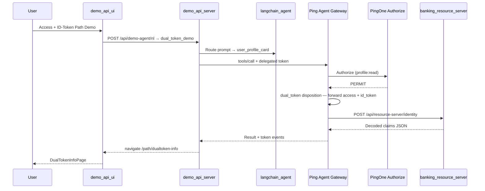
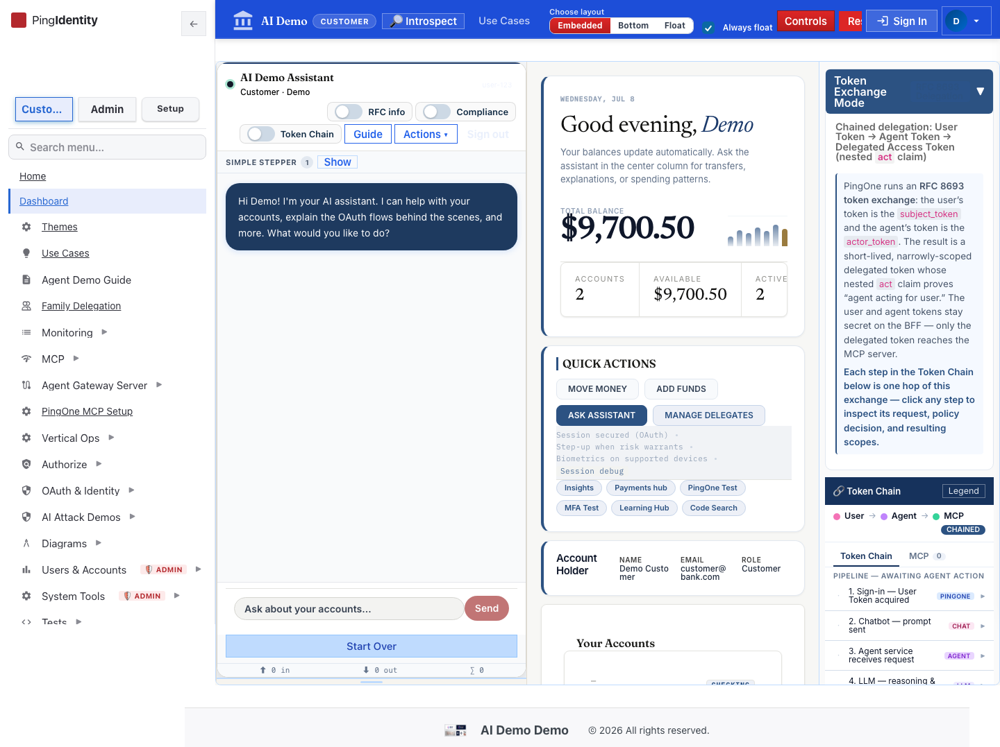

# How To Test: Prompt → LLM → PingGateway → P1AZ → Dual-Token (Access + ID) Path

This guide extends the [read-only banking flow](./llm-pinggateway-p1az-flow-test.md) with the **dual-token** disposition (`dual_token`). The agent calls `user_profile_card`; the Node MCP gateway (Path B) forwards **access token + id_token** to `banking_resource_server`, which decodes claims server-side (no raw JWT crosses the UI boundary). When PingGateway is the default gateway, the BFF still routes Path B tools to the Node gateway.

**Last verified:** 2026-07-09 (k8s / OrbStack; live `user_profile_card` → `credentialPath=dual_token`)

## Test Results (2026-07-09)

| Verification | Result |
|--------------|--------|
| UI SPA | ✅ |
| BFF health | ✅ `healthy` |
| MCP gateway in-cluster | ✅ `ok` |
| Live `user_profile_card` | ✅ `credentialPath=dual_token` |
| LLM proxy | ✅ `healthy` |
| Screenshot capture script | ⚠️ 1/4 (run regenerate when UI port-forward active) |

Agent steps use mocked NL + `user_profile_card` MCP response; architecture and `/path/dualtoken-info` reflect live UI routes.

## Prerequisites

Same stack as the PERMIT banking guide, plus:

- Customer token includes **`openid profile banking:read`** scopes
- Feature flags: `ff_mcp_gateway_pinggateway=true`, real P1AZ (`ff_authorize_real=true`)

**Trigger:** chip **Access + ID-Token Path Demo** or banking action `dual_token_demo`

**Expected outcome:** SPA navigates to **`/path/dualtoken-info`** with teal **ACCESS + ID-TOKEN PATH** badge and decoded claims card.

## Pipeline Overview



| Hop | Component | What happens |
|-----|-----------|--------------|
| 1–3 | Same as banking read | Prompt → LLM → RFC 8693 exchange |
| 4 | **PingGateway** | Routes `user_profile_card` to **dual_token** disposition |
| 5 | **P1AZ** | PERMIT when profile/banking scopes present |
| 6 | **Credential forward** | Access + id_token forwarded (not swapped to API key) |
| 7 | **Resource server** | Decodes claims server-side |
| 8 | **UI** | `DualTokenInfoPage` at `/path/dualtoken-info` |

## Step-by-Step Test (UI)

### 1. Sign in and open the agent

Go to `https://api.ping.demo:4000/dashboard` and sign in as a customer.



### 2. Click the dual-token chip

Use **Access + ID-Token Path Demo** on the agent panel.


### 3. Confirm dual-token info page

Expected: **`/path/dualtoken-info`** with teal badge and claims-only card from `banking_resource_server`.


### 4. Inspect Token Chain

Open **Token Chain** and confirm:

| Event ID | Meaning |
|----------|---------|
| `user-token` | OIDC session access token |
| `exchanged-token` | RFC 8693 delegated token |
| `mcp-gateway-route` | Gateway route — **dual_token** disposition |
| `gw-authorize` | P1AZ **PERMIT** |
| `gw-credential-forward` | Access + id_token forwarded to resource server |
| `mcp-tool-result` | `user_profile_card` payload |


## Step-by-Step Test (API smoke)

```bash
curl -sk https://api.ping.demo:3001/health
kubectl exec -n ai-demo deploy/demo-api-server -- wget -qO- http://mcp-gateway:3005/health
```

Live tool call (session cookie required):

```bash
curl -sk -X POST https://api.ping.demo:3001/api/mcp/tool \
  -H 'Content-Type: application/json' \
  -b 'connect.sid=<session-cookie>' \
  -d '{"tool":"user_profile_card","params":{}}'
```

Expected: `ok`, `gwAuditTrail.decision: "PERMIT"`, `_meta.credentialPath: "dual_token"`.

## Regenerate Screenshots

```bash
cd demo_api_ui
node scripts/capture-llm-pinggateway-p1az-dualtoken-flow.cjs
```

Output: `docs/screenshots/llm-pinggateway-p1az-dualtoken-flow/*.png`

## Troubleshooting

| Symptom | Likely cause | Fix |
|---------|--------------|-----|
| Empty `/path/dualtoken-info` | Navigation without MCP result state | Run chip from agent dashboard |
| DENY from P1AZ | Missing profile/banking scopes | Re-login with openid + banking scopes |
| No teal badge | Wrong disposition in gateway | Verify `dual_token` routing for `user_profile_card` |

## Related guides

- [Read-only accounts flow](./llm-pinggateway-p1az-flow-test.md)
- [Mortgage API-key path](./llm-pinggateway-p1az-mortgage-flow-test.md)
- [HITL transfer flow](./llm-pinggateway-p1az-hitl-flow-test.md)

## Code References

- Dual-token UI: `demo_api_ui/src/components/DualTokenInfoPage.jsx` (or `/path/dualtoken-info` route)
- Agent dispatch: `demo_api_ui/src/components/AIAgent.js` (`dual_token_demo`)
- Gateway dual_token routing: `demo_mcp_gateway/src/router.ts`
- NL intent: `demo_api_server/services/nlIntentParser.js` (`dual_token_demo`)

---

_[Back to use-case index](./README.md)_
