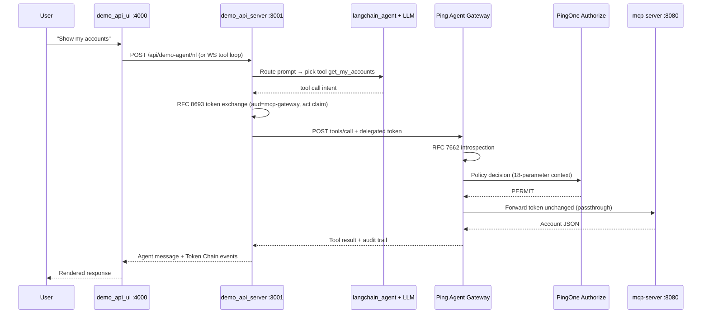
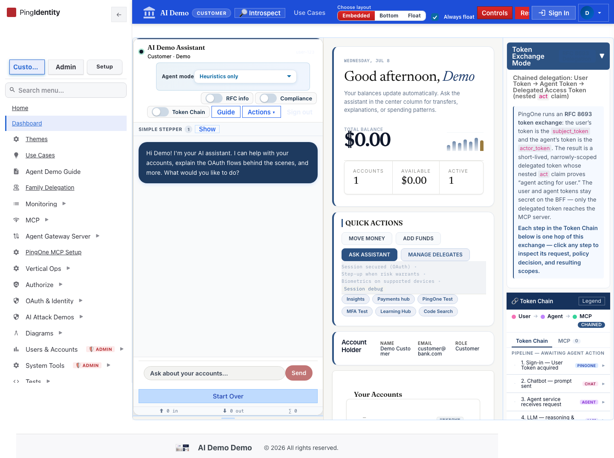
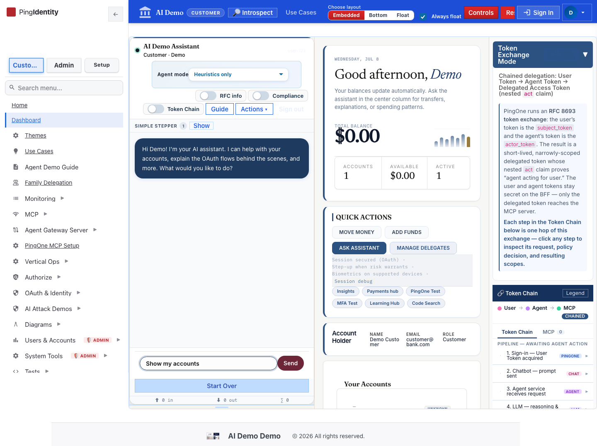
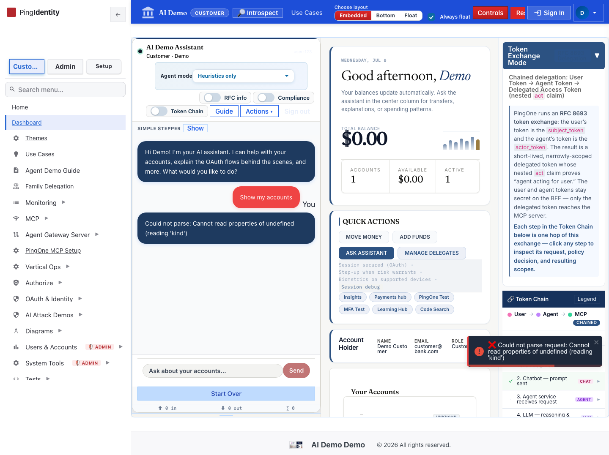
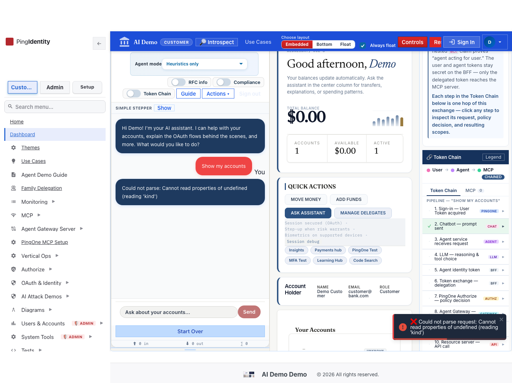
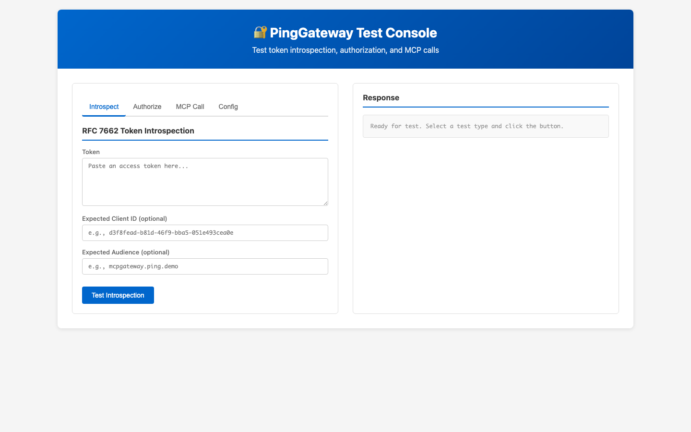
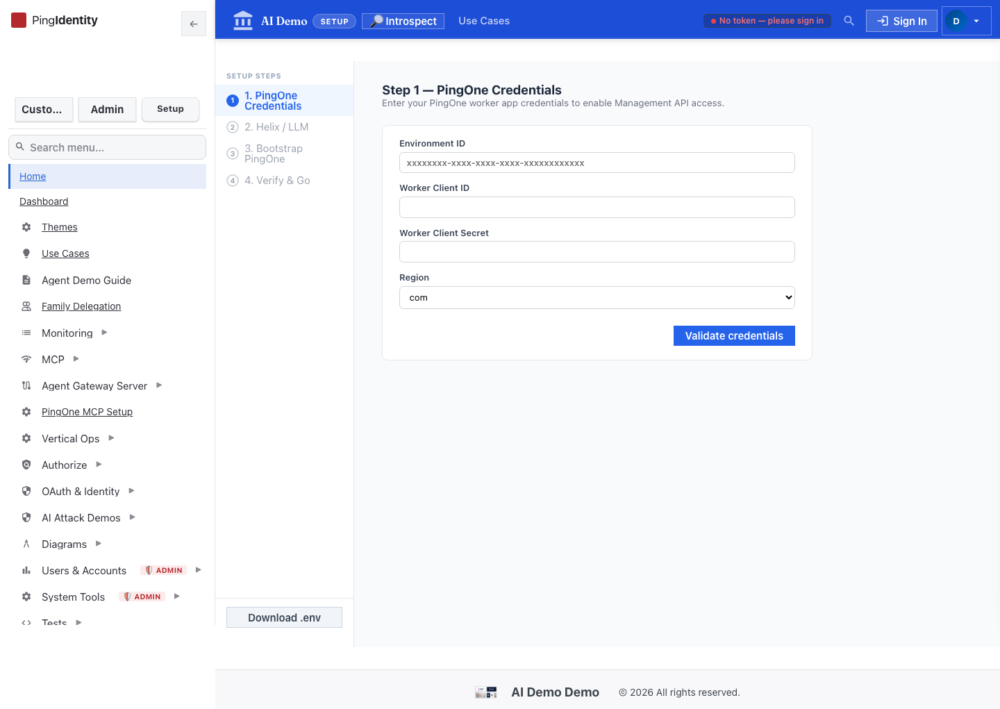

# How To Test: Prompt → LLM → PingGateway → P1AZ → Agent Response

This guide walks through the end-to-end banking agent path where a natural-language prompt is routed by the LLM, authorized at Ping Agent Gateway (PingGateway) and PingOne Authorize (P1AZ), and returns tool output to the agent UI.

**Last verified:** 2026-07-08 (k8s / OrbStack, port-forwards active)

See also: [HITL transfer flow test](./llm-pinggateway-p1az-hitl-flow-test.md) · [Mortgage app (API-Key path)](./llm-pinggateway-p1az-mortgage-flow-test.md) · [Dual-token (Access + ID) path](./llm-pinggateway-p1az-dualtoken-flow-test.md)

## Test Results (2026-07-08)

| Verification | Result |
|--------------|--------|
| UI SPA (`/`) | ✅ `PingOne AI IAM Core` |
| Token Lab (`/pinggateway-test.html`) | ✅ `PingGateway Test` |
| BFF health (`/health`) | ✅ `healthy` |
| MCP gateway in-cluster (`mcp-gateway:3005/health`) | ✅ `ok` / `banking-mcp-gateway` |
| LLM proxy in-cluster (`llm-proxy:8090/health`) | ✅ `ok` (local MS Phi-4 GGUF from `~/models`) |
| Screenshot capture script | ✅ 7/7 images regenerated |

Screenshots below were captured with the Playwright script against the live UI. Agent steps (03–06) use mocked session/API responses to demonstrate the Token Chain and chat UX; architecture (01), Token Lab (02), and Gateway Tester shell (07) are live pages.

## Prerequisites

- Demo stack running (`kubectl port-forward` or `./run.sh`)
- UI: `https://api.ping.demo:4000`
- BFF: `https://api.ping.demo:3001`
- Port-forwards (minimum): `frontend 4000:4000`, `demo-api-server 3001:3001`, `mcp-gateway 3005:3005`
- Feature flags: `ff_mcp_gateway_pinggateway=true` (PingOne Agent Gateway), `ff_authorize_simulated=false` (real P1AZ)
- LLM mode: **llama.cpp** via in-cluster `llm-proxy:8090` with local **Microsoft Phi-4-mini-instruct** GGUF at `~/models/microsoft_Phi-4-mini-instruct-Q4_K_M.gguf` — mount into tiers with `LLM_MODELS_HOST_PATH=$HOME/models ./k8s/deploy.sh yotuo on` (do **not** use the YOTUO external drive; it is unreliable). Alternatives: host **oMLX** (`bash demo_llm_proxy/start-omlx.sh start`, model in `~/.omlx/models/Phi-4-mini-instruct-4bit`), **Helix**, or **heuristics**
- For fully live OAuth login tests: `demo_api_ui/tests/e2e/.env.e2e` with `E2E_CUSTOMER_USERNAME` / `E2E_CUSTOMER_PASSWORD`

## Pipeline Overview



| Hop | Component | What happens |
|-----|-----------|--------------|
| 1 | **UI / Agent** | User submits prompt (NL input or chip action) |
| 2 | **LLM** | Resolves intent → MCP tool name (`get_my_accounts`) |
| 3 | **BFF** | Session token → RFC 8693 delegated token (`aud=mcp-gateway`, `act`) |
| 4 | **PingGateway** | Introspect token, enforce D-05 anti-bypass |
| 5 | **P1AZ** | Authorize decision: PERMIT / DENY / INDETERMINATE |
| 6 | **MCP Server** | Executes tool against banking API |
| 7 | **Return path** | Result + gateway audit trail → agent UI + Token Chain panel |

## Step-by-Step Test (UI)

### 1. Review the token-flow architecture

Open the interactive diagram to see where PingGateway and P1AZ sit in the delegation chain.


URL: `https://api.ping.demo:4000/architecture/token-flow.html`

### 2. Sign in as a customer

1. Go to `https://api.ping.demo:4000/dashboard`
2. Complete PingOne OAuth login (customer role with MCP scopes)

Expected: Inline banking agent panel visible on the dashboard.



### 3. Submit a banking prompt

1. In the agent input, type: **Show my accounts**
2. Press Enter (or use Actions → **My Accounts**)

Expected: Agent invokes `get_my_accounts` through the gateway.



### 4. Verify agent response

Expected: Account balances returned in the chat panel.



### 5. Inspect Token Chain (gateway + P1AZ evidence)

1. Click **Token Chain** in the agent chrome
2. Confirm these events appear:

| Event ID | Meaning |
|----------|---------|
| `user-token` | OIDC session token |
| `exchanged-token` | RFC 8693 delegated token (`aud=mcp-gateway`) |
| `mcp-gateway-route` | PingGateway introspect + route |
| `gw-authorize` | P1AZ decision (**PERMIT** for read-only accounts) |
| `mcp-tool-result` | MCP tool output |



### 6. Optional — Token Lab (raw gateway APIs)

For power-user debugging with pasted tokens (introspect / authorize / MCP call tabs):

- AdminSideNav → **Agent Gateway Server** → **Token Lab**
- URL: `https://api.ping.demo:4000/pinggateway-test.html`



### 7. Optional — Gateway Tester (admin)

- AdminSideNav → **Gateway Tester**
- URL: `https://api.ping.demo:4000/setup?tab=mcp-gateway&subtab=tester`
- Select tool `get_my_accounts`, send test call
- Expected: **PERMIT** in audit trail, `authzBackend: real (PingOne Authorize)`



## Step-by-Step Test (API smoke)

```bash
# UI + BFF up
curl -sk https://api.ping.demo:4000/ | grep '<title>'
curl -sk https://api.ping.demo:3001/health

# Token Lab proxied through UI nginx
curl -sk https://api.ping.demo:4000/pinggateway-test.html | grep '<title>'

# MCP gateway health from inside the cluster (authoritative)
kubectl exec -n ai-demo deploy/demo-api-server -- \
  wget -qO- http://mcp-gateway:3005/health

# LLM proxy (local MS Phi-4 via ~/models hostPath)
kubectl exec -n ai-demo deploy/demo-api-server -- \
  wget -qO- http://llm-proxy:8090/health
```

Local model setup (once per machine — skip YOTUO):

```bash
# GGUF must live here (download once if missing):
ls ~/models/microsoft_Phi-4-mini-instruct-Q4_K_M.gguf

# Mount into k8s llama tiers (OrbStack hostPath)
LLM_MODELS_HOST_PATH=$HOME/models ./k8s/deploy.sh yotuo on

# Optional: host oMLX instead of in-cluster tiers (Mac Apple Silicon)
bash demo_llm_proxy/start-omlx.sh start   # Phi-4 in ~/.omlx/models
```

Note: `GET /api/health/mcp-gateway` via localhost port-forward may report unreachable if the BFF pod resolves a stale gateway URL. Use the in-cluster wget above to confirm gateway health.

Full gateway tool test (requires logged-in session cookie):

```bash
curl -sk -X POST https://api.ping.demo:3001/api/mcp-gateway/test \
  -H 'Content-Type: application/json' \
  -b 'connect.sid=<session-cookie>' \
  -d '{"tool":"get_my_accounts","args":{}}'
```

Expected JSON fields: `ok: true`, `gwAuditTrail.decision: "PERMIT"`, `gateway.name: "PingOne Agent Gateway"`.

## Regenerate Screenshots

```bash
cd demo_api_ui
npm install
npx playwright install chromium
node scripts/capture-llm-pinggateway-p1az-flow.cjs
```

Output: `docs/screenshots/llm-pinggateway-p1az-flow/*.png` (7 files)

For live-login captures, set `E2E_BASE_URL=https://api.ping.demo:4000` and credentials in `tests/e2e/.env.e2e`, then run:

```bash
E2E_BASE_URL=https://api.ping.demo:4000 npm run test:e2e:real -- tests/e2e/banking-agent.real.spec.js
```

## Troubleshooting

| Symptom | Likely cause | Fix |
|---------|--------------|-----|
| UI shows "Frontend not built" on `/dashboard` | nginx proxying `index.html` to BFF | Use `location = /pinggateway-test.html` only (not `location ~ \.(html)$`) |
| 404 on `/pinggateway-test.html` | Missing nginx/Vite proxy to BFF public dir | k8s ConfigMap + Vite dev proxy in `vite.config.js` |
| Agent returns "servers not running" | LLM proxy or `llama-tier1` not ready | Ensure `~/models/microsoft_Phi-4-mini-instruct-Q4_K_M.gguf` exists, then `LLM_MODELS_HOST_PATH=$HOME/models ./k8s/deploy.sh yotuo on`; or start host oMLX / use **Helix** / **heuristics** |
| Gateway test → DENY | P1AZ policy or missing scopes | Check Authorize rules; verify token `aud` and `act` in Token Chain |
| `/api/health/mcp-gateway` false negative | BFF health probe vs port-forward mismatch | Verify with in-cluster `wget http://mcp-gateway:3005/health` |

## Code References

- Agent tool loop: `langchain_agent/`
- BFF token exchange: `demo_api_server/services/agentMcpTokenService.js`
- Gateway client: `demo_api_server/services/mcpGatewayClient.js`
- Gateway tester API: `demo_api_server/routes/mcpGatewayConfig.js` (`POST /api/mcp-gateway/test`)
- Token Lab routes: `demo_api_server/routes/pinggatewayTestRoutes.js`
- Token Chain UI: `demo_api_ui/src/components/TokenChainDisplay.js`
- Progressive trust plan: `docs/planning/PLAN-progressive-trust-demo.md`

---

_[Back to use-case index](./README.md)_
