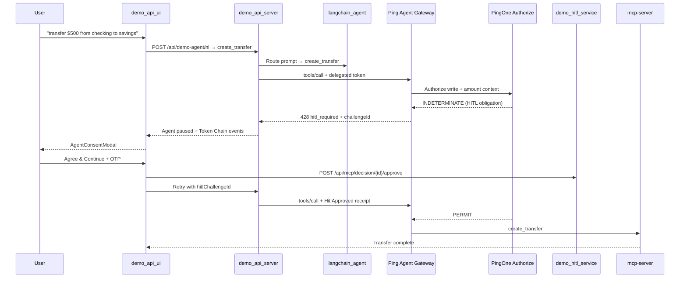
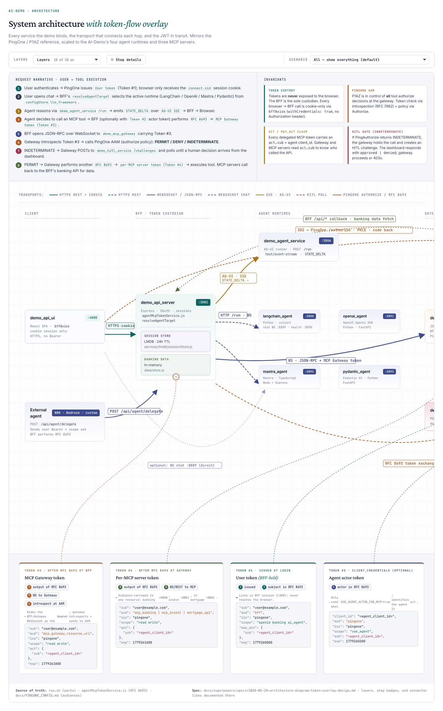
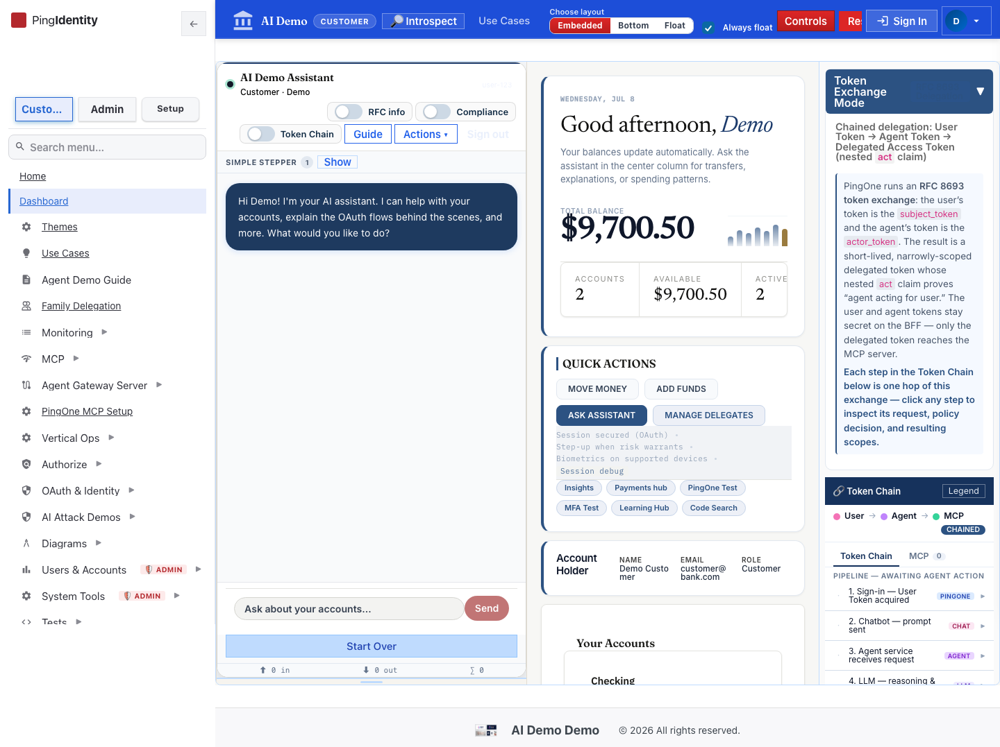
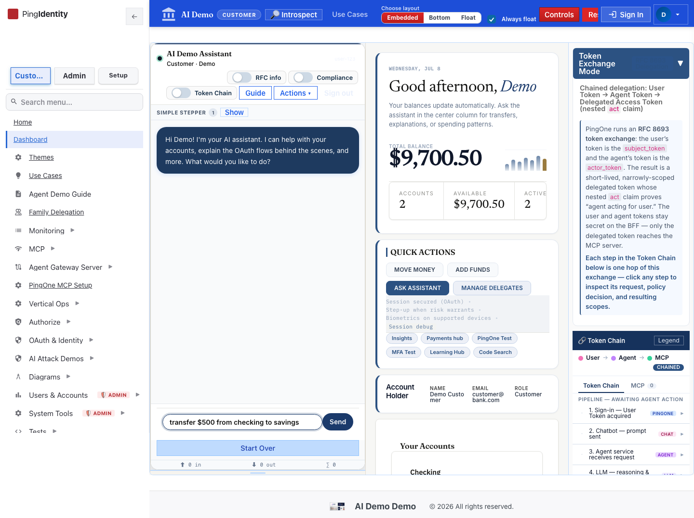
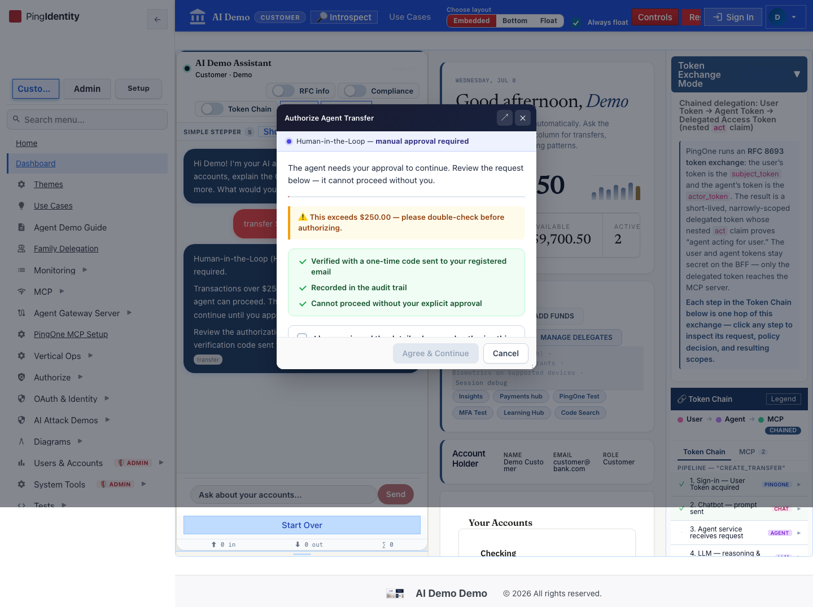
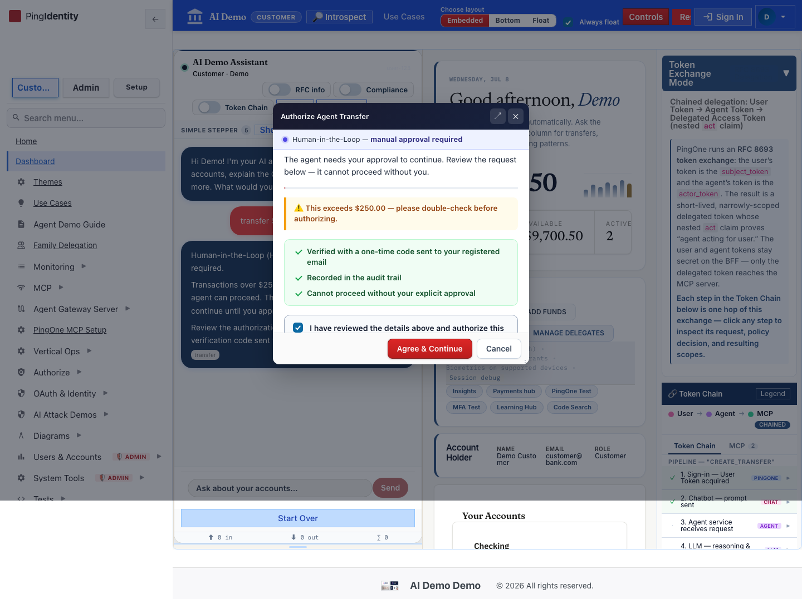

# How To Test: Prompt → LLM → PingGateway → P1AZ → HITL → Agent Response

This guide extends the [read-only flow test](./llm-pinggateway-p1az-flow-test.md) with **Human-in-the-Loop (HITL)** consent. A consequential write (`create_transfer`) pauses the agent until PingOne Authorize returns a HITL obligation and the user approves via the consent modal.

**Last verified:** 2026-07-08 (k8s / OrbStack, port-forwards active)

## Test Results (2026-07-08)

| Verification | Result |
|--------------|--------|
| UI SPA (`/`) | ✅ `PingOne AI IAM Core` |
| BFF health | ✅ `healthy` |
| MCP gateway in-cluster | ✅ `ok` |
| LLM proxy in-cluster | ✅ `healthy` / `phi-4-mini-instruct` |
| HITL feature flag | ✅ `ff_hitl_enabled` (required) |
| Screenshot capture script | ✅ 6/6 images |

Agent steps (02–06) use mocked `/api/demo-agent/nl` + `/api/mcp/tool` (428 `hitl_required`) to demonstrate the consent modal and Token Chain; architecture (01) is a live page.

## Prerequisites

Same stack as the [PERMIT flow guide](./llm-pinggateway-p1az-flow-test.md), plus:

- `ff_hitl_enabled=true` (Demo Controls → Feature Flags)
- `ff_mcp_gateway_pinggateway=true`, `ff_authorize_simulated=false` (real P1AZ)
- Customer OAuth session with MCP write scopes
- LLM: local Phi-4 via `~/models` (see PERMIT guide)

**Trigger (UC8):** chip or typed prompt: **`transfer $500 from checking to savings`**

**Expected outcome:** `HITL_REQUIRED` — agent pauses; transfer runs only after consent + OTP.

## Pipeline Overview (HITL branch)



| Hop | Component | What happens |
|-----|-----------|--------------|
| 1–4 | Same as PERMIT flow | Prompt → LLM → token exchange → gateway introspect |
| 5 | **P1AZ** | `INDETERMINATE` + HITL obligation for `create_transfer` / amount |
| 6 | **Gateway** | Returns `428 hitl_required`, `challengeType: consent_required` |
| 7 | **UI** | `AgentConsentModal` — user reviews transfer, checks consent box |
| 8 | **HITL service** | Approve challenge → bound single-use receipt |
| 9 | **Retry** | BFF refires tool with `hitlChallengeId`; P1AZ → **PERMIT** |
| 10 | **Return** | Transfer result + full Token Chain in agent UI |

## Step-by-Step Test (UI)

### 1. Review architecture (HITL sits at P1AZ + gateway)



### 2. Sign in and open the banking agent

Go to `https://api.ping.demo:4000/dashboard` and sign in as a customer.



### 3. Submit a transfer prompt

Type or use the **Transfer $500** chip:

**`transfer $500 from checking to savings`**



### 4. Confirm HITL consent modal

Expected: agent chat shows HITL pause message; **`AgentConsentModal`** opens with transfer details.



Check the consent box, then click **Agree & Continue**. Complete OTP when prompted.



### 5. Inspect Token Chain (HITL evidence)

Open **Token Chain** and confirm:

| Event ID | Meaning |
|----------|---------|
| `user-token` | OIDC session token |
| `exchanged-token` | RFC 8693 delegated token |
| `mcp-gateway-route` | PingGateway introspect + route |
| `gw-authorize` | P1AZ **INDETERMINATE** (HITL obligation) |
| `gw-hitl-challenge-type` | Gateway signals `consent_required` |
| *(after approve)* `gw-authorize` | P1AZ **PERMIT** with `HitlApproved` |
| *(after approve)* `mcp-tool-result` | `create_transfer` result |


## Step-by-Step Test (API smoke)

```bash
# Stack health (same as PERMIT guide)
curl -sk https://api.ping.demo:3001/health
kubectl exec -n ai-demo deploy/demo-api-server -- wget -qO- http://mcp-gateway:3005/health
kubectl exec -n ai-demo deploy/demo-api-server -- wget -qO- http://llm-proxy:8090/health

# HITL service reachable (in-cluster)
kubectl exec -n ai-demo deploy/demo-api-server -- \
  wget -qO- http://hitl-service:3004/health 2>/dev/null || echo "check hitl-service pod"
```

Live transfer test (requires session cookie):

```bash
# First call — expect 428 hitl_required
curl -sk -X POST https://api.ping.demo:3001/api/mcp/tool \
  -H 'Content-Type: application/json' \
  -b 'connect.sid=<session-cookie>' \
  -d '{"tool":"create_transfer","params":{"from_account_id":"acc_001","to_account_id":"acc_002","amount":500}}'
```

Expected: HTTP **428**, `"error":"hitl_required"`, `tokenEvents` include `gw-authorize` + `gw-hitl-challenge-type`.

## Regenerate Screenshots

```bash
cd demo_api_ui
node scripts/capture-llm-pinggateway-p1az-hitl-flow.cjs
```

Output: `docs/screenshots/llm-pinggateway-p1az-hitl-flow/*.png` (6 files)

## Troubleshooting

| Symptom | Likely cause | Fix |
|---------|--------------|-----|
| Transfer completes without modal | `ff_hitl_enabled` off | Enable in Demo Controls |
| No modal, generic error | Simulated authz without HITL rules | Set `ff_authorize_simulated=false` |
| Modal never opens (mocked UI test) | `/api/mcp/tool` not returning 428 | Verify `create_transfer` + `hitl_required` |
| OTP step fails | Notifications not configured | Use stub OTP or check BFF logs |
| PERMIT without retry | Missing `hitlChallengeId` on refire | Approve via `/api/mcp/decision/{id}/approve` first |

## Related use cases

- [UC8 — HITL consent](./hitl-consent.md)
- [UC7 — Step-up required](./step-up-required.md) (MFA path for higher amounts)
- [LLM → PingGateway → P1AZ (read-only)](./llm-pinggateway-p1az-flow-test.md)

## Code References

- HITL obligations: `demo_api_server/services/authorizeObligations.js`
- MCP 428 handler: `demo_api_ui/src/services/demoAgentService.js` (`callMcpTool`)
- Consent modal: `demo_api_ui/src/components/AgentConsentModal.js`
- Gateway consent modal: `demo_api_ui/src/components/GatewayConsentModal.js`
- Banking HITL chip: `demo_api_server/config/verticals/banking/manifest.json` (`bk-hitl`)

---

_[Back to use-case index](./README.md)_
