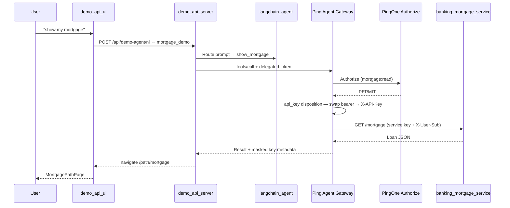
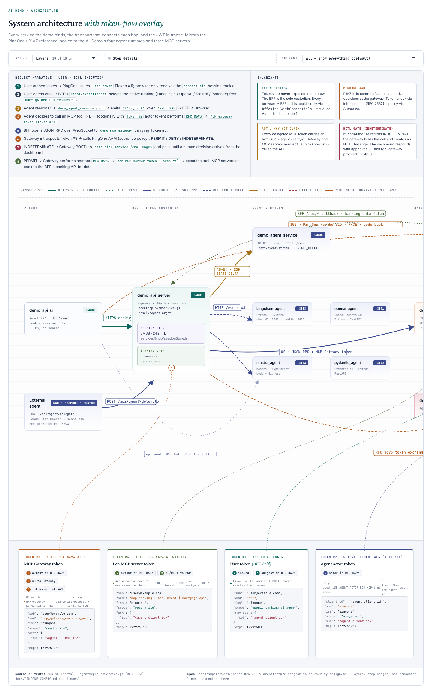
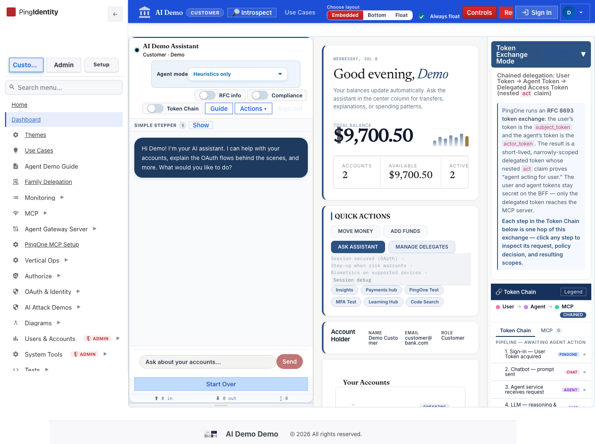
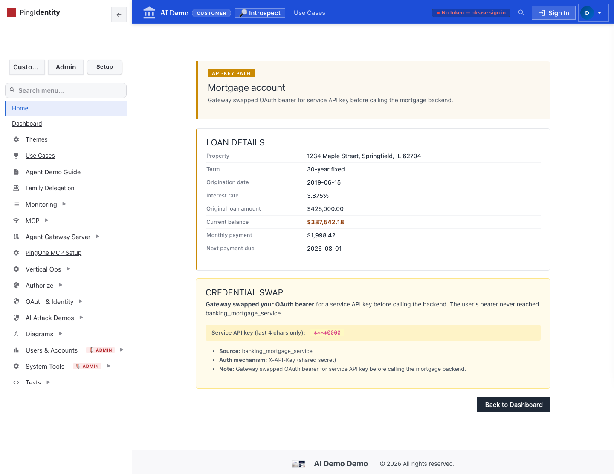
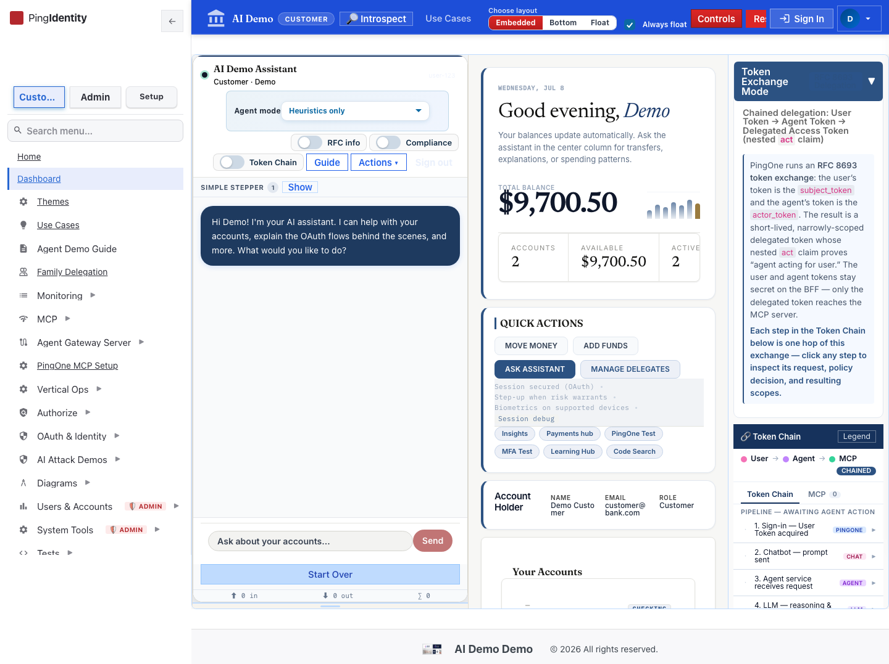

# How To Test: Prompt → LLM → PingGateway → P1AZ → Mortgage App (API-Key Path)

This guide extends the [read-only banking flow](./llm-pinggateway-p1az-flow-test.md) with the **mortgage app** path (`/path/mortgage`). The agent calls `show_mortgage` through PingGateway; P1AZ checks `mortgage:read`; the gateway **swaps** the user's OAuth bearer for a service API key before calling `banking_mortgage_service`.

**Last verified:** 2026-07-08 (k8s / OrbStack, port-forwards active)

## Test Results (2026-07-08)

| Verification | Result |
|--------------|--------|
| UI SPA | ✅ |
| BFF health | ✅ `healthy` |
| MCP gateway in-cluster | ✅ `ok` |
| LLM proxy | ✅ `healthy` |
| `mortgage-service` pod | ✅ (see kubectl below) |
| Screenshot capture | ✅ 5/5 |

Agent steps use mocked NL + `show_mortgage` MCP response; architecture (01) and mortgage page layout (04) reflect live UI routes.

## Prerequisites

Same stack as the PERMIT banking guide, plus:

- Customer token includes **`mortgage:read`** scope (re-login if the gateway returns `insufficient_scope`)
- `mortgage-service` running in-cluster (`k8s/64-mortgage-service-deployment.yaml`)
- Feature flags: `ff_mcp_gateway_pinggateway=true`, real P1AZ (`ff_authorize_simulated=false`)

**Trigger:** chip **My mortgage** or prompt **`show my mortgage`**

**Expected outcome:** SPA navigates to **`/path/mortgage`** with loan details and credential-swap card.

## Pipeline Overview



| Hop | Component | What happens |
|-----|-----------|--------------|
| 1–3 | Same as banking read | Prompt → LLM → RFC 8693 exchange |
| 4 | **PingGateway** | Routes `show_mortgage` to **api_key** disposition |
| 5 | **P1AZ** | PERMIT when `mortgage:read` present |
| 6 | **Credential swap** | User bearer never reaches mortgage service |
| 7 | **Mortgage service** | Returns loan payload |
| 8 | **UI** | `MortgagePathPage` at `/path/mortgage` |

## Step-by-Step Test (UI)

### 1. Architecture reference



Path A (API-KEY) is documented on the interactive token-flow page and in `MortgagePathPage` (amber badge).

### 2. Sign in and open the agent

`https://api.ping.demo:4000/dashboard`



### 3. Ask for mortgage data

Type **`show my mortgage`** or use the **My mortgage** chip.


### 4. Confirm mortgage app page

Expected: redirect to **`/path/mortgage`** with loan details and **Credential swap** section (`****0000` masked key).



### 5. Token Chain evidence

| Event ID | Meaning |
|----------|---------|
| `user-token` | Session token (`mortgage:read` scope) |
| `exchanged-token` | RFC 8693 delegated token |
| `mcp-gateway-route` | Gateway route — **api_key** disposition |
| `gw-authorize` | P1AZ **PERMIT** |
| `gw-credential-swap` | Bearer → service API key |
| `mcp-tool-result` | `show_mortgage` payload |



## Step-by-Step Test (API smoke)

```bash
curl -sk https://api.ping.demo:3001/health
kubectl exec -n ai-demo deploy/demo-api-server -- wget -qO- http://mcp-gateway:3005/health
kubectl get pods -n ai-demo -l component=mortgage-service

# Mortgage backend (in-cluster)
kubectl exec -n ai-demo deploy/demo-api-server -- \
  wget -qO- http://mortgage-service:8082/health 2>/dev/null || \
  wget -qO- http://mortgage-service:8082/mortgage 2>/dev/null | head -c 200
```

Live tool call (session cookie required):

```bash
curl -sk -X POST https://api.ping.demo:3001/api/mcp/tool \
  -H 'Content-Type: application/json' \
  -b 'connect.sid=<session-cookie>' \
  -d '{"tool":"show_mortgage","params":{}}'
```

Expected: `ok`, `gwAuditTrail.decision: "PERMIT"`, result includes `mortgage` object and `_meta.credentialPath: "api_key"`.

## Regenerate Screenshots

```bash
cd demo_api_ui
node scripts/capture-llm-pinggateway-p1az-mortgage-flow.cjs
```

Output: `docs/screenshots/llm-pinggateway-p1az-mortgage-flow/*.png`

## Troubleshooting

| Symptom | Likely cause | Fix |
|---------|--------------|-----|
| `/path/mortgage` empty state | Gateway call not run or navigation without state | Run prompt from agent (not direct URL) |
| `insufficient_scope` | Missing `mortgage:read` | Re-consent / re-login with mortgage scope |
| DENY from P1AZ | Wrong vertical or policy | Use banking customer; check Authorize rules |
| Gateway 502 to mortgage | `mortgage-service` down | `kubectl get pods -l component=mortgage-service` |

## Related guides

- [Read-only accounts flow](./llm-pinggateway-p1az-flow-test.md)
- [HITL transfer flow](./llm-pinggateway-p1az-hitl-flow-test.md)
- Phase 267 routing tests: `demo_mcp_gateway/tests/mortgageDispatch.test.ts`

## Code References

- Mortgage UI: `demo_api_ui/src/components/MortgagePathPage.jsx`
- Agent dispatch: `demo_api_ui/src/components/AIAgent.js` (`mortgage_demo` / `show_mortgage`)
- Gateway api_key routing: `demo_mcp_gateway/src/router.ts`, `demo_mcp_gateway/src/apiKeyDispatch.ts`
- Mortgage backend: `demo_mortgage_service/server.js`
- NL intent: `demo_api_server/services/nlIntentParser.js` (mortgage_demo)

---

_[Back to use-case index](./README.md)_
