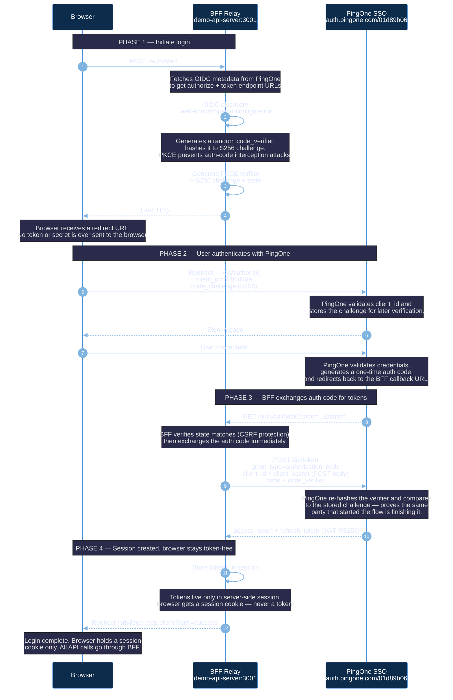
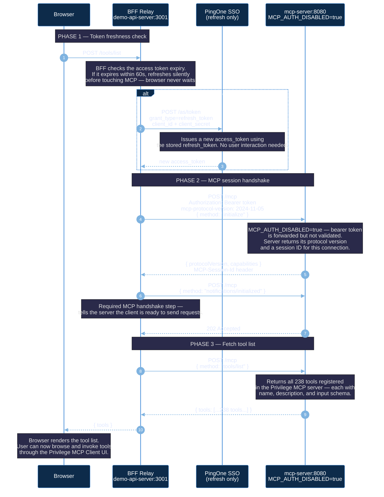
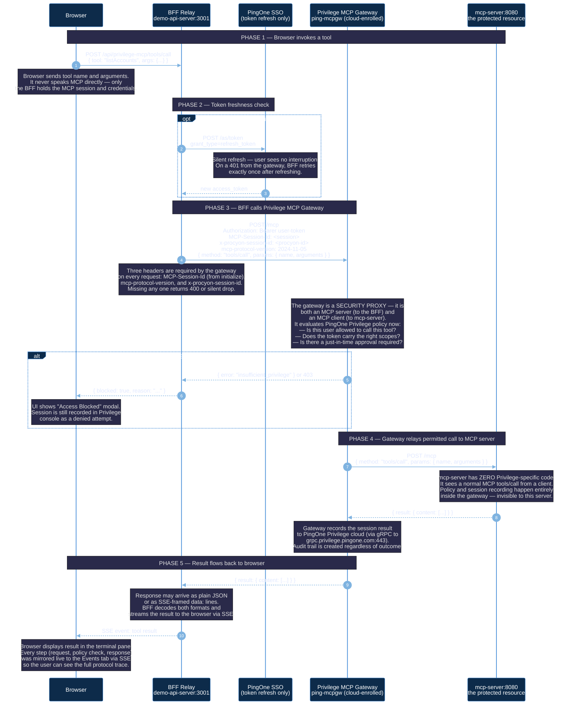
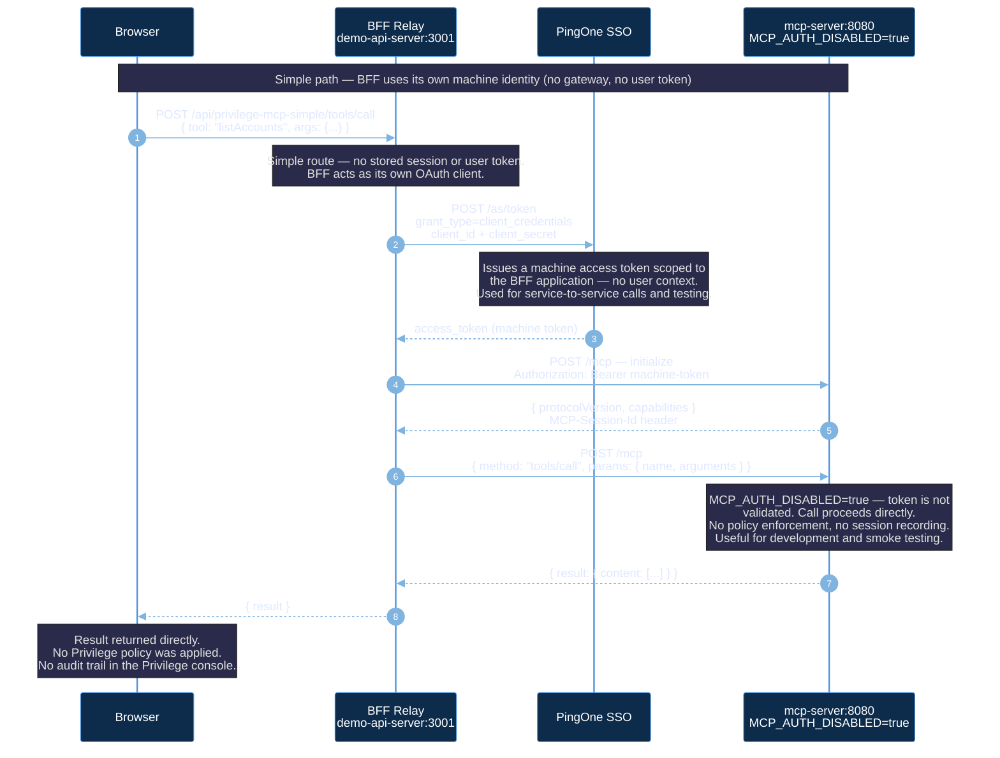

# Privilege MCP Client — Auth & Tool Flow

---

## Flow 1: Login (PKCE + client_secret_post)

User clicks **Sign In with Privilege** — browser never holds a token.
BFF owns the OAuth exchange end-to-end.

| Phase | Steps | What happens |
|-------|-------|-------------|
| Initiate | 1–4 | BFF starts PKCE flow, returns redirect URL to browser |
| Authenticate | 5–7 | Browser redirects to PingOne; user signs in |
| Exchange | 8–10 | PingOne calls back with auth code; BFF swaps it for tokens |
| Complete | 11–12 | Tokens stored server-side; browser gets session cookie only |

---

## Flow 2: Load Tools (authenticated)

After login — browser requests tools, BFF relays to MCP server.
`ping-mcpgw` is **not** in this path. BFF calls `mcp-server` directly.

| Phase | Steps | What happens |
|-------|-------|-------------|
| Token check | 1–3 | BFF silently refreshes access token if it expires within 60s |
| MCP handshake | 4–7 | BFF opens an MCP session: initialize → acknowledged |
| Tool discovery | 8–10 | BFF fetches the full tool list; returns it to browser |

---

## Flow 3: Tool Invocation (via Privilege MCP Gateway)

User selects a tool and clicks **Run** — the BFF sends a `tools/call` to the **Privilege MCP Gateway**, not directly to the MCP server. The gateway sits in the middle on purpose: it applies just-in-time least-privilege policy, records the session, and only then forwards the call to the real MCP server. The MCP server itself has no Privilege-specific code.

> **Key concept:** The browser is never an MCP client. The BFF speaks MCP on behalf of the user. The gateway is both an MCP server (to the BFF) and an MCP client (to mcp-server) — a security proxy by design.

| Phase | Steps | What happens |
|-------|-------|-------------|
| Invoke | 1 | Browser sends tool name + args to BFF over plain HTTPS |
| Token guard | 2–3 | BFF refreshes access token if needed before calling the gateway |
| Gateway policy | 4–6 | BFF calls gateway; gateway evaluates Privilege policy — permit or deny |
| MCP relay | 7–8 | Gateway forwards permitted call to mcp-server; gets result back |
| Response | 9–10 | Result flows back through gateway → BFF → browser; session recorded |

---

## Flow 4: Tool Invocation — Simple Path (machine token, no gateway)

Alternative path used when `MCP_AUTH_DISABLED=true` or for testing without the Privilege gateway. BFF acts as its own OAuth client using `client_credentials` grant — no user login needed.

| Phase | Steps | What happens |
|-------|-------|-------------|
| Machine token | 1–2 | BFF mints its own token with client_credentials — no user involved |
| Direct MCP call | 3–6 | BFF calls mcp-server directly, bypassing the gateway |

---

## Current Config

| Setting | Value |
|---------|-------|
| PRIVILEGE_MCPGW_URL | `http://mcp-server:8080/mcp` |
| PRIVILEGE_SSO_ENV_ID | `01d89b06-...` |
| PRIVILEGE_SSO_CLIENT_ID | `6586d3de-...` |
| Token auth method | `client_secret_post` |
| MCP_AUTH_DISABLED | `true` |
| ping-mcpgw role | Sidecar — not in call path |
